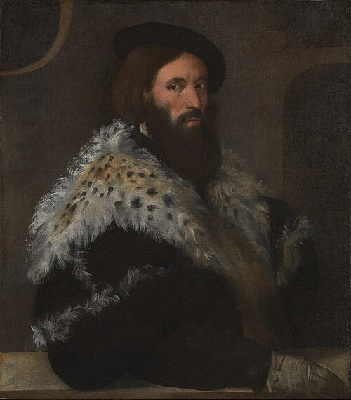
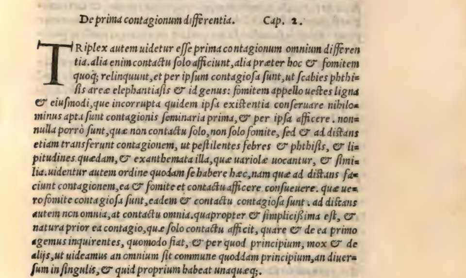

In 1530 a physician of [Verona](kloom:e/verona) published a long Latin poem about a disease. **[Girolamo Fracastoro](kloom:e/girolamo-fracastoro)**, born there in the late 1470s and educated at the **[University of Padua](kloom:e/university-of-padua)**, wrote in three books of hexameters of the pox that had swept Italy since the French invasion of 1494–95, and of its cure. In it a shepherd named Syphilus offends the Sun and is struck with the disease. The poem was _Syphilis sive morbus gallicus_, "Syphilis, or the French disease," and the shepherd gave **[syphilis](kloom:e/syphilis)** its name.

The disease had a lesson in it. It passed from person to person by touch, it came to Europe all at once, and it was plainly something specific: not a general imbalance of the four humors, which was how the physicians of Fracastoro's day, following **[Galen](kloom:e/galen)**, explained most illness. Sixteen years later, in 1546, Fracastoro published at Venice a prose book on the whole question, _De contagione et contagiosis morbis et eorum curatione_, "On contagion, contagious diseases and their cure," in three books: what contagion is, the contagious diseases one by one, and how to treat them. The portrait, attributed to **[Titian](kloom:e/titian)** and dated to about 1528, is thought to be his.

## Three ways to catch a disease

He began with a definition. In our translation of the Latin of 1546, contagion is "an exactly similar corruption of a compound, in its substance, passing from one thing to another, the infection being first made in imperceptible particles." Then he sorted:

| Mode                  | What carries it                                  | His examples                                               |
| --------------------- | ------------------------------------------------ | ---------------------------------------------------------- |
| By contact alone      | The touch of one thing on another                | Fruit rotting, "grape to grape and apple to apple"         |
| By contact and fomes  | Clothes, wood and the like, which keep the seeds | Scabies, consumption, _areae_ (hair loss), _elephantiasis_ |
| At a distance as well | The air, with no touch and no thing between      | Pestilent fevers, consumption, some eye diseases, smallpox |

The plate draws the three rows. The word for the middle one was his: "I call fomites clothes, wood and things of that kind, which, though not themselves corrupted, are nevertheless fit to keep the first seeds of contagion and to infect by them." A **[fomite](kloom:e/fomite)**, from _fomes_, tinder, is still the word for an object that carries infection. The three were nested, he said: whatever infects at a distance also infects by fomes and by touch, but not the other way round. And he gave evidence for the middle mode from what any physician had seen: clothes that consumptives had worn, and their rooms and beds, "have often been seen to bring the contagion after two years."

## What were the seeds?

What passed in every case were _seminaria_, little seeds of contagion, particles too small to see, given off by putrefaction, each kind acting on its own organ, as consumption's seeds attack the lungs and nothing else. Smells, he argued, linger in wood and cloth for a long time because they too are carried by tiny bodies, and soot clings to a wall the same way: a seed that is subtle and sticky can hide in the pores of a garment.

How far to read germs into this is argued. Charles and Dorothea Singer, in 1917, called his doctrine of "hidden germs or seeds" his best claim to scientific eminence, and thought it idle to ask whether he believed them alive, since the distinction would not have mattered to him. Wilmer Cave Wright's translation of 1930 rendered _seminaria_ as "germs." The historian **[Vivian Nutton](kloom:e/vivian-nutton)** has argued the opposite: the seeds came from the atoms of **[Lucretius](kloom:e/lucretius)**, the theory had ancient and medieval forerunners, and Fracastoro "was no Robert Koch." His seeds were seen only by "the eye of logic." What was new was a contagious disease that did not depend on the patient's humors: destroy or expel the seeds, and it stopped.

## Plague, and three centuries' wait

Italy did not need the theory to act. Venice had quarantined arrivals from plague-stricken places since 1423, holding crews forty days on the island of the **[Lazzaretto Vecchio](kloom:e/lazzaretto-vecchio)**, as **[Ragusa](kloom:e/republic-of-ragusa)** had for thirty days since 1377, scrubbing and fumigating their ships and cargo, a practice a theory of fomites could only confirm. Fracastoro was physician to the **[Council of Trent](kloom:e/council-of-trent)**, which Pope Paul III moved to Bologna in March 1547 on the pretext of an epidemic.

The seeds stayed a hypothesis. No one could see them, and, as Nutton puts it, it was easier to treat the patient in front of the doctor and to avoid foul air than to chase particles no instrument could show. Physicians kept explaining epidemics by corrupted air, the **[miasma](kloom:e/miasma-theory)** theory, for three hundred years more. When the next contagion was traced, it was by counting rather than seeing: in London in 1854, where John Snow followed cholera to a pump.
