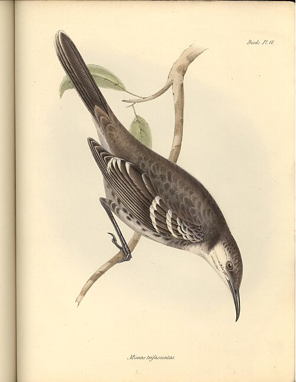

A week out of Lima, on September 15, 1835, the [_Beagle_](kloom:e/hms-beagle) reached the **[Galápagos Islands](kloom:e/galapagos-islands)**, volcanic islands on the equator some six hundred miles west of the mainland, annexed in 1832 by Ecuador, the new Republic of the Equator. She stayed five weeks while the officers charted them. [Darwin](kloom:e/charles-darwin) went ashore on four, Chatham, Charles, Albemarle and James, where he camped for nine days with the surgeon Benjamin Bynoe and their servants. He collected plants, insects, reptiles and birds, and much of the shooting was done by his servant **[Syms Covington](kloom:e/syms-covington)**.

On Charles Island lived between two and three hundred people, "nearly all people of colour, who have been banished for political crimes from the Republic of the Equator." Its acting governor, the Norwegian-born **[Nicholas Lawson](kloom:e/nicholas-lawson)**, told the visitors that the **[giant tortoises](kloom:e/galapagos-tortoise)** differed from island to island, and that he "could with certainty tell from which island any one was brought." Darwin admitted later that "I did not for some time pay sufficient attention to this statement, and I had already partially mingled together the collections from two of the islands."

## The mockingbirds

The birds that caught his eye were the mockingbirds. On Chatham he noted one like the Thenca of Chile. The one he caught on Charles looked different, and from then on he kept his mockingbirds by island. These are the four in his ornithological notes, with the verdict of the ornithologist **[John Gould](kloom:e/john-gould)** in London in 1837:

| Island (today's name)   | Darwin's specimen | Darwin, 1836            | Gould, 1837          | Today                                               |
| ----------------------- | ----------------- | ----------------------- | -------------------- | --------------------------------------------------- |
| Charles (Floreana)      | 3306, male        | different               | _Mimus trifasciatus_ | the Floreana mockingbird, gone from Floreana itself |
| Chatham (San Cristóbal) | 3307              | the same as Albemarle's | _Mimus melanotis_    | the San Cristóbal mockingbird                       |
| Albemarle (Isabela)     | 3349, female      | the same as Chatham's   | _Mimus parvulus_     | the Galápagos mockingbird                           |
| James (Santiago)        | 3350, male        | different               | _Mimus melanotis_    | the Galápagos mockingbird                           |

Writing up his notes at sea in 1836, Darwin reasoned through them in a passage that has been called the first expression of his doubt:

> When I see these Islands in sight of each other, & possessed of but a scanty stock of animals, tenanted by these birds, but slightly differing in structure & filling the same place in Nature, I must suspect they are only varieties. … If there is the slightest foundation for these remarks the zoology of Archipelagoes — will be well worth examining; for such facts would undermine the stability of Species.

The "would" was added afterward, a second thought. Gould made them species: three, one for Charles, one for Albemarle and one shared by James and Chatham. Taxonomy has moved since. The James birds now go with Albemarle's, and a study of their mitochondrial DNA in 2006 found four lineages that do not all match the named species, every one descended from a single colonization of the archipelago.

## The finches came later

Gould also told the **[Zoological Society](kloom:e/zoological-society-of-london)**, on January 10, 1837, that Darwin's Galápagos "blackbirds," "gross-beaks" and finches were all finches, "an entirely new group, containing 12 species." Darwin had not labeled most of them by island. "Unfortunately most of the specimens of the finch tribe were mingled together," he wrote, and what localities he later published came almost entirely from the collections of three shipmates, FitzRoy among them, as the historian **[Frank Sulloway](kloom:e/frank-sulloway)** showed. The finches barely appear in his diary. The famous sentence, that "one might really fancy that from an original paucity of birds in this archipelago, one species had been taken and modified for different ends," was added only in the 1845 edition of his _Journal_. The name **[Darwin's finches](kloom:e/darwins-finches)** came in 1936 and was made famous by **[David Lack](kloom:e/david-lack)** in 1947. Darwin, Sulloway argues, went on believing species fixed for a year and a half after he left the islands. In July 1837 he opened his first notebook on the transmutation of species, having been "greatly struck" since March by "S. American fossils — & species on Galapagos Archipelago. — These facts origin (especially latter) of all my views."

The finches earned their fame in the field. From 1973 **[Peter and Rosemary Grant](kloom:e/peter-and-rosemary-grant)** and their students measured the finches of **[Daphne Major](kloom:e/daphne-major)**, a single cone of an island. In 1977 the rains failed. Small soft seeds ran out and large hard ones, chiefly of _Tribulus_, were left. Between May 1976 and March 1978 the island's **[medium ground finches](kloom:e/medium-ground-finch)** fell by 85 percent. Large birds with deep beaks, which could crack the hard seeds, survived best, and Peter Boag and Peter Grant reported in 1981 that the selection was the strongest yet measured in a wild vertebrate. The drought was measured in the seeds:

| Sample on Daphne Major | Seed size–hardness index |
| ---------------------- | ------------------------ |
| April 1973             | 0.84                     |
| December 1973          | 1.19                     |
| July 1975              | 1.01                     |
| March 1976             | 1.03                     |
| June 1977              | 6.53                     |
| December 1977          | 5.19                     |

## Tortoises for the table

Darwin's shipmates ate the evidence. The _Beagle_ took eighteen tortoises aboard at Chatham and then thirty adults for the Pacific crossing, and ate them all; the few that reached England were too young to tell apart. On Charles Island tortoise shells served as flowerpots, and the island's own tortoise was extinct within about ten years of the visit. The **[Floreana mockingbird](kloom:e/floreana-mockingbird)** was gone from Floreana by 1888, after rats, cats and goats arrived; it survives on two islets offshore. The trail sails on across the Pacific, to the coral reefs.
