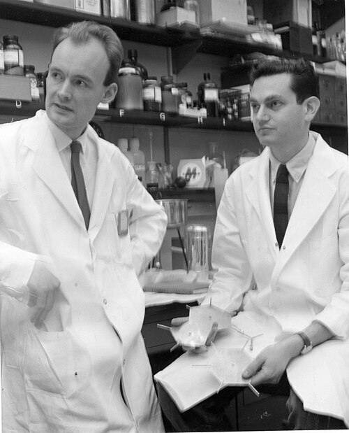

The double helix of 1953 showed that a gene is a sequence of four kinds of base along a strand of DNA. A protein is a sequence of twenty kinds of amino acid. Something had to turn one sequence into the other, and that something is the **[genetic code](kloom:e/genetic-code)**.

## A problem for theorists

The first answer came from a physicist. In 1954 **[George Gamow](kloom:e/george-gamow)** proposed that amino acids fitted into diamond-shaped holes between the bases of the double helix, each hole formed by four bases, so that neighboring holes shared bases. He and **James Watson** founded the **[RNA Tie Club](kloom:e/rna-tie-club)**, twenty members for the twenty amino acids and four honorary ones for the bases, each with a wool tie embroidered with a helix. **[Francis Crick](kloom:e/francis-crick)** dismissed Gamow's code with the proteins already read: an overlapping code allows only some neighbors, and "even the sequences of the insulin molecule are sufficient" to rule it out, he wrote in 1958. Those sequences were **[Frederick Sanger](kloom:e/frederick-sanger)**'s.

Crick's own contribution, in a note to the club in 1955, was the adaptor: amino acids could not fit a nucleic acid directly, so each must be carried by a small molecule that paired with the template. In his 1957 lecture, printed in 1958, he set out the **[central dogma](kloom:e/central-dogma-of-molecular-biology)**:

> This states that once 'information' has passed into protein it cannot get out again.

The template was **[RNA](kloom:e/rna)**, which carries the base uracil (U) where DNA has thymine. Twenty amino acids from four bases needs words of at least three letters: by our arithmetic, pairs give only 16 words, triplets 64. Everyone guessed three. No one had read a word.

## Poly-U

**[Marshall Nirenberg](kloom:e/marshall-warren-nirenberg)**, a biochemist at the **[National Institutes of Health](kloom:e/national-institutes-of-health)** in Bethesda, Maryland, turned to protein synthesis at the end of 1958 and wrote in his notebook: "Could crack life's code!" In 1960 he was joined by **[Heinrich Matthaei](kloom:e/j-heinrich-matthaei)**, a German postdoctoral fellow. They broke open cells of **[_Escherichia coli_](kloom:e/escherichia-coli)** by grinding them with alumina and kept the cell-free juice, with its ribosomes, which went on making **protein** in a test tube. Treated with an enzyme that destroys DNA and left to run down, it made almost no protein until RNA was added: RNA of their choice.

The amino acids were labeled with radioactive carbon-14, one or a few to a tube. After incubation the protein was thrown down with acid, washed and counted: radioactivity in the protein meant that amino acid had been built in. Early one morning in May 1961 Matthaei added poly-U, a synthetic RNA made only of uracil, to a tube labeled with **[phenylalanine](kloom:e/phenylalanine)**. The NIH's history office dates it Saturday 27 May at three in the morning; Wikipedia's article on Matthaei says 15 May. Their paper, in counts per minute per milligram of protein after thirty minutes:

| Labeled amino acids in the tube                                 | Blank, stopped at once | No RNA added | Poly-U added |
| --------------------------------------------------------------- | ---------------------: | -----------: | -----------: |
| Phenylalanine                                                   |                     25 |           68 |       38,300 |
| Glycine, alanine, serine, aspartic acid, glutamic acid          |                     17 |           20 |           33 |
| Eleven others, among them leucine, tyrosine, proline and valine |                     73 |          276 |          899 |
| Cysteine (labeled with sulfur-35)                               |                      6 |           95 |          113 |

Poly-U multiplied phenylalanine's count about 560 times, by our arithmetic, and barely touched the rest. Without ribosomes the count fell to 52; with an enzyme that destroys RNA, to 120. The product behaved in every solvent as polyphenylalanine did. "One or more uridylic acid residues therefore appear to be the code for phenylalanine," they wrote; whether the code was "of the singlet, triplet, etc., type has not yet been determined." Poly-C, they added in proof, gave polyproline.

In August 1961 Nirenberg read the result to about two dozen people at the International Congress of Biochemistry in Moscow. **Matthew Meselson** heard it and fetched Crick, who gave him the stage of the symposium he chaired, before an audience of about a thousand.

## Three at a time

In Cambridge that summer and autumn Crick, **[Sydney Brenner](kloom:e/sydney-brenner)**, Leslie Barnett and Richard Watts-Tobin settled the length of the word with no chemistry at all. A dye, proflavin, seemed to add or remove a single base in a gene of a phage that infects _E. coli_; at Caltech the physicist **[Richard Feynman](kloom:e/richard-feynman)** had stumbled on such a suppressor too, and could not explain it. In Cambridge one mutation knocked the gene out, and a second of opposite "sign" nearby restored it. Two of one sign did not:

| Mutations in the gene | How the bases are read after them | Phage grows? |
| --------------------- | --------------------------------- | ------------ |
| None                  | In threes from the start          | Yes          |
| One (+)               | Shifted by one, garbled           | No           |
| One (+), one (−)      | Garbled only between the two      | Yes, mostly  |
| Two (+ +)             | Shifted by two, garbled           | No           |
| Three (+ + +)         | Back in step after the third      | Yes, mostly  |

All six triple mutants they built grew. The code, they wrote in _Nature_ that December, is read in non-overlapping groups of three from a fixed starting point, and is probably "degenerate", with several triplets for one amino acid. "The genetic code may well be solved within a year."

## The whole table

It took five. RNA of two or three bases in known proportions gave the bases of about fifty codons, but not their order. In 1964 Nirenberg and **Philip Leder** found that a ribosome holds an amino acid's adaptor, **transfer RNA**, when given a single triplet: AAA held lysine's, and AA held nothing. **[Har Gobind Khorana](kloom:e/har-gobind-khorana)**, at Wisconsin, made RNAs of repeating sequence: UCUCUC… gave serine and leucine, alternating. By 1966 the table was full:

| First base ↓ second → | U                                      | C   | A                                | G                                       |
| --------------------- | -------------------------------------- | --- | -------------------------------- | --------------------------------------- |
| U                     | Phe (UUU, UUC) · Leu (UUA, UUG)        | Ser | Tyr (UAU, UAC) · stop (UAA, UAG) | Cys (UGU, UGC) · stop (UGA) · Trp (UGG) |
| C                     | Leu                                    | Pro | His (CAU, CAC) · Gln (CAA, CAG)  | Arg                                     |
| A                     | Ile (AUU, AUC, AUA) · Met, start (AUG) | Thr | Asn (AAU, AAC) · Lys (AAA, AAG)  | Ser (AGU, AGC) · Arg (AGA, AGG)         |
| G                     | Val                                    | Ala | Asp (GAU, GAC) · Glu (GAA, GAG)  | Gly                                     |

Synonyms differ mostly in the third base, so many mutations change nothing. The 1968 Nobel Prize in Physiology or Medicine went to Nirenberg, Khorana and **Robert W. Holley**, who had worked out the structure of a transfer RNA. Matthaei, who ran the poly-U tube, was left out, one of the prize's disputed omissions.

Nirenberg had once applied to work with Jacques Monod in Paris and been turned down. Monod's laboratory, in the same months, had found how a cell decides which words to read, the next frame.
