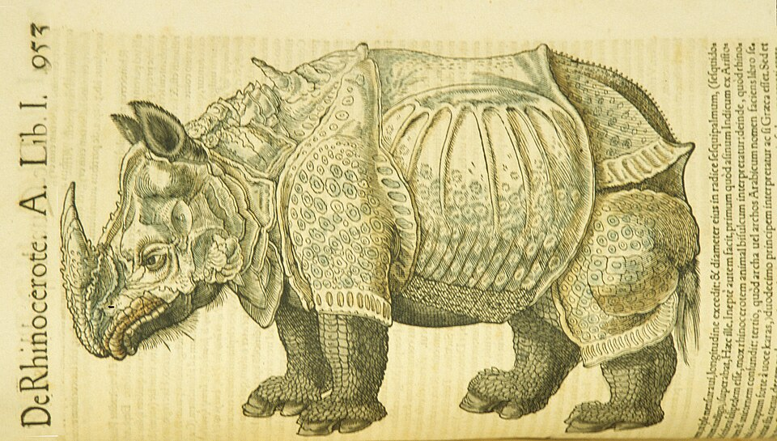

In 1551 the printer **[Christoph Froschauer](kloom:e/christoph-froschauer)** of **[Zurich](kloom:e/zurich)** brought out a folio of 1,160 pages on the animals that bear live young and walk on four feet. Its author was **[Conrad Gessner](kloom:e/conrad-gessner)**, a physician of thirty-five, the son of a poor Zurich furrier, who in 1554 became the city's physician. The book was the first volume of the **[_Historiae animalium_](kloom:e/historia-animalium-gessner-book)**, the "histories of animals", the first printed zoology to try to say everything known about every animal. Volumes on egg-laying quadrupeds (1554), birds (1555) and fishes and other water animals (1558) followed, and a fifth, on snakes, came out in 1587, after his death.

A note to the reader on the title page says what it holds: not a plain history of animals but "copious commentaries" on, and "very many corrections" of, everything written about animals that he had been able to see, "especially in the works of [Aristotle](kloom:e/aristotle), [Pliny](kloom:e/pliny-the-elder), Aelian, Oppian, the writers on farming, Albertus Magnus." It had taken, he joked, as long to conceive and bring forth as an elephant is fabled to take (all translations from the Latin here are ours).

## A library in one book

Gessner was a bibliographer before he was a zoologist. His **[_Bibliotheca universalis_](kloom:e/bibliotheca-universalis)** of 1545 set out to list every writer in Latin, Greek and Hebrew, "extant and not, ancient and recent, … published and hiding in libraries." The historian **[Ann Blair](kloom:e/ann-m-blair)** counts it at 1,300 folio pages, listing 10,000 works by 3,000 authors; Wikipedia's article on the book gives 1,800 authors, and its article on Gessner 12,000 titles. Printing had made such a list possible and, for Gessner, urgent: the book opens by mourning the libraries lost in antiquity.

He wrote the _Historiae animalium_ the same way, from slips. Blair describes his working method: passages copied out by hand, or cut from letters and printed books, stored by topic and then pasted into order. He once told a correspondent he could not consult an earlier letter, because he had already cut it up. He listed among his sources more than 80 Greek writers and at least 175 Latin ones.

## Eight headings for every animal

What made the mass usable was a fixed scheme. In the preface to the 1551 volume Gessner explains it. Each animal's history is divided into eight chapters, marked with the first eight capital letters, so that a reader looking for an elephant's medicines always turns to G:

| Letter | What the chapter holds, in Gessner's words (abridged)                                                                       |
| ------ | --------------------------------------------------------------------------------------------------------------------------- |
| A      | The animal's names, Hebrew first, then Arabic, Persian, Greek, Italian, Spanish, French, German, English, Illyrian          |
| B      | The regions where it is found and how it varies by region; the body, its size and its parts, outside and in                 |
| C      | The body's natural actions: voice, senses, food, sleep, habitat, motion, mating, birth, the young, lifespan, diseases       |
| D      | The mind: temperament, virtues and vices, its friendships and enmities with other animals                                   |
| E      | Its uses, besides food and medicine: hunting and taming it, keeping it, its price, what is made of its parts, weather signs |
| F      | The animal as food, and how to cook it                                                                                      |
| G      | Remedies made from it, whole and part by part                                                                               |
| H      | Philology: names and epithets, images, proverbs, prodigies, sacrifices, fables and emblems, in parts lettered a to h        |

He chose letters rather than numbers, he says, because many animals lacked some chapters, and it "seemed absurd to call a chapter the fourth where the third was missing." The plate draws the scheme on a page. A chapter's head in the book reads, for instance, "De Rhinocerote. A."

## Pictures from life, and one that was not

The pictures were the book's other novelty. "Our pictures," Gessner wrote, "I either had made from life myself, or received, made so, from trustworthy friends (unless I warn otherwise, which is rare)." He wished they could have been printed in color; since they could not, Froschauer had some copies colored by hand for buyers willing to pay more. Gessner thanks the men who sent him drawings, among them **Lucas Schan**, a painter of Strasbourg who "drew very many birds for us from life." It was the method the herbals of **[Leonhart Fuchs](kloom:e/leonhart-fuchs)** had brought to plants nine years before.

The rhinoceros was not from life. Gessner's caption says plainly that "this picture is **[Albrecht Dürer](kloom:e/albrecht-durer)**'s," made of the animal brought from Cambay in India to King Manuel at Lisbon in 1515. Dürer had never seen it. He worked from a letter and a sketch sent to Nuremberg, and gave the animal plates, rivets and a second horn on its back. **[Dürer's Rhinoceros](kloom:e/durers-rhinoceros)** was copied for two centuries. The historian Sachiko Kusukawa, studying the sources of Gessner's pictures, finds them "varied in kind and in quality": he kept several pictures of one animal, false and true side by side, as he kept contradictory texts, so that the record would be whole.

So he kept fabulous animals too, with his doubts beside them. Of the **[unicorn](kloom:e/unicorn)** he reports the test some used to prove a horn genuine: give poison to two pigeons, and only the one that drinks the scraped horn survives. "I leave this way of testing to the rich," he wrote, for the horn cost as much as gold.

## Banned and translated

In 1559 Pope Paul IV's **[Index Librorum Prohibitorum](kloom:e/index-librorum-prohibitorum)** listed Gessner among some 550 authors whose every work was forbidden, because he was a **[Protestant](kloom:e/protestantism)**. Catholic booksellers in Venice protested, and some of his books were later allowed in expurgated copies. Gessner died in Zurich of the plague on 13 December 1565, aged 49, with his work on plants unpublished. His animals lived on in abridgements, and in English as **[Edward Topsell](kloom:e/edward-topsell)**'s _Historie of Foure-Footed Beastes_ (1607), which kept Dürer's rhinoceros.

A century later, collectors who wanted to see the animals themselves began to gather them into rooms: the cabinet of curiosities.
