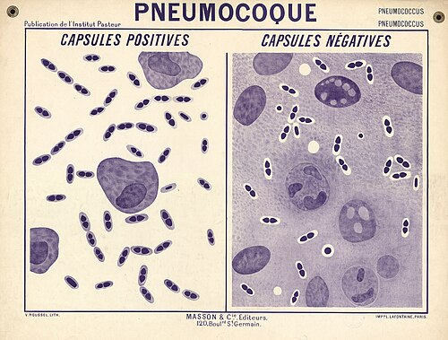

In January 1928 the _Journal of Hygiene_ printed a long paper by **[Fred Griffith](kloom:e/frederick-griffith)**, a medical officer of the Ministry of Health in London. Its title, "The Significance of Pneumococcal Types", promised epidemiology, and most of its 47 pages deliver it. Near the middle is an experiment that its author found hard to believe, and that led, sixteen years later, to the finding that genes are made of DNA.

## Typing the pneumococcus

Griffith shared the Ministry's Pathological Laboratory, in Dudley House on Endell Street, with his friend William Scott. The bacteriologist Allan Downie, who visited in the early 1930s, found one office, one laboratory and a media kitchen, and two men who did all their own bench work. He quoted an obituary of them: they "could do more with a kerosene tin and a primus stove than most men could do with a Palace."

Their subject was how infections spread. Lobar **[pneumonia](kloom:e/pneumonia)** was then a common and dreaded disease, and its main cause was **[_Streptococcus pneumoniae_](kloom:e/streptococcus-pneumoniae)**, the pneumococcus. From 1909 **[Fred Neufeld](kloom:e/fred-neufeld)** in Berlin found that a serum protecting mice against some strains failed against others, and at the [Rockefeller Institute](kloom:e/rockefeller-university) in New York **[Oswald Avery](kloom:e/oswald-avery)** and his colleagues defined Types I, II and III and a mixed Group IV. A type was the chemistry of the bacterium's **[capsule](kloom:e/bacterial-capsule)**, a coat of sugar that shields it from the body's white cells and makes its colonies smooth: the S form. Grown in serum against its own type, a strain lost its capsule and became a rough, harmless R form. Types were thought fixed, and treatment with serum depended on telling them apart. But Griffith kept finding Group IV strains in patients recovering from Type I pneumonia, and began to wonder whether one type could turn into another.

## The mice

He injected mice under the skin. Small doses of his live R pneumococci, derived from Type II, did no harm. A large mass of virulent Type I bacteria, killed by two hours at 60 °C, did no harm either. Together, they killed. His Table VII records twelve mice:

| Injected                                     | Mice | Died           | Grown from the mice                                                 |
| -------------------------------------------- | ---- | -------------- | ------------------------------------------------------------------- |
| Type I culture, heated 2 hours at 60 °C      | 4    | None           | Nothing                                                             |
| The same, with live R from Type II           | 4    | One, in 3 days | Smooth Type I from the dead mouse; R at the site in the other three |
| The same, with R grown in the heated culture | 4    | One, in 4 days | Smooth Type I from the dead mouse                                   |

The two dead mice grew pure smooth Type I from their blood: a type no living bacterium injected into them had been. "The most obvious alternative to this presumption," Griffith wrote, "is that a few Type I pneumococci in the heated culture remained viable," and he set out how he had excluded it. The heated culture was sown on plates, heated again, incubated overnight and sown again, and every plate stayed sterile. He went on to turn R forms from Type I into smooth Type II, and R forms of either into Type III. Heated R cultures never did it, and his attempts to make it happen in a tube of serum, carried through eight changes of medium, gave only R colonies.

The textbook version is four groups of mice, drawn in the plate: live R, live S, heated S, and live R with heated S. Griffith's paper has them all, but not as one experiment. Living R and living S were his everyday materials, tested many times elsewhere in the paper, and of Table VII he admitted that the R strain, "although not tested alone on this occasion," had been shown in numerous tests to be pure.

## A food, not a gene

What had happened? Griffith thought the R form kept a trace of type substance, and that it used the dead bacteria's capsular material "as a pabulum from which to build up a similar antigen": as food for building a coat. He drew conclusions for epidemiology, about types changing inside a patient, and none about heredity. He did not ask what the substance was.

Others did. Neufeld, told of the experiments on a visit to London, repeated them and asked Griffith when he would publish; his confirmation followed within months. At the Rockefeller Institute Avery at first put the result down to poor controls, but while he was away ill **[Martin Dawson](kloom:e/martin-henry-dawson)** confirmed it, and in 1931 Dawson and Richard Sia made R cells change type in a test tube, in broth with serum against the R form and heat-killed S bacteria. In 1932 James Alloway did it with a filtered extract free of whole cells, from which alcohol threw down the active substance. The laboratory came to call that substance the transforming principle, and the change **[transformation](kloom:e/genetic-transformation)**.

Griffith, Downie recalled, was very shy, rarely went to meetings and could not easily be persuaded to read a paper, and his results had waited a long time for print. He turned to typing streptococci. During **[the Blitz](kloom:e/the-blitz)** in 1941 a bomb hit his London flat, where Scott was staying, and both men were killed. Downie, who knew them, wrote that it was February; Wikipedia's article on Griffith, citing the first Griffith Memorial Lecture, gives the night of 17 April. Neither man saw the principle named. Avery's laboratory named it three years later.
