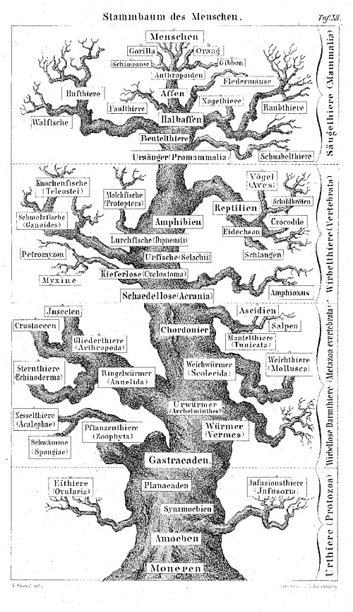
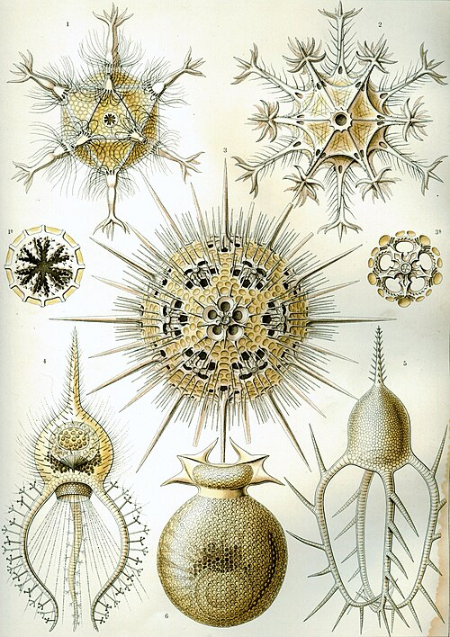

In 1859 a young German physician, **[Ernst Haeckel](kloom:e/ernst-haeckel)**, went to Messina in Sicily to study **[radiolaria](kloom:e/radiolaria)**: single-celled creatures of the open sea, most a tenth to a fifth of a millimeter across, that build skeletons of glassy silica in lattices, spheres and spines. Back in Berlin he read [Darwin](kloom:e/charles-darwin)'s [_Origin of Species_](kloom:e/on-the-origin-of-species) in Heinrich Georg Bronn's German translation and, as the historian **[Robert J. Richards](kloom:e/robert-j-richards)** puts it, "immediately became a convert." His monograph _Die Radiolarien_ (1862), illustrated with his own drawings, won Darwin's admiration and a post at the **[University of Jena](kloom:e/university-of-jena)**, where Haeckel taught for 47 years. Before the First World War, Richards writes, more people learned of evolution from his books than from any other source.

## A name for the household of nature

His wife of eighteen months, Anna Sethe, died in 1864. In grief Haeckel wrote, in about a year, the two thick volumes of _Generelle Morphologie der Organismen_ (1866), an attempt to rebuild all of biology on descent. To carry it he coined words, among them _phylum_, _ontogeny_ and _phylogeny_. And in the second volume he named a science, **[ecology](kloom:e/ecology)**, that, he complained, the textbooks had not yet recognized. In our translation:

> By ecology we understand the whole science of the relations of the organism to the surrounding outside world, to which we can reckon, in the wider sense, all "conditions of existence." These are partly organic, partly inorganic in nature. … Every organism has, among the others, friends and enemies, those that favor its existence and those that harm it.

His word was _Oecologie_, from the Greek _oikos_, which he glossed in a footnote as "the household, the relations of life." The inorganic conditions were climate, light, heat, moisture, water and soil; the organic ones were every other living thing an organism meets, as food, parasite, friend or enemy. His example came from Darwin: red clover in England sets seed only when bumblebees visit it, mice wreck the bees' nests, and cats eat the mice, so the clover crop depends, through two links, on the cats. (Haeckel ran the chain on, after Carl Vogt, through English beef to English brains and the British Empire.) Haeckel called such ties the place each organism holds "in the economy of the whole of nature," and said that physiology had left them to "uncritical natural history." The science he named grew mostly without him, in the hands of field botanists in the 1890s, but the word is still his.

## Trees, embryos and a law that failed

Haeckel drew the history of life as branching trees, the first of them in the _Generelle Morphologie_. In this one, from his _Anthropogenie_ of 1874, single cells form the roots and humans the crown.

To read such trees he relied on a rule he called the biogenetic law: "ontogeny recapitulates phylogeny," the embryo climbing through the adult forms of its ancestors. In _Natürliche Schöpfungsgeschichte_ (1868), his popular book of lectures, he printed one woodcut three times, labeled the embryo of a dog, a chicken and a turtle. The Swiss zoologist **[Ludwig Rütimeyer](kloom:e/ludwig-ruetimeyer)** caught it in a review at the end of 1868, and Haeckel replaced the three with one in 1870. The anatomist **[Wilhelm His](kloom:e/wilhelm-his-sr)** attacked his embryo drawings again in 1874, and the charge of fraud followed Haeckel for the rest of his life.

The law, as **[recapitulation theory](kloom:e/recapitulation-theory)**, is wrong: embryos do not pass through the adult stages of their ancestors, and in 1997 the embryologist Michael Richardson and colleagues, comparing real specimens of vertebrate embryos at the stage Haeckel drew, found them to vary more than tenfold in length, and concluded that his figures show "not a conserved stage for vertebrates, but a stylised amniote embryo." Historians judge him less simply. Richardson and Gerhard Keuck wrote in 2002 that some criticisms of the drawings "are legitimate, others are more tendentious," and that the law holds for single characters, if not whole stages. Richards argues that Haeckel adapted the drawings of the experts of his day.

## Art forms, and the trees of men

After the **[Challenger expedition](kloom:e/challenger-expedition)** of 1872–76 brought home samples from the world's oceans, Haeckel described its radiolaria: 4,318 species in 739 genera, 3,508 of them new. Some build their skeletons on the solids of geometry, and _Circogonia icosahedra_ is a regular icosahedron of twenty triangles, its twelve corners carrying hollow spines, as the plate draws it. It is the first figure of the first plate of **[_Kunstformen der Natur_](kloom:e/kunstformen-der-natur)** (1899–1904), a hundred plates printed by the lithographer Adolf Giltsch on which Art Nouveau designers drew.

Haeckel joined all this in a monism: matter and spirit as one substance, God as nature. He applied his trees to people, too. _Natürliche Schöpfungsgeschichte_ ranked human "species" from Papuans and Khoikhoi up to Europeans, and in 1904 he wrote that "lower races" were "psychologically nearer to the mammals (apes or dogs) than to civilized Europeans; we must, therefore, assign a totally different value to their lives." In 1971 the historian **[Daniel Gasman](kloom:e/daniel-gasman)** argued that Haeckel bore a particular responsibility for the racial thinking of the Nazis. Richards answers that Haeckel was not an antisemite (he set Jews near the top of his scale), that such racism was common in his century, and that the Nazis were divided over him: an SS biologist praised him in 1936, and a 1935 party list of banned books named him. Both sides agree that his trees of human worth were false. The next frame turns his household of nature into equations.
