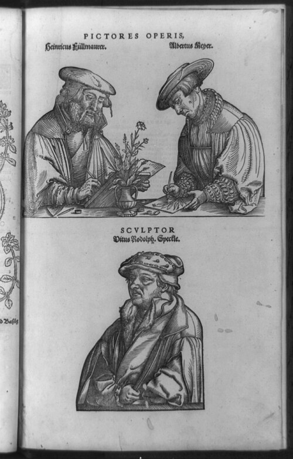
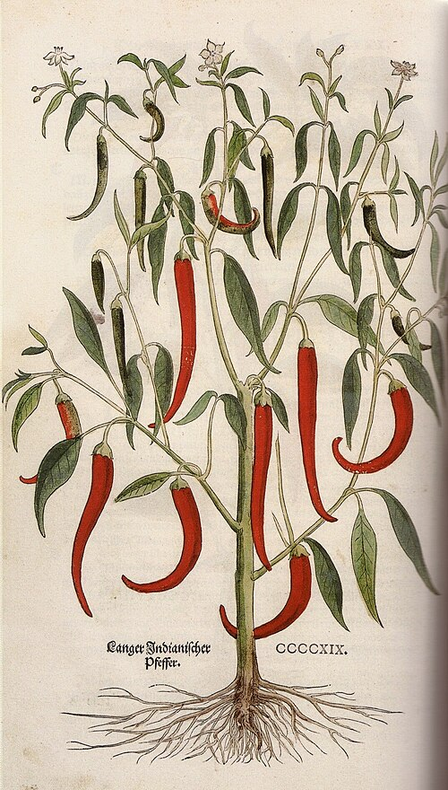

A [herbal](kloom:e/herbal) is a book of plants and what they are good for, written for physicians and apothecaries. For fifteen hundred years the authority was **[Dioscorides](kloom:e/dioscorides)**, a Greek physician of the first century AD, whose **[_De materia medica_](kloom:e/de-materia-medica)** describes some 500 plants and the drugs made from them. Its text was copied by hand, and so were its pictures. The **[Vienna Dioscurides](kloom:e/vienna-dioscurides)**, a copy made in Constantinople in about AD 512 for the princess Anicia Juliana, has drawings that the botanist **[Agnes Arber](kloom:e/agnes-arber)**, in her 1912 history of herbals, called "remarkably beautiful, and very naturalistic." But every copy was made from another copy, and a picture copied from a picture drifts from the plant.

## Pictures from pictures, then from plants

Printing made the problem faster. The first printed herbals, in the 1480s, were illustrated with woodcuts, and the cuts of a German herbal printed at Mainz in 1485, Arber found, "form the basis of nearly all botanical illustrations for the next half-century, being copied and recopied from book to book." A reader could not hold one up against a plant and be sure.

The break came in 1530, at Strasbourg, with **[Otto Brunfels](kloom:e/otto-brunfels)**'s _Herbarum vivae eicones_, "living pictures of plants." Its artist, **[Hans Weiditz](kloom:e/hans-weiditz)**, drew the specimen in front of him and nothing else, so faithfully that some of his plants have withered leaves or holes eaten by insects. Brunfels's text was weaker than his pictures. He tried to find Dioscorides's plants, which grew around the Mediterranean, in the fields of the Rhine, and many of them were not there. [Theophrastus](kloom:e/theophrastus), Arber notes, had pointed out eighteen centuries earlier that different regions have different plants.

## How Fuchs made his book

**[Leonhart Fuchs](kloom:e/leonhart-fuchs)**, professor of medicine at Tübingen, planted the university's first medicinal garden in 1535 and spent a decade on a herbal of his own. **[_De historia stirpium_](kloom:e/de-historia-stirpium-commentarii-insignes)**, printed at [Basel](kloom:e/basel) by Michael Isingrin in 1542, describes about 500 plants, over a hundred of them for the first time, with 512 woodcuts. In his preface, in Arber's translation, Fuchs says what he asked of his artists:

> Each of which is positively delineated according to the features and likeness of the living plants … we have devoted the greatest diligence to secure that every plant should be depicted with its own roots, stalks, leaves, flowers, seeds and fruits. Furthermore we have purposely and deliberately avoided the obliteration of the natural form of the plants by shadows, and other less necessary things, by which the delineators sometimes try to win artistic glory.

A picture took three people, and Fuchs printed their portraits at the end of the book:

| Step                | Who                    | What was done                                                      |
| ------------------- | ---------------------- | ------------------------------------------------------------------ |
| Draw from life      | Heinrich Füllmaurer    | The plant drawn whole, roots to fruit, in outline                  |
| Copy onto the block | Albrecht Meyer         | The drawing traced, reversed, onto a smoothed wooden block         |
| Cut                 | Veit Rudolph Speckle   | Everything but the lines cut away, leaving them standing in relief |
| Print               | Isingrin's shop, Basel | The block inked and printed in the press with the type             |
| Color (some copies) | Colorists, by hand     | Washes laid on each printed picture                                |

Arber gives the drawing to Füllmaurer and the copying to Meyer; other accounts, among them Wikipedia's article on the book, give it the other way round. The woodcut portrait itself shows both men at a table with a plant in a vase. The plate draws the third man's work: a relief block in section, its lines left standing at the height of the type beside it, the cut-away ground below them taking no ink. Fuchs's refusal of shading was a scientific choice as well as a style. A line block prints only lines, and a clean outline of each leaf and root could be read, copied and checked against the plant.

## Plants from a new world

Fuchs ordered his plants alphabetically and made no attempt at a natural classification. But his book was among the first to picture plants from the Americas, among them [maize](kloom:e/maize) and the [chili pepper](kloom:e/chili-pepper), which the German edition of 1543 calls _Langer Indianischer Pfeffer_, long Indian pepper, after the Indies. Both had crossed the Atlantic in the fifty years since [Columbus](kloom:e/christopher-columbus).

Pictures were not the only way to keep a plant. In Italy in the same years **[Luca Ghini](kloom:e/luca-ghini)** taught his students to press fresh plants between sheets of paper and dry them, a "dry garden" that could be studied in winter. Ghini's own has not survived. The oldest herbarium that has, Gherardo Cibo's, dates from about 1532.

Fuchs's book went through 39 printings in his lifetime, in five languages. A decade later **[Conrad Gessner](kloom:e/conrad-gessner)**, in Zurich, set out to do the same for animals.
