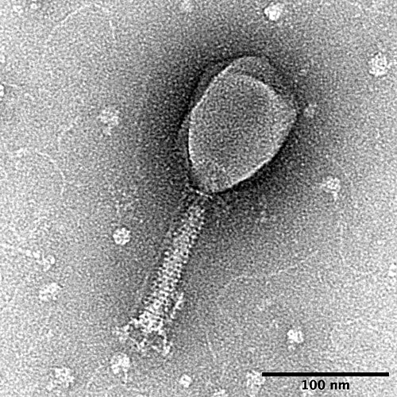

In 1952 the question of what genes are made of was settled, for many biologists, with a kitchen blender. **[Alfred Hershey](kloom:e/alfred-hershey)** and **[Martha Chase](kloom:e/martha-chase)**, at the Department of Genetics of the **[Carnegie Institution of Washington](kloom:e/carnegie-institution-for-science)** at **[Cold Spring Harbor](kloom:e/cold-spring-harbor-laboratory)** on Long Island, showed that when a virus infects a bacterium, its [DNA](kloom:e/dna) goes in and nearly all of its [protein](kloom:e/protein) stays outside. The work is known as the **[Hershey–Chase experiment](kloom:e/hershey-chase-experiment)**.

## The phage group

The virus was T2, a **[bacteriophage](kloom:e/bacteriophage)**: a virus that infects bacteria, here **[_Escherichia coli_](kloom:e/escherichia-coli)**. From about 1940 an informal school had grown up around three men who used phages to study heredity: **[Max Delbrück](kloom:e/max-delbruck)**, a physicist who had left Germany in 1937, **[Salvador Luria](kloom:e/salvador-luria)**, an Italian physician newly arrived in the United States, and Hershey, a chemist at Washington University in St. Louis, who joined them in 1943. They agreed in 1944 to work on the same few phages, shared results freely, and from 1945 taught a summer phage course at Cold Spring Harbor. They were the **[phage group](kloom:e/phage-group)**. A phage's infection could be followed in a flask in an afternoon, and in minutes it could make hundreds of new particles inside its host. When the Nobel Prize went to the three in 1969, the Karolinska Institute said that their methods had "turned bacteriophage research into an exact science."

A phage is little more than protein and DNA, the DNA packed inside a protein head. Thomas Anderson's electron micrographs showed T2 attaching to bacteria by its tail, and a sudden change of salt could burst the particles into empty protein "ghosts" and free DNA. Hershey asked whether infection split them the same way.

## Two labels and a blender

Phosphorus is in DNA but not in the phage's protein; sulfur is in the protein but not in DNA. So Hershey and Chase grew phages on bacteria fed radioactive **[phosphorus-32](kloom:e/phosphorus-32)** or sulfur-35, making one stock labeled in its DNA and another in its protein. The isotopes, a footnote says, came from the **[Oak Ridge National Laboratory](kloom:e/oak-ridge-national-laboratory)** through the Atomic Energy Commission. Its X-10 reactor, built for the Manhattan Project, had been sending out isotopes for research since 1946, phosphorus-32 among them.

They let each stock attach to bacteria, washed off what had not attached, and ran the suspension in a Waring Blendor at 10,000 revolutions a minute, a minute at a time, cooling it in ice water between runs. Then they spun it in a centrifuge: the bacteria went to the bottom, and whatever had been torn off them stayed in the fluid. Their Table V gives one experiment, with fewer phages than bacteria:

| Label               | Blender     | In the fluid | Infected cells still making phage |
| ------------------- | ----------- | ------------ | --------------------------------- |
| Sulfur-35 (protein) | None        | 16%          | 101%                              |
| Sulfur-35 (protein) | 2.5 minutes | 81%          | 78%                               |
| Phosphorus-32 (DNA) | None        | 10%          | 120%                              |
| Phosphorus-32 (DNA) | 2.5 minutes | 21%          | 82%                               |

Across their runs the blender stripped 75 to 80 percent of the sulfur but only 21 to 35 percent of the phosphorus, half of that coming off with no blending at all, and the stripped cells went on making phage. Retellings give the phosphorus as anything from 15 percent (the paper's own summary) to 40. Then the labels were followed into the next generation. Offspring of sulfur-labeled phage carried less than 1 percent of their parents' sulfur; offspring of phosphorus-labeled phage carried 30 percent or more of their parents' phosphorus. The paper concluded with care: the protein "probably has no function in the growth of intracellular phage. The DNA has some function. Further chemical inferences should not be drawn from the experiments presented."

## Why it convinced

Historians have noticed the irony. About a fifth of the phage sulfur was unaccounted for, and the paper could not say whether sulfur-free protein went in with the DNA. Peter Reichard, who studied the Nobel committee's files on Avery, points out that the protein that entered the cells was a much larger contamination than any in Avery's DNA, and that the phage group had viewed Avery's claim with considerable skepticism. The National Library of Medicine's account calls the experiment "not as carefully conceived and executed as Avery's had been". Yet it was taken as proof. The historian Frederic Holmes points to Hershey writing directly to doubting colleagues; Michel Morange, to timing, since by 1952 biologists were readier to consider DNA. And it came from inside the phage group, the people working on the gene. [James Watson](kloom:e/james-watson) had been Luria's first graduate student.

## Who got the credit

Chase, a 1950 graduate of the College of Wooster, was Hershey's research assistant, and her name is on the paper and on the experiment. The 1969 prize went to Delbrück, Hershey and Luria, and the Nobel announcement said of the experiment that "he was able to show (1952)" that only the nucleic acid entered the bacterium. Chase left Cold Spring Harbor in 1953 for Oak Ridge and the University of Rochester, took a doctorate at the University of Southern California in 1964, and never held a tenured post or a laboratory of her own. A 2024 study at Rochester called her "The Woman in STEM Who Was Forgotten". She died in Ohio in 2003; a family of bacteriophages, the Chaseviridae, is named for her.

Seven months after the paper, Watson and Francis Crick proposed the double helix.
