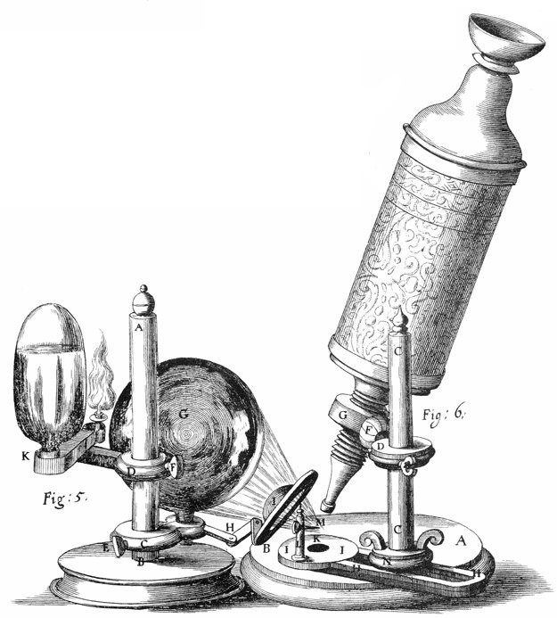
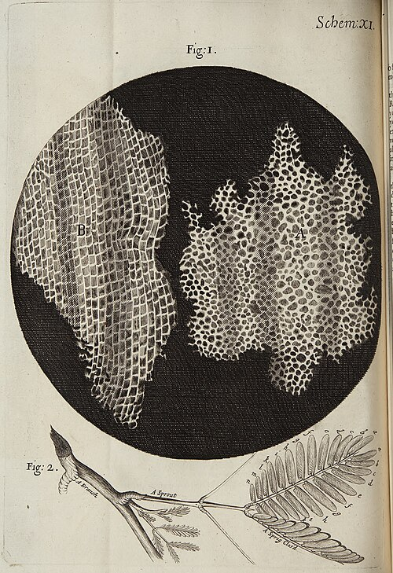
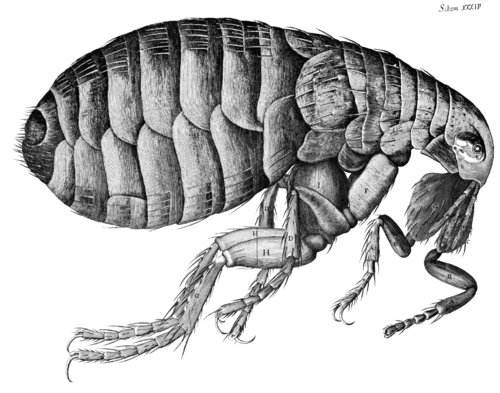

On 20 January 1665 the naval official **[Samuel Pepys](kloom:e/samuel-pepys)** collected a new book from his bookseller, "Hooke's book of microscopy, a most excellent piece." The next night, he wrote in his diary, "I sat up till two o'clock in my chamber reading of Mr. Hooke's Microscopicall Observations, the most ingenious book that ever I read in my life." It was **[_Micrographia_](kloom:e/micrographia)**, by **[Robert Hooke](kloom:e/robert-hooke)**: sixty observations, each with its engraving, of things too small to see, from the point of a needle and the edge of a razor, through mold, sand, hair and insects, to the Moon and stars at the end.

Hooke was twenty-nine. At Oxford he had been the assistant of **[Robert Boyle](kloom:e/robert-boyle)**, and had built Boyle's air pump. Since 1662 he had been Curator of Experiments to the **[Royal Society](kloom:e/royal-society)**, paid to show the fellows something new at their weekly meetings. The Society's Council licensed the book on 23 November 1664, its printers printed it, and it came out in January 1665, two months before the first number of the Society's journal.

## A lamp, a globe of brine and a lens

The **[microscope](kloom:e/microscope)** Hooke used most was a compound one, probably made in London by **[Christopher Cock](kloom:e/christopher-cock)**: a tube six or seven inches long, with four drawers to lengthen it, an object glass at the bottom, an eye glass at the top and a third glass between them to widen the view. For close work he took the middle glass out, "for always the fewer the Refractions are, the more bright and clear the Object appears." His real problem was light. The object glass was tiny, so few rays got through it, and a magnified object looked dark and indistinct. His answer was to pour light onto the specimen.

By day he set the microscope on a table three or four feet from a south window and gathered the window's light with a globe of water or a thick lens. At night he used the stand in his figure, which the plate draws in section:

| Part, as Hooke lettered it | What it did                                                                         |
| -------------------------- | ----------------------------------------------------------------------------------- |
| Lamp K                     | A small oil flame, set level with the globe                                         |
| Globe G                    | A glass ball "fill'd with exceeding clear Brine", gathering the flame's light       |
| Convex glass I             | A deep plano-convex lens on a jointed arm, throwing the gathered light onto the pin |
| Pin M                      | The specimen, stuck on its point, turned to the light and to the eye                |
| Object and eye glasses     | The microscope proper, its tube clamped to a pillar beside the stage                |

With it, he wrote, "with the small flame of a Lamp may be cast as great and convenient a light on the Object as it will well indure; and being always constant, and to be had at any time, I found most proper for drawing the representations of those small Objects I had occasion to observe." He measured magnification with both eyes open: one at the microscope, the other on a ruler laid beside it, so that the enlarged object seemed to lie on the scale. In the same preface he described another kind of microscope, a single tiny bead of glass melted on the end of a glass thread and set in a pinhole in a metal plate. It magnified better than "any of the great Microscopes," he admitted, but it was "very troublesome to be us'd."

## A great many little boxes

The eighteenth observation is of **[cork](kloom:e/cork-material)**. Hooke cut a slice "exceeding thin" with a penknife "sharpen'd as keen as a Razor," laid it on a black plate because cork is white, and lit it with his deep lens. It was "all perforated and porous, much like a Honey-comb," its walls as thin, compared with the spaces between them, as "those thin films of Wax in a Honey-comb." Cut lengthwise, each long pore turned out to be divided by cross-walls into "a great many little Boxes." Hooke called them **[cells](kloom:e/cell-biology)**, the word for a honeycomb's chambers. Many accounts, among them Wikipedia's article on _Micrographia_ and the biologist Nick Lane, say he was thinking of monks' small rooms. Hooke's own comparison is the honeycomb.

Then he counted. He found "about threescore of these small Cells placed end-ways in the eighteenth part of an Inch," and multiplied it out:

| Hooke's count of cork's cells | Number        |
| ----------------------------- | ------------- |
| In one eighteenth of an inch  | about 60      |
| In an inch                    | 1,080         |
| In a square inch              | 1,166,400     |
| In a cubic inch               | 1,259,712,000 |

"A thing almost incredible," he wrote, "did not our Microscope assure us of it by ocular demonstration." By our arithmetic, his count makes each cell about 23.5 micrometers across.

## Fleas, lice and what he did not see

The plates people remembered were the insects. The **[flea](kloom:e/flea)**, "adorn'd with a curiously polish'd suit of sable Armour," was engraved on a sheet that folded out larger than the book, and the louse larger still. Hooke starved some lice for two or three days and let one feed on his hand, and watched "a small current of blood, which came directly from its snout, and past into its belly."

What Hooke saw in cork were walls. The cells were dead and full of air, which was why, he reasoned, cork is light and springy and holds the air in a bottle. In green plants he saw the same cells "fill'd with juices," and took them for pipes for the plant's nourishment. He said nothing about cells being alive, or about everything living being made of them. Wikipedia's article on cell biology says he called them "the building blocks of all living organisms," which is more than he wrote. That idea came in 1838 and 1839, from **[Matthias Schleiden](kloom:e/matthias-jakob-schleiden)** and **[Theodor Schwann](kloom:e/theodor-schwann)**. The next frame goes from the microscope to the meat market, in Florence.
