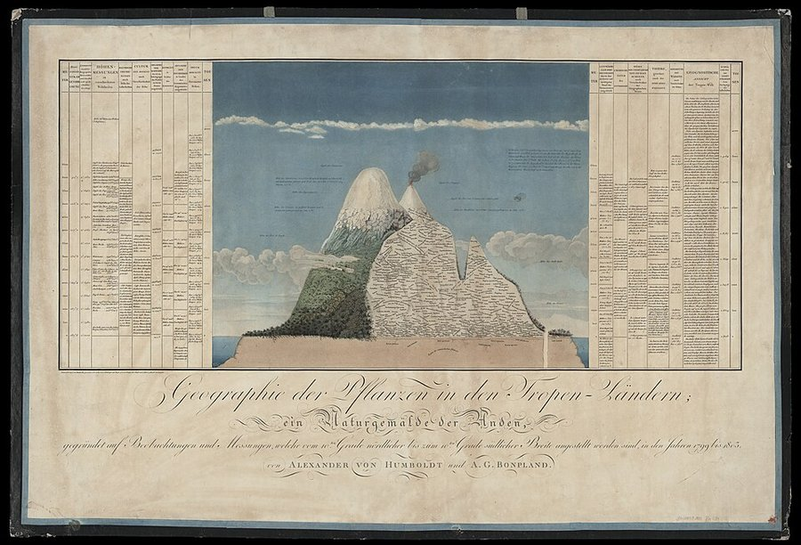

On 5 June 1799 the Prussian naturalist and former mining inspector **[Alexander von Humboldt](kloom:e/alexander-von-humboldt)** and the French botanist **[Aimé Bonpland](kloom:e/aime-bonpland)** sailed from La Coruña with the Spanish crown's permission to travel in its American colonies, at Humboldt's own expense. They landed at Cumaná, in Venezuela, in July, and did not see Europe again until August 1804. They went up the Orinoco, climbed the Andes from Bogotá to Lima and spent a year in Mexico. Humboldt carried a small laboratory: barometers, thermometers, a sextant, a hygrometer, an electrometer, a cyanometer to measure the blue of the sky. He measured everything, and the question he kept asking was why a plant grows where it does.

## Chimborazo in section

On 23 June 1802, with Bonpland, the young Quito nobleman **[Carlos de Montúfar](kloom:e/carlos-de-montufar)** and a party of Indigenous porters, Humboldt tried to climb **[Chimborazo](kloom:e/chimborazo)**, the highest of the Andes as then measured. Fresh snow and altitude sickness stopped them at about 5,878 meters, nearly 400 meters below the summit, higher than any European was known to have climbed.

What he made of the Andes was a picture. In the _Essay on the Geography of Plants_, dated 1805 on its title page and published with Bonpland in 1807, a large engraved plate shows the mountain in section from the Pacific to the Amazon. On its slopes are the names of plants, placed, he wrote (in our translation), "compass in hand," each at the height where he and Bonpland had found it on the scale of meters beside the drawing, and written slanting where a plant covered a band of heights. Down both sides run fourteen columns, each a quantity that changes with height: temperature, air pressure, humidity, the chemistry and electrical tension of the air, the boiling point of water, the fall in gravity, the farming at each level and the animals living there. The cyanometer read 16° over Paris in summer, about 23° in the tropics, and 46° at some 5,900 meters in the Andes. Barometer readings became heights by Laplace's formula; Gaspard de Prony had more than 400 of them worked out. The temperatures came from several thousand readings, taken in the shade, often hourly. Here are Humboldt's own figures, with the plants his text puts in each band:

| Height (m)  | Mean temperature (°C) | Plants, as the _Essay_ places them                   |
| ----------- | --------------------- | ---------------------------------------------------- |
| 0–1,000     | 25.3                  | Palms, bananas and heliconias                        |
| 1,000–2,000 | 21.2                  | Tree ferns (400–1,600 m); cinchona begins            |
| 2,000–3,000 | 18.7                  | Cinchona (to 2,900 m); oaks from 1,700 m             |
| 3,000–4,000 | 9.0                   | Trees nearly cease at 3,500 m; shrubs of the páramo  |
| 4,000–5,000 | 3.7                   | Grasses, the _pajonal_ (4,100–4,600 m); then lichens |
| 5,000–6,000 | about −2              | Lichens on bare rock, the last seen at 5,554 m       |

From such numbers he drew rules. Under the equator the air cooled by about one degree for every 200 meters of climb, and he proposed that the snow line, anywhere on Earth, lay at roughly 200 meters times the mean temperature of the lowlands below. At 45 degrees north, where that mean is 12.5 °C, he worked it out at 2,420 meters.

The picture was more certain than its data. In 2019 a team led by the historian Pierre Moret and the ecologist Olivier Dangles, working from Bonpland's field journal and the herbarium labels, showed that most of the high plants were collected not on Chimborazo, where snow had stopped the party, but on **[Antisana](kloom:e/antisana)**, in March 1802. Humboldt had put the grasses above the alpine plants, the reverse of what he saw, and he revised the upper zones in 1817 and 1824. Their team climbed Antisana again in 2017 and found that one groundsel Bonpland had collected at the snow line, at 4,860 meters, now grows some 215 to 266 meters higher.

## A web, and those who wove it

In 1817 Humboldt drew lines of equal mean temperature across a map, isotherms, so that the climates of places far apart could be compared at a glance. His last work, **[_Kosmos_](kloom:e/cosmos-humboldt-book)** (1845–62), began as lectures in Berlin in 1827–28. Nature, in Elise Otté's translation of 1849, "is a unity in diversity of phenomena; a harmony blending together all created things, however dissimilar in form and attributes; one great whole … animated by the breath of life." **[Charles Darwin](kloom:e/charles-darwin)** wrote from Brazil in 1832, "I formerly admired Humboldt, I now almost adore him," and ranked the _Personal Narrative_ of the journey among the two books that most shaped him. **[Henry David Thoreau](kloom:e/henry-david-thoreau)** and **[John Muir](kloom:e/john-muir)** read him too.

Humboldt did not work alone. The Spanish crown's botanist in Bogotá, **[José Celestino Mutis](kloom:e/jose-celestino-mutis)**, opened his collection of thousands of drawings to him. **[Francisco José de Caldas](kloom:e/francisco-jose-de-caldas)**, a self-taught scientist of New Granada who measured heights by the boiling point of water, had reached similar ideas on how altitude ordered plants; he asked to join the expedition, and Humboldt took Montúfar instead. Both men were shot in 1816 by the Spanish army retaking the colony. Some of the _Essay_'s names for the zones, such as _páramo_ and _pajonal_, are the ones the people of the country used. At Callao, Humboldt studied the fertilizing power of seabird droppings, **[guano](kloom:e/guano)**, and his writings brought it to Europe's notice.

He spent two stays in Cuba, saw its sugar estates, and in 1826 published an essay on the island. "Slavery is no doubt the greatest evil that afflicts human nature," it says in Thomasina Ross's translation. In 1856 an American edition by John S. Thrasher, a supporter of slavery, left out the chapter with which the essay ended. Humboldt protested in a Berlin newspaper, and the protest was reprinted across the United States: to that part of his work, he wrote, "I attach greater importance than to any astronomical observations, experiments of magnetic intensity, or statistical statements." Next, Ernst Haeckel gave the study of such connections a name.
