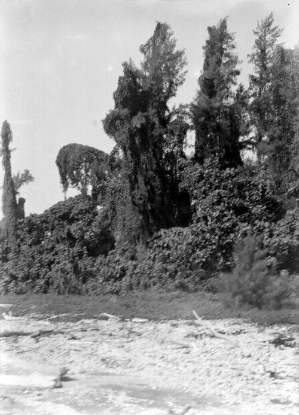

Naturalists had long seen that a large island holds more kinds of animal than a small one, and a remote island fewer than one near a mainland. In December 1963 two young biologists offered a reason. **[Robert MacArthur](kloom:e/robert-h-macarthur)**, a mathematician turned ecologist, and **[E. O. Wilson](kloom:e/e-o-wilson)**, a Harvard expert on the ants of Melanesia, published "An Equilibrium Theory of Insular Zoogeography" in _Evolution_. In 1967 they widened it into a book, **[_The Theory of Island Biogeography_](kloom:e/the-theory-of-island-biogeography)**, and gave a field its name: **[island biogeography](kloom:e/insular-biogeography)**.

## Ten times the area, twice the species

Plot the species on islands against their area on logarithmic axes, and the points fall near a straight line. MacArthur and Wilson wrote it as _s_ = _bA_ᵏ, now usually _S_ = _cA_ᶻ, the **[species–area relationship](kloom:e/species-area-relationship)**, with the exponent "approximately 0.5" for the ponerine ants of Melanesia, 0.4 for the land birds of Indonesia and 0.3 for the beetles, reptiles and amphibians of the Greater Antilles. The Harvard zoogeographer **[Philip Darlington](kloom:e/p-jackson-darlington-jr)** had put the last as a rule of thumb in 1957: on those islands, "division of area by ten divides the amphibian and reptile fauna by two." It is the same rule: by our arithmetic, 10 to the power 0.3 is almost exactly 2.

## Two curves that cross

Remote islands were usually said to be poorer because colonists had not yet had time to reach them. MacArthur and Wilson drew instead "how the number of new species entering an island may be balanced by the number of species becoming extinct on that island," as the plate does. As species accumulate, the rate at which _new_ species arrive falls, because each arrival is more likely to belong to a species already there; it reaches zero when the whole pool of possible colonists is present. The rate of extinction rises, because more species share the ground and each is rarer. Where the curves cross, the number holds steady even though its members keep changing. A distant island has a lower immigration curve, a small one a higher extinction curve, and either way the crossing moves to fewer species.

They tested it on **[Krakatau](kloom:e/krakatoa)**, whose eruption in August 1883 left its remnants under 30 to 60 meters of hot pumice and ash: "Almost certainly the entire flora and fauna were destroyed." The Dutch botanist **[Melchior Treub](kloom:e/melchior-treub)** found 11 kinds of fern and 15 flowering plants there in June 1886; by 1906 the list of flowering plants had reached 92. The birds, as collected and summarized by K. W. Dammerman, showed what MacArthur and Wilson wanted:

| Krakatau, land and freshwater birds | 1908 | 1919–21 | 1932–34 |
| ----------------------------------- | ---: | ------: | ------: |
| Species recorded                    |   13 |      31 |      30 |

The count rose and stopped, near what their curve predicted for an island that size, but it did not stand still: five resident species seen in 1919–21 were missing in 1932–34, and five new ones had come.

They were not the first to think so. In 1948 the Canadian entomologist **[Eugene Munroe](kloom:e/eugene-g-munroe)** had sketched the same balance in a Cornell thesis on Caribbean butterflies; the ecologist Lawrence Gilbert later credited him with developing the theory "in modern form," fifteen years early. MacArthur and Wilson themselves noted that the engineer and ecologist Frank Preston had published an equilibrium idea in 1962.

## Emptying islands

In 1966 Wilson and his graduate student **[Daniel Simberloff](kloom:e/daniel-simberloff)** made the experiment on purpose. They chose small islets of **[red mangrove](kloom:e/rhizophora-mangle)** in Florida Bay, 11 to 18 meters across, with no dry ground, each home to 20 to 50 species of insects, spiders and other arthropods, every one of which they identified. Then they covered each islet with a tent and filled it with methyl bromide, at a dose that killed the arthropods and spared the trees. Through 1967 they searched each islet every 18 days. Counts from their tables, as compiled for an open data set:

| Islet | Species before | About a year after | Last census (day) |
| ----- | -------------: | -----------------: | ----------------: |
| E1    |             20 |                 13 |               360 |
| E2    |             35 |                 29 |               371 |
| E3    |             22 |                 27 |               379 |
| E7    |             23 |                 37 |               370 |
| E9    |             38 |                 29 |               364 |
| ST2   |             25 |                 23 |               322 |

"By 250 days after defaunation," they reported in 1969, "the faunas of all the islands except the most distant one ('E1') had regained species numbers and composition similar to those of untreated islands." Barklice, weak fliers carried on the wind, were the first to build large populations; ants, the islets' dominant animals, came last. The paper concluded that "a dynamic equilibrium number of species exists for any island," and two years on the numbers were little changed while immigrations and extinctions "continued at a high rate."

## Reserves as islands

A park ringed by farms is an island too. In 1975 **[Jared Diamond](kloom:e/jared-diamond)** drew rules for nature reserves from the theory, among them that one large reserve beats several small ones of the same total area. Simberloff and Lawrence Abele answered in 1976 that this was "premature": several small reserves can hold more species between them. The **[SLOSS debate](kloom:e/sloss-debate)**, single large or several small, ran for a decade, and most ecologists now hold that neither answer fits every case. In 1979 **[Thomas Lovejoy](kloom:e/thomas-lovejoy)** began an experiment north of Manaus: patches of Amazon forest of 1, 10 and 100 hectares, surveyed before the forest around them was cleared. A 2015 synthesis of such experiments on five continents found that **[habitat fragmentation](kloom:e/habitat-fragmentation)** reduced biodiversity by 13 to 75 percent, and that 70 percent of the world's remaining forest lies within a kilometer of an edge.

MacArthur died in 1972, aged 42. Wilson wrote in the preface to the book's 2001 reprint that its flaws "lie in its oversimplification and incompleteness." Run backward, its species–area curve became one of the main ways to estimate how many species lost habitat will cost, a question taken up in the biodiversity crisis.
