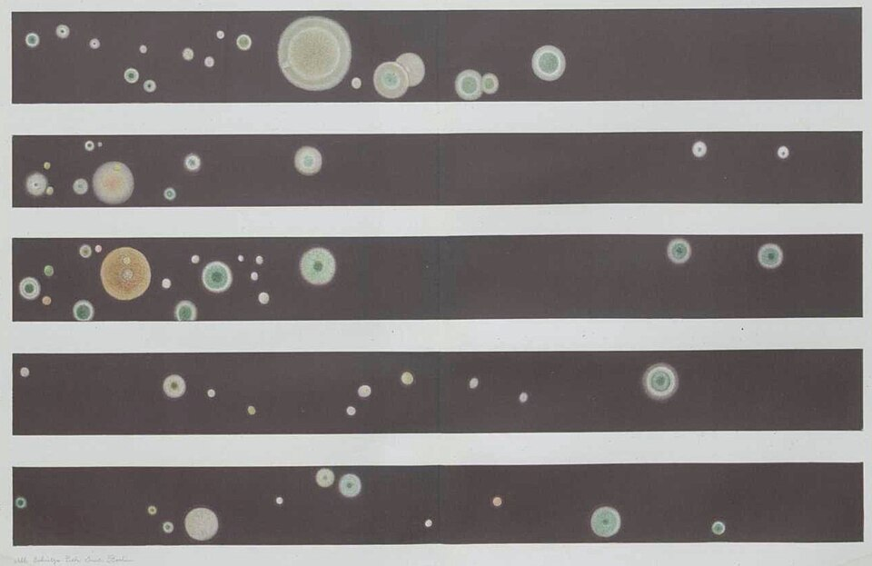

**[Robert Koch](kloom:e/robert-koch)** was a country doctor. From 1872 he was district physician at **[Wollstein](kloom:e/wolsztyn)**, in the Prussian province of Posen, and he curtained off half of his consulting room as a laboratory, with a microscope, a microtome and a darkroom for photography. Around Wollstein, **[anthrax](kloom:e/anthrax)** killed sheep and cattle, and since 1849 rods had been seen in the blood of animals dying of it. Whether the rods caused the disease or were a product of it, even whether they were alive, was still argued.

## Anthrax, 1876

Koch put a little of a dead mouse's spleen into a drop of aqueous humor from an ox's eye, sealed it in a hollow slide on a stage warmed by an oil lamp, and watched. In a few hours the rods lengthened into threads that filled the drop; then bright, oval bodies formed in the threads, and were freed when the threads broke up. Put into fresh fluid, these spores swelled and grew into threads again, and a trace of them, scratched into the root of a mouse's tail, killed it with anthrax. He passed the disease through a series of twenty mice, one after another, and found the same rods every time. Fresh bacilli dried in a thin layer lost their power in 12 to 30 hours; sheep's blood that had dried slowly enough to form spores still killed the animals he inoculated after nearly four years. So **[_Bacillus anthracis_](kloom:e/bacillus-anthracis)** lived through drought and winter as spores in the soil of the fields where infected animals had bled. **Ferdinand Cohn** printed the paper at Breslau in 1876.

## Tuberculosis, 1882

In 1880 Koch went to Berlin, to the Imperial Health Office, and with his assistants made bacteriology a set of methods. Bacteria grown on a solid surface form separate colonies, each from one cell, where in broth they mix. They tried slices of potato and then gelatin, which melts at body heat. The answer, by the account her son gave in 1937, came from **[Fanny Hesse](kloom:e/fanny-hesse)**, whose husband Walther worked with Koch: she had long used **[agar](kloom:e/agar)**, a seaweed jelly she had from Dutch friends of her mother's who had lived in Java, for jellies in her kitchen, and it stays solid at 37 °C. Koch's lecture of 1882 is the first printed mention of agar in bacteriology. Her paintings of colonies grown from air illustrated his paper of 1884:

On 24 March 1882 Koch told the Physiological Society in Berlin that he had found the cause of **[tuberculosis](kloom:e/tuberculosis)**, which, he said, killed one person in seven. Its bacillus had escaped everyone because it hardly takes a stain. He left tissue or a dried smear for a day in **[methylene blue](kloom:e/methylene-blue)** made alkaline with potash, then flooded it with a brown dye, vesuvin: everything turned brown except the bacilli, which stayed blue, often a few inside a giant cell, as the plate draws. He found them in every tuberculous lesion he examined, from people, cattle, monkeys and guinea pigs. **[Paul Ehrlich](kloom:e/paul-ehrlich)**, who was sorting blood cells by the aniline dyes they took, heard the lecture and called it "my single greatest scientific experience."

Finding was not proving. "To prove that tuberculosis is a parasitic disease," Koch said, in our translation, "the bacilli had to be isolated from the body, grown in pure cultures until they were freed of anything that might cling to them from the animal, and finally, by transferring the isolated bacilli to animals, the same disease had to be produced." He grew them on blood serum heated until it set: nothing showed for ten days, then dry scales. He made fifteen pure cultures, and injected them:

| Rabbits injected in the ear vein (experiment 11) | Number | Result                                    |
| ------------------------------------------------ | -----: | ----------------------------------------- |
| Serum alone                                      |      2 | Healthy when killed on day 38             |
| Culture from monkey tuberculosis, 178 days old   |      4 | Lungs full of tubercles; dead from day 19 |
| Culture from a human lung, 103 days old          |      3 | The same; the first died on day 18        |
| Culture from a cow's lung, 121 days old          |      3 | The same                                  |

The bacilli, he concluded, were "not merely companions of the tuberculous process, but its cause." He grew the same bacillus, **[_Mycobacterium tuberculosis_](kloom:e/mycobacterium-tuberculosis)**, from the pearl disease of cattle as from people; in 1901 he told a London congress that the cattle bacillus so seldom infected people that no measures against milk were needed, and was soon shown wrong.

## The postulates

Koch never numbered his rules, now called **[Koch's postulates](kloom:e/kochs-postulates)**. His assistant **[Friedrich Loeffler](kloom:e/friedrich-loeffler)**, in his diphtheria paper of 1884, set out "three postulates":

| As now taught                     | Loeffler, 1884                            | Koch, 1890                                        |
| --------------------------------- | ----------------------------------------- | ------------------------------------------------- |
| 1. In every case of the disease   | Found constantly in the diseased parts    | In every case, matching the lesions               |
| 2. Isolated and grown pure        | Isolated and grown pure                   | Not found as a chance passenger in other diseases |
| 3. Pure culture gives the disease | The disease reproduced from pure cultures | After many pure cultures, produces it again       |
| 4. Recovered again from the host  | –                                         | –                                                 |

In 1890 Koch added that the first two were enough to prove a cause for diseases no laboratory animal would take, typhoid, diphtheria, leprosy and cholera among them. The rules have other limits: carriers who are infected and well, which he met in cholera and typhoid; **[viruses](kloom:e/virus)**, which grow only in living cells; and microbes no one can culture, now identified by their DNA.

## Tuberculin

In August 1890 Koch announced a remedy that could halt tuberculosis in guinea pigs. **[Tuberculin](kloom:e/tuberculin)** went out to doctors in October, its nature kept secret; he expected millions of marks a year from it. By early 1891 patients had died, **[Rudolf Virchow](kloom:e/rudolf-virchow)** had found fresh tubercles in the bodies of the treated, and Koch could not show his cured guinea pigs. It was a glycerin extract of the bacillus. It survives as a skin test for infection, and Koch, who won the Nobel Prize in 1905, survives as the man who made "this microbe causes this disease" something to prove. The trail goes on to Ronald Ross and malaria.
