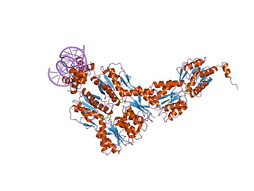

At the end of 1940 **[Jacques Monod](kloom:e/jacques-monod)**, finishing a doctoral thesis on the growth of bacteria at the Sorbonne in occupied Paris, fed his cultures two sugars at once. With some pairs they grew in one smooth burst. With others they grew, stopped dead, and then grew again. He took the curve to **[André Lwoff](kloom:e/andre-michel-lwoff)** at the **[Pasteur Institute](kloom:e/pasteur-institute)**, who said it might have something to do with "enzyme adaptation". "Enzyme adaptation? Never heard of it!" Monod recalled answering in his Nobel lecture. He named the double curve **[diauxie](kloom:e/diauxic-growth)**, and spent the next twenty years explaining it.

The bacteria were eating one sugar first, usually glucose. Only when it ran out did they start making the enzymes for the second, lactose among them, and the pause was the time that took. The question was how a cell knows which proteins to make, and when.

## Two men at war

The work waited on the war. Monod helped circulate the first clandestine tracts in 1940, worked at times in secret in Lwoff's laboratory, and joined the armed **[French Resistance](kloom:e/french-resistance)**; by the liberation, Wikipedia's article on him says, he was a staff officer of its forces of the interior, arranging parachute drops of weapons. **[François Jacob](kloom:e/francois-jacob)**, a second-year medical student, left France in June 1940 to join the Free French in London. He served as a medical officer in Libya and Tunisia, was wounded there, and was wounded again, badly, in Normandy in August 1944. He spent seven months in hospital and could never be the surgeon he had meant to be. In 1950 he joined Lwoff, in what he called "the attics of the Pasteur Institute".

## The enzyme that waits

Monod chose one enzyme in **[_Escherichia coli_](kloom:e/escherichia-coli)**, **[β-galactosidase](kloom:e/beta-galactosidase)**, which splits lactose. With radioactive tracers he showed that "adaptation" meant the cell building the enzyme new from amino acids. Some sugar-like compounds switched its making on without being split by it, while lactose itself, given alone, did not: the inducer acted not on the enzyme but on something else in the cell. Two more proteins came on with it, a permease that carries the sugar in and a transacetylase, each from its own gene, _z_, _y_ and _a_. A mutation in a fourth gene, _i_, made the cell produce all three all the time.

In 1957 the American biochemist **[Arthur Pardee](kloom:e/arthur-pardee)** came for a year, and with Jacob and Monod used bacterial mating, in which a male cell injects its chromosome into a female, to put genes into cells and watch. The PaJaMo experiment, from the first letters of their names, found two things. A _z_ gene injected into a cell that lacked it began making enzyme within minutes, at full rate, so the gene could not be building some stable template first. And the normal _i_ gene, injected into a cell that made the enzyme all the time, slowly stopped it: _i_ made a product that blocked the enzyme's making, a repressor. A lactose-like inducer did not switch the genes on; it switched the repressor off. **[Leo Szilard](kloom:e/leo-szilard)**, passing through Paris, had argued for exactly that.

Cells carrying a second copy of the genes showed where the repressor acted. Jacob compared it to doors opened by radio receivers:

| The cell carries                         | Enzyme without inducer          | What it showed                                       |
| ---------------------------------------- | ------------------------------- | ---------------------------------------------------- |
| A normal _i_ gene                        | None                            | The genes are switched off until induced             |
| A broken _i_ gene only                   | Always                          | No repressor, no switch                              |
| A broken _i_ and a normal _i_            | None                            | The repressor drifts through the cell to both copies |
| A broken operator beside one copy of _z_ | Always, but only from that copy | The operator works only on the genes next to it      |

So the repressor's target was a site on the chromosome, the operator, at one end of a row of genes read together. In 1960 Jacob, Monod and their colleagues called the row an **operon**, and the lactose genes the **[lac operon](kloom:e/lac-operon)**. The plate draws it switched off and on.

## The messenger

If a gene made enzyme at once, something short-lived had to carry its message to the ribosomes. On Good Friday 1960, in Cambridge, Jacob described the PaJaMo results to **[Sydney Brenner](kloom:e/sydney-brenner)** and Francis Crick, and Brenner, Crick recalled, "let out a loud yelp". That June Brenner and Jacob went to Caltech, where, with **[Matthew Meselson](kloom:e/matthew-meselson)**'s ultracentrifuge, they showed that a phage's new RNA ran on the cell's old ribosomes. Their paper and one from James Watson's group at Harvard appeared together in May 1961, beside Jacob and Monod's long review naming **[messenger RNA](kloom:e/messenger-rna)**. Who discovered it, the historian Matthew Cobb concludes, depends on what "discovered" means.

## The switch, seen

Jacob, Monod and Lwoff shared the Nobel Prize in Physiology or Medicine in 1965. The repressor had been seen only by its effects, and Monod compared himself to a police inspector sketching an unseen murderer from the clues. In 1966 **Walter Gilbert** and Benno Müller-Hill at Harvard caught it by its grip on a radioactive inducer: about ten molecules for each copy of the genes, one part in ten thousand of the cell's protein, holding the enzyme a thousandfold below its induced level. A crystal structure published in 2000 shows it gripping the operator.

Later work found that inside the cell β-galactosidase turns a little lactose into allolactose, the true inducer. Switches like this one, wired together, gave biologists a way to think about how cells with the same genes become different tissues, and in [_Chance and Necessity_](kloom:e/chance-and-necessity) (1970) Monod argued that a cell's "choices" are made by such choiceless chemistry.

The switch became a tool: a gene placed behind the lac operator can be turned on at will with a chemical inducer. Moving genes from one organism into another is where the next section, Reading and writing life, begins, with recombinant DNA.
