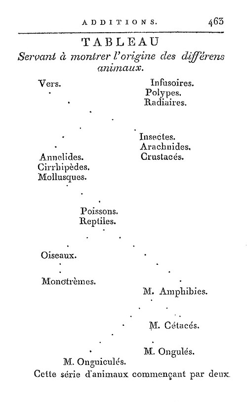

When the Convention turned the king's garden in Paris into the **[Muséum](kloom:e/national-museum-of-natural-history-france)** in 1793, it created two chairs of zoology. One took the mammals, birds, reptiles and fishes. The other took everything else, Linnaeus's "insects and worms", and there was no obvious candidate for it. It went to a botanist, **[Jean-Baptiste Lamarck](kloom:e/jean-baptiste-lamarck)**, who had kept the royal herbarium and knew animals only through a collection of shells. The Muséum's register of 1794 describes him as "fifty years old; married for the second time; wife enceinte; six children; professor of zoology, insects, worms and microscopic animals."

## Animals without backbones

In his first lectures, in the spring of 1794, he divided the whole animal kingdom in two, "Animals that have vertebrae" and "Animals without vertebrae." [Aristotle](kloom:e/aristotle) had made almost the same cut more than two thousand years before, between animals with blood and animals without; Lamarck's translator Hugh Elliot credited Lamarck with seeing that the backbone, not blood, was the mark that mattered. Over the next decade Lamarck took the crustaceans and the arachnids out of Linnaeus's insects and the annelids out of his worms, and in 1801 he published a system of the **[invertebrates](kloom:e/invertebrate)**, his word. In 1802 he and the German Gottfried Treviranus each proposed a name for the science of living things: biology.

## A ladder bent by habit

As late as 1797 he had written of species as fixed. In **[_Philosophie zoologique_](kloom:e/philosophie-zoologique)** (1809) he gave two causes of their change. Life, he held, tends toward ever greater complexity, so animals form a rising series; and the environment bends that series, so that "the state in which we find any animal" is the result of both. The second cause works through two laws, here in Hugh Elliot's translation of 1914:

> **First Law.** In every animal which has not passed the limit of its development, a more frequent and continuous use of any organ gradually strengthens, develops and enlarges that organ, … while the permanent disuse of any organ imperceptibly weakens and deteriorates it, … until it finally disappears.
>
> **Second Law.** All the acquisitions or losses wrought by nature on individuals, through the influence of the environment in which their race has long been placed, … are preserved by reproduction to the new individuals which arise, provided that the acquired modifications are common to both sexes, or at least to the individuals which produce the young.

His examples run from a need to a habit to a form:

| A need                                      | The habit                                           | After many generations                    |
| ------------------------------------------- | --------------------------------------------------- | ----------------------------------------- |
| Prey on the water                           | Spreading the toes to strike the water              | The webbed feet of ducks and geese        |
| Prey at the water's edge, for a non-swimmer | Stretching the legs to keep the body out of the mud | The long bare legs of wading birds        |
| Leaves on the trees of an arid country      | Constant efforts to reach them                      | The giraffe's neck, about six meters high |

The **[giraffe](kloom:e/giraffe)**, the example everyone remembers, fills two sentences. The plate draws his "table showing the origin of the various animals," printed among the additions at the end of the book: two roots, worms and infusorians, branching up to the mammals. Why could no one see species change? Because, he wrote, if a man's life lasted one second, thirty generations watching a clock would never see the hour hand move.

## Cuvier's eulogy

Lamarck went blind and died poor in December 1829, and was buried in a grave rented for five years. **[Georges Cuvier](kloom:e/georges-cuvier)** wrote his eulogy, read to the Academy of Sciences in November 1832, months after Cuvier's own death. Claiming to use "the words of the author," it summed up the theory: "it is the desire and the attempt to swim that produces membranes in the feet of aquatic birds." Lamarck had written of needs, efforts and habits, not desires. Such a system, the eulogy concluded, "may amuse the imagination of a poet," but "cannot for a moment bear the examination of any one who has dissected a hand, a viscus, or even a feather." Lamarck's biographer Alpheus Packard called it unworthy of Cuvier in 1901. The historian Martin Rudwick, quoted in Wikipedia's article on Lamarck, finds Cuvier hostile to the materialism of such theories, but not necessarily believing that species began by miracle.

## Lamarckism

The inheritance of acquired characters was not Lamarck's invention: it had been taken for granted since antiquity. **[Charles Darwin](kloom:e/charles-darwin)** held it too. "I think there can be little doubt," he wrote in 1859, "that use in our domestic animals strengthens and enlarges certain parts, and disuse diminishes them; and that such modifications are inherited," and in 1868 his hypothesis of **[pangenesis](kloom:e/pangenesis)** gave it a mechanism. Yet privately, in 1844, he begged to be spared "Lamarck nonsense of a 'tendency to progression' 'adaptations from the slow willing of animals'."

Late in the century **[August Weismann](kloom:e/august-weismann)** cut the tails off mice for five generations, 901 young in all, and none was born without one; critics answer that cutting is not disuse. The name **[Lamarckism](kloom:e/lamarckism)** stuck to the inheritance of acquired characters all the same, and in the Soviet Union **[Trofim Lysenko](kloom:e/trofim-lysenko)**'s version of it, backed by Stalin, shaped farm policy, as the trail of what we got wrong tells. **[Epigenetics](kloom:e/epigenetics)** has revived the word. Epigenetic marks, chemical tags on DNA and its proteins, can pass down the generations in plants and in nematode worms. But in mammals, as Édith Heard and Robert Martienssen put it in a review of 2014, two rounds of erasure leave "little chance" for them, and environmentally induced changes are rarely inherited, "let alone adaptive." No known case involves an organ strengthened by use.

The next frame goes to the Dorset coast and Mary Anning.
