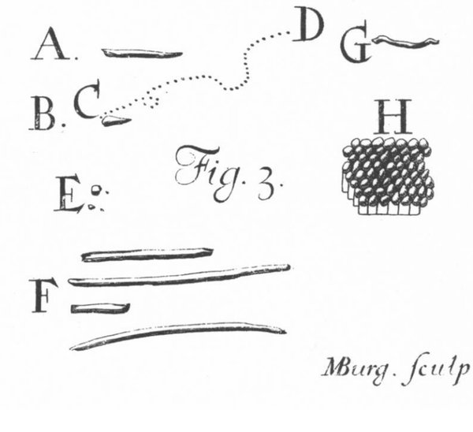

**[Antonie van Leeuwenhoek](kloom:e/antonie-van-leeuwenhoek)** kept a draper's shop in **[Delft](kloom:e/delft)**, selling linen, yarn and ribbon, and held a post at the town hall. He wrote in Dutch, and was not, he said, "brought up to languages or arts, but only to business." From 1673 he sent what he saw through his own [microscopes](kloom:e/microscope) to **[Henry Oldenburg](kloom:e/henry-oldenburg)**, the secretary of the **[Royal Society](kloom:e/royal-society)** in London, who translated and printed many of his letters. The letter of 9 October 1676 ran to eighteen folio pages. Oldenburg cut it to about half, "English'd" it, and printed it in the [_Philosophical Transactions_](kloom:e/philosophical-transactions-of-the-royal-society) in March 1677. In the judgment of the editors of his collected letters, it holds the first unmistakable description of **[bacteria](kloom:e/bacteria)**.

## A drop of pepper-water

Leeuwenhoek had wanted to know why [pepper](kloom:e/black-pepper) is hot on the tongue. To soften some peppercorns for study, he left about a third of an ounce in water for three weeks, and on 24 April 1676 he looked at the water:

> I … discern'd in it, to my great wonder, an incredible number of little animals of divers kinds.

The fourth sort he described was the smallest, "incredibly small, and so small in my eye, that I judged, that if 100 of them lay one by another, they would not equal the length of a grain of course Sand; and according to this estimate, ten hundred thousand of them could not equal the dimensions of a grain of such course Sand." From those measures his editors take these for bacteria, and call 24 April 1676 "the birthday of bacteriology." He did not: to him all of them, large and small, were little animals. He was careful about contamination, topping up his cups with snow-water kept three years in a stoppered bottle, in which he had found nothing alive.

## One lens

His microscope was a single lens, a tiny bead of glass held between two metal plates, with the specimen on the point of a pin just in front of it and screws to bring it into focus; the frame on his red blood cells describes the instruments. A short lens magnifies more, and a small bead is a very short lens. In 2021 neutron imaging of his most powerful surviving microscope, at Utrecht, which magnifies 266 times, showed that its lens is a ball of glass 1.3 millimeters across, with the stub of a glass thread still attached. The plate traces light through it. A glass ball's focal length is *n*D/4(_n_ − 1), its refractive index times its diameter over four times the index less one, and a magnifier held close to the eye enlarges by about 250 millimeters divided by its focal length:

| The Utrecht lens                     | Value        |
| ------------------------------------ | ------------ |
| Diameter                             | 1.3 mm       |
| Focal length, for glass of index 1.5 | about 1 mm   |
| Magnification, 250 mm ÷ focal length | about 256    |
| Measured magnification               | 266          |
| Object's distance from the glass     | about 0.3 mm |

The working figures are by our arithmetic. The object has to sit a third of a millimeter from the glass, which is why Leeuwenhoek mounted it on a pin, and liquids in hair-thin glass tubes. A lens of this kind, a bead melted on the end of a glass thread, was the method **[Robert Hooke](kloom:e/robert-hooke)** had printed in the preface of [_Micrographia_](kloom:e/micrographia). Leeuwenhoek made more than five hundred lenses and never said how.

## Eight witnesses and a meeting in London

Oldenburg asked for his method so that others could confirm them. Leeuwenhoek would not give it, but in March 1677 he explained how he counted: a drop of water as big as a green pea held as much as 92 grains of millet. And he promised witnesses. In October he sent the testimonies of eight men who had looked through his microscopes at pepper-water drawn into a glass tube as thin as a horsehair: two Lutheran pastors, of Delft and The Hague, the pastor of the English church in Delft, a notary, a lawyer, a physician and two others. Some saw 10,000 animals in water the size of a millet grain, others 30,000 or 45,000. At 45,000, Leeuwenhoek reckoned, a drop held 4,140,000. Wikipedia's article on him says the Royal Society arranged these witnesses; his letters show he gathered them himself.

In London the botanist **[Nehemiah Grew](kloom:e/nehemiah-grew)** had been asked to repeat the observations, and failed. Their minutes, printed by Thomas Birch, record what happened:

| Meeting, 1677 | What was tried                                             | What was seen                                      |
| ------------- | ---------------------------------------------------------- | -------------------------------------------------- |
| 1 November    | Hooke's hair-thin glass pipes, filled with pump water      | No animals                                         |
| 8 November    | Rain-water with whole pepper, steeped two or three days    | Nothing; one fellow thought them specks of pepper  |
| 15 November   | Rain-water with whole pepper, steeped nine or ten days     | "great numbers of exceedingly small animals"       |
| 6 December    | Hooke's new single-lens microscope, shown to the President | The same creatures, clear to people new to glasses |

On 15 November the animals were seen by **[Christopher Wren](kloom:e/christopher-wren)**, Grew and others, "so that there was no longer any doubt of Mr: Leewenhoeck's discovery." He was elected a fellow in 1680.

## Teeth and sperm

In November 1677 a visitor, Mr. Ham, brought him a man's semen in which he had seen living "animalcules" with tails. Leeuwenhoek looked, and described their tails and their swimming: the first account of **[sperm](kloom:e/sperm)** cells. When the little eels in his vinegar multiplied, he concluded, in his editors' translation, that they had "increased by procreation," not come from the vinegar.

In September 1683 he scraped the white matter from between his teeth, "as thick as wetted flower," mixed it with clean rain-water, and found "very many small living Animals, which moved themselves very extravagantly." The drawings printed with the letter are among the first of bacteria: rods that "darted themselves thro the water," others that "spun about like a Top," their path drawn as a dotted line. He found them in every mouth he tried, and reckoned that in one man's teeth they "exceed the number of Men in a kingdom."

No one else saw bacteria again for more than a century. His lenses were not surpassed for a century and a half, until the achromatic microscope.
