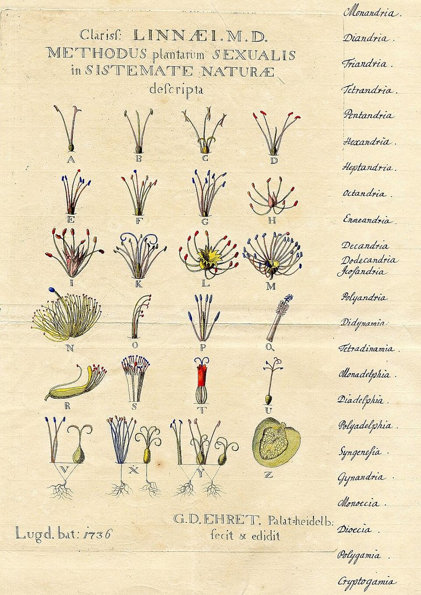
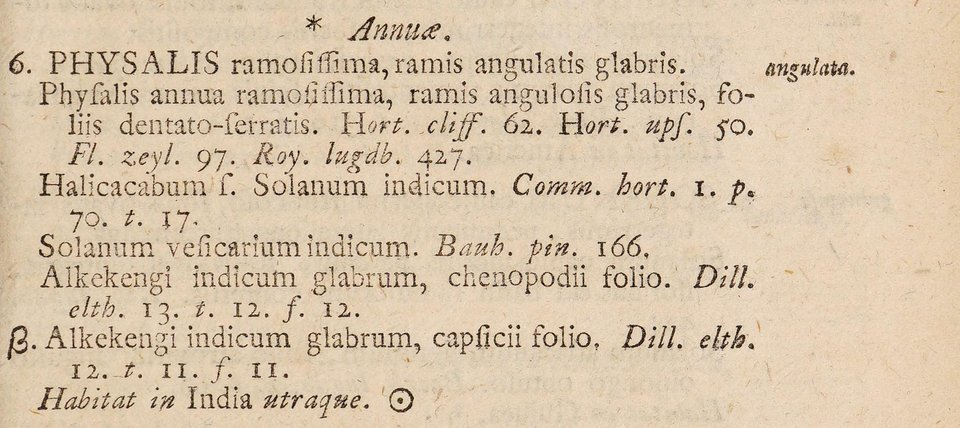

**[Carl Linnaeus](kloom:e/carl-linnaeus)** was born in 1707 at Råshult in southern Sweden, the son of a country curate, and went on to **[Uppsala University](kloom:e/uppsala-university)** in 1728 to study medicine, which then meant botany too. In 1732 the Royal Society of Sciences in Uppsala paid for him to walk and ride through Lapland: six months, some 2,000 kilometers, among the Sámi reindeer herders, whose dress he later wore for his portrait. He brought back about a hundred plants no one had described. In 1735 he went to the Netherlands for a medical degree, and there, at Leiden, friends paid to print the plan he had carried from Sweden: **[_Systema Naturae_](kloom:e/systema-naturae)**, a title page and eleven large pages, mostly tables, sorting the three kingdoms of nature, animal, vegetable and mineral.

## Counting stamens

Its plants were sorted by their sex. Every plant was put in one of 24 classes by its stamens, the male parts: how many, how long, whether joined. Each class was split into orders by the pistils, the female parts.

| Class            | What the flower has                      | A genus Linnaeus put there     |
| ---------------- | ---------------------------------------- | ------------------------------ |
| 1 · Monandria    | One stamen                               | _Canna_                        |
| 2 · Diandria     | Two stamens                              | _Olea_, the olive              |
| 3 · Triandria    | Three stamens                            | _Iris_                         |
| 4 · Tetrandria   | Four stamens                             | _Plantago_, the plantains      |
| 5 · Pentandria   | Five stamens                             | _Physalis_, the groundcherries |
| 6 · Hexandria    | Six stamens                              | _Tulipa_                       |
| 24 · Cryptogamia | No flowers to be seen: "hidden marriage" | Ferns, mosses, fungi           |

The botanical artist **[Georg Dionysius Ehret](kloom:e/georg-dionysius-ehret)** drew the key in Leiden the next year, a stamen or a cluster of them for each class.

Linnaeus knew the system was artificial. It put the plants it was easiest to count together, not the ones most alike, and in his _Philosophia botanica_ of 1751 he wrote, in our translation: "Fragments of a natural method are to be sought with diligence. This is the first and last thing desired in botany. Nature does not make leaps. All plants show affinity on every side, like territory on a map." The natural method would come from others; the sexual system stayed in use into the nineteenth century.

## Two names

In 1741 he became a professor at Uppsala. In 1753 he published **[_Species Plantarum_](kloom:e/species-plantarum)**, every plant species he knew: 5,940 names by one count, over 7,300 species by another. He thought the world held fewer than 10,000; [John Ray](kloom:e/john-ray) had guessed more than 18,000. Botanists date the book to 1 May 1753 and take it as the starting point of plant names. Each species still had its definition, a short Latin phrase that told it from the others in its genus. But in the margin Linnaeus printed one word beside it, the _nomen triviale_. Genus and trivial name together made **[binomial nomenclature](kloom:e/binomial-nomenclature)**, a label that could stay the same while the definition grew. Here is one of his plants, the cutleaf groundcherry, **[_Physalis angulata_](kloom:e/physalis-angulata)**:

| Where                                     | The name, with our English                                                                     |
| ----------------------------------------- | ---------------------------------------------------------------------------------------------- |
| Bauhin, _Pinax_, 1623                     | _Solanum vesicarium indicum_, Indian bladder nightshade                                        |
| Linnaeus, _Hortus Cliffortianus_, 1738    | _Physalis annua ramosissima, ramis angulosis glabris, foliis dentato-serratis_                 |
| _Species Plantarum_, 1753, its definition | _Physalis ramosissima, ramis angulatis glabris_: much branched, its branches angled and smooth |
| The same page, in the margin              | _angulata_                                                                                     |
| Today                                     | _Physalis angulata_ L., the cutleaf groundcherry                                               |

The page is headed Pentandria Monogynia, its class and order. Kingdom, class, order, genus, species: five nested ranks, drawn in the plate, and the start of modern **[taxonomy](kloom:e/taxonomy-biology)**, which has since added phyla and families. The tenth edition of the _Systema_, in 1758, gave animals two names too, and it is where animal names begin.

Linnaeus headed his list of the principal botanists, in order of time, with **[Theophrastus](kloom:e/theophrastus)**, and named a genus, _Theophrasta_, for him; it is after Linnaeus that Theophrastus is called the father of botany.

## The apostles

Linnaeus never left Sweden again after 1738. His students went instead: seventeen he called his apostles, and seven never came home. Pehr Kalm brought back some 90 of the 700 North American plants in _Species Plantarum_. **[Daniel Solander](kloom:e/daniel-solander)** sailed with Joseph Banks on **[James Cook](kloom:e/james-cook)**'s first voyage, 1768 to 1771. In Japan, where foreigners were kept on the island of Dejima, Carl Peter Thunberg got many of his plants from the Japanese interpreters who brought them to him.

## The varieties of man

The 1758 _Systema_ named our own species _Homo sapiens_ and placed it among the primates, beside the apes. Then it divided it into varieties, four of them by continent and color, each with a temperament and a character. In our translation:

| Variety    | Color, temperament, bearing | Character                     | "Ruled by" |
| ---------- | --------------------------- | ----------------------------- | ---------- |
| Americanus | Red, choleric, upright      | Obstinate, cheerful, free     | Custom     |
| Europaeus  | White, sanguine, muscular   | Gentle, very sharp, inventive | Rites      |
| Asiaticus  | Sallow, melancholic, stiff  | Severe, haughty, greedy       | Opinions   |
| Afer       | Black, phlegmatic, slack    | Crafty, lazy, careless        | Caprice    |

These are prejudices dressed as description. Historians weigh them differently. Staffan Müller-Wille argues that Linnaeus, who thought skin color a product of climate, never presented the varieties as fixed races, and Linnaeus himself had asked who "with a sane mind" would make each difference of color a species, as John Ray had argued. The **[Linnean Society of London](kloom:e/linnean-society-of-london)**'s head of collections, Isabelle Charmantier, answers that the African was always at the bottom of his list and always the most harshly described, and that this was the hierarchy that stuck: the Society counts his classification among the roots of **[scientific racism](kloom:e/scientific-racism)**.

The Society bears his name because in 1784 a young Englishman, **[James Edward Smith](kloom:e/james-edward-smith-botanist)**, bought Linnaeus's collections from his widow: 14,000 plants, 3,198 insects, 1,564 shells, some 3,000 letters and 1,600 books. Smith founded the Society around them in 1788, and in 1858 it heard Darwin's and Wallace's papers on natural selection. The story of life turns next to what could not be named by eye: the world under the microscope, which Hooke had opened nearly a century before.
