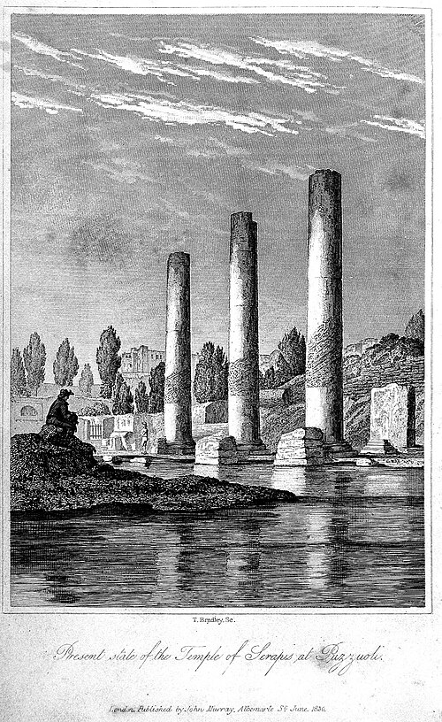

In 1830 the London publisher John Murray brought out the first volume of a book by a Scottish lawyer turned geologist, **[Charles Lyell](kloom:e/charles-lyell)**. Its title said what it would do: **[_Principles of Geology_](kloom:e/principles-of-geology)**, "being an attempt to explain the former changes of the earth's surface, by reference to causes now in operation." No floods of a kind no one had seen, no sudden upheavals of the whole crust: rain, rivers, waves, earthquakes and volcanoes, working at the rates they work now, given time enough. The title page promised two volumes; there were three, the last in 1833.

The idea was older. In 1788 the Edinburgh physician and farmer **[James Hutton](kloom:e/james-hutton)** had argued that "from what has actually been, we have data for concluding with regard to that which is to happen hereafter," on "the supposition that the operations of nature are equable and steady." His paper ended: "we find no vestige of a beginning, — no prospect of an end." Lyell set out to prove it with evidence a reader could check. In a review of 1832, **[William Whewell](kloom:e/william-whewell)** gave the view the name it has kept: **[uniformitarianism](kloom:e/uniformitarianism)**.

## Three columns at Pozzuoli

The first volume opens with a picture.

Lyell had visited the ruin near Naples, then called the Temple of Serapis, in 1828, and he measured it. His figures, as the plate draws them:

| Measure (Lyell, 1830)                      | Feet        |
| ------------------------------------------ | ----------- |
| Height of the three standing columns       | 42          |
| Smooth, above the pedestals                | about 12    |
| Band bored by a marine bivalve, above that | 12          |
| Platform below high water in 1828          | about 1     |
| Top of the borings above high water        | at least 23 |

The holes were made by a stone-boring mussel, **[_Lithophaga_](kloom:e/lithophaga)**, whose shells were still in them. It lives only in the sea. So the columns had stood upright in seawater for years, their lower parts sheltered by "ten or twelve feet" of volcanic tuff and rubble, and had then been lifted out again. Was it the sea that moved? There are no real tides in the Mediterranean, Lyell answered, and the old Roman harbor works showed its level unchanged for two thousand years. The land had moved, and he dated the movements: inscriptions showed the building in use in the third century; a writer of 1580 said the sea had reached the hills fifty years before; and the eruption that raised Monte Nuovo in 1538 lifted the coast with it.

The geologist Charles Daubeny had objected that columns could not sink and rise thirty feet without falling. Lyell pointed to 1819, when the delta of the Indus sank "and the houses within the fort of Sindree subsided beneath the waves without being overthrown." Movements enough to drown a building and raise it again, inside fifteen centuries, by causes still at work: that was his whole argument in one picture. The ruin was later shown to be a market, the **[Macellum of Pozzuoli](kloom:e/macellum-of-pozzuoli)**, and the ground under it still rises and falls: between 1969 and 1973 it rose about 1.7 meters.

Lyell took uniformity further than most. He argued that climate swings back and forth over a "great year," so that "the huge iguanodon might reappear in the woods, and the ichthyosaur in the sea." **[Henry De la Beche](kloom:e/henry-de-la-beche)**, who knew Mary Anning's ichthyosaurs well, drew _Awful Changes_ (1830) in reply: a Professor Ichthyosaurus lecturing to his students on a fossil human skull.

## How much time

Lyell's earth needed time without limit, and his readers took it. In 1859 **[Charles Darwin](kloom:e/charles-darwin)** reckoned, allowing a sea cliff to wear back an inch a century, that the erosion of the Weald in southern England alone "must have required 306,662,400 years." In 1862 the physicist William Thomson, later **[Lord Kelvin](kloom:e/lord-kelvin)**, answered from the earth's heat. Rocks grow warmer downward, so heat is leaking out, and a cooling earth cannot be running in Lyell's endless cycle: to suppose so, he wrote of Lyell by name, was like believing "that a clock constructed with a self-winding movement" might go "for ever." He put the solidifying of the crust between 20 and 400 million years ago, most likely about 98 million.

| Estimate                                | Years             |
| --------------------------------------- | ----------------- |
| Buffon, from cooling globes, 1779       | 74,832            |
| Darwin, erosion of the Weald only, 1859 | about 306 million |
| Thomson, cooling of the crust, 1862     | 98 million        |
| Patterson, lead in meteorites, 1956     | 4.55 billion      |

Thomson did not know of radioactivity, which heats the earth from within. In 1956 **[Clair Patterson](kloom:e/clair-patterson)** dated the earth from the lead in meteorites at 4.55 billion years: more time than Thomson allowed, though not the endless time Lyell assumed.

## Darwin's copy

When the _Beagle_ sailed in December 1831, its captain, **[Robert FitzRoy](kloom:e/robert-fitzroy)**, gave Darwin the first volume. His teacher **[John Stevens Henslow](kloom:e/john-stevens-henslow)** had advised him, Darwin remembered, "to get and study the first volume of the 'Principles,' which had then just been published, but on no account to accept the views therein advocated." At the first landfall, St. Jago in the Cape Verde Islands, a white band of seashells high in a sea cliff convinced him of "the infinite superiority of Lyell's views." He collected the second volume at Montevideo in November 1832 and read the third in 1834.

Lyell was slow to follow his follower. In _The Antiquity of Man_ (1863) he set out the case for evolution without quite accepting it, and Darwin told Hooker he was "deeply disappointed" that Lyell's "timidity prevents him giving any judgment." Only in the tenth edition of the _Principles_, from 1866, did he write as a convert. By then he had helped Darwin in another way: in 1858 he and Hooker arranged the joint reading of Darwin's and Wallace's papers, the next frame.
