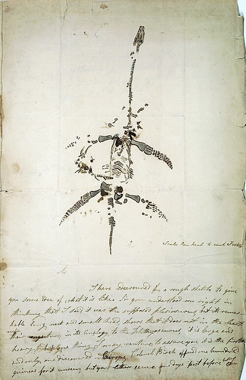
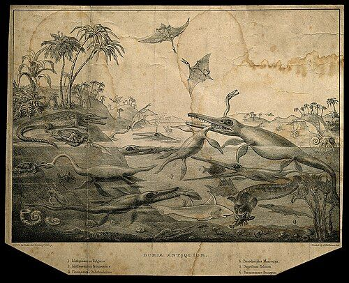

**[Mary Anning](kloom:e/mary-anning)** was born in **[Lyme Regis](kloom:e/lyme-regis)**, on the Dorset coast, on 21 May 1799. Her father, Richard, was a cabinetmaker who sold fossils to the visitors at the seaside resort; when he died in November 1810 he left the family £120 in debt, and by 1811 they were on parish relief. The cliffs east of the town are the Blue Lias, a Jurassic seabed of limestone and shale. They fall in winter storms, and what falls must be taken before the tide. A Bristol newspaper wrote in 1823 that she searched "at every tide," at "the continual risk of being crushed."

## The sea dragons

In 1811 her brother Joseph found a four-foot skull below Black Ven. Nearly a year later Mary found the rest of the skeleton, and the family sold it for £23. Everard Home described it to the Royal Society from 1814 without naming its finders. It was one of the **[ichthyosaurs](kloom:e/ichthyosauria)**, sea reptiles shaped like dolphins.

On the night of 10 December 1823 she found something else under the same cliff, and it was dug out "on that night and the succeeding morning," the local paper reported. Sixteen days later she drew it for a buyer:

"Its remarkable long neck and small head," she wrote under the sketch, showed it was the animal the geologists had guessed at from fragments, "the supposed plesiosaurus." She added: "it is large and heavy, but one thing I may venture to assure you it is the first and only one discovered in Europe."

The clergyman-geologist **[William Conybeare](kloom:e/william-conybeare-geologist)** had named **[_Plesiosaurus_](kloom:e/plesiosaurus)**, "near lizard," with **[Henry De la Beche](kloom:e/henry-de-la-beche)** in 1821 from scattered bones. He described Anning's skeleton to the **[Geological Society of London](kloom:e/geological-society-of-london)** on 20 February 1824. He counted the vertebrae as the plate draws them: about 35 in the neck, more than the swan's, where every mammal has seven; six more before the forelimbs; 21 in the back, 2 at the hip and about 26 in the tail, some 90 in all. Modern counts of the neck run from 38 to 42, depending on where the neck is taken to end.

It looked impossible. **[Georges Cuvier](kloom:e/georges-cuvier)**, shown drawings in Paris, first thought it forged, a skeleton put together from more than one animal. Conybeare answered the charge without naming it: he had been suspected, "like the painter in Horace," of making "a fictitious animal from the juxtaposition of incongruous members," and this specimen "confirmed the justice of my former conclusions in every essential point." Accounts differ on how the doubt was settled: the Natural History Museum says the Society called a special meeting, to which Anning was not invited. Cuvier came round.

## Who was paid, and who was named

Conybeare thanked the specimen's owner, the Duke of Buckingham, and did not name her. The historian **[Hugh Torrens](kloom:e/hugh-torrens)** calls this a pattern: the finders, who hunted, were forgotten, and the gentlemen who bought, the gatherers, were named. The prices show the trade:

| Year | Specimen and buyer                                       | Price         |
| ---- | -------------------------------------------------------- | ------------- |
| 1812 | First ichthyosaur, to the lord of the manor              | £23           |
| 1819 | The same, to the British Museum at auction               | £47 5s        |
| 1820 | Colonel Birch's sale of his Anning fossils, for them     | over £400     |
| 1824 | First complete _Plesiosaurus_, to the Duke of Buckingham | probably £100 |
| 1829 | Second _Plesiosaurus_, to the British Museum             | 100 guineas   |
| 1831 | _Plesiosaurus macrocephalus_, to Lord Cole               | 200 guineas   |
| 1838 | Annuity raised by geologists and the government          | £25 a year    |

Torrens gives the duke's price as probably £100, and notes eight other sources giving between £110 and £200; Wikipedia gives £45 5s for the 1819 sale where Torrens, citing the auction catalog, gives £47 5s. A visitor in 1824, Lady Harriet Silvester, saw how she worked: "She fixes the bones on a frame with cement and then makes drawings and has them engraved," and the professors "all acknowledge that she understands more of the science than anyone else in this kingdom." Anna Pinney, a young woman who sometimes collected with her, set down Anning's own complaint: "these men of learning have sucked her brains, and made a great deal of publishing works, of which she furnished the contents."

She could not answer them in their own society. The Geological Society did not admit women; Cynthia Burek, writing for the Society, dates its first women Fellows to 1919 (Torrens and Wikipedia give 1904, the museum 1908).

## Stones and ink

Some finds were credited. Lyme's collectors sold "bezoar stones," and Anning noticed where they lay. **[William Buckland](kloom:e/william-buckland)** told the Society in 1829 that "Miss Anning informs me" she had found them "within the ribs or near the pelvis of almost every perfect skeleton of Ichthyosaurus." Broken open, they held fish scales and bones; the chemist William Wollaston found them rich in phosphate of lime, like dung. Buckland named them **[coprolites](kloom:e/coprolite)**. She also found fossil ink bags of squid-like animals, still distended; a drawing made with their ink passed with a painter as "sepia of excellent quality."

In 1830, when her trade was slow, De la Beche drew **[_Duria Antiquior_](kloom:e/duria-antiquior)**, "a more ancient Dorset," from her fossils: the first scene of prehistoric life to circulate widely. He had Georg Scharf make a lithograph and gave the proceeds of the prints to her. De la Beche was himself the owner of Halse Hall, a sugar estate in Jamaica worked by enslaved people; its income failed in the early 1830s, and the compensation paid when Britain abolished slavery went to his mortgagees.

**[Louis Agassiz](kloom:e/louis-agassiz)** named two fossil fish after her in the 1840s, the only species named for her in her lifetime. She died of breast cancer on 9 March 1847, and De la Beche, then the Society's president, gave her an obituary in its journal, an honor kept for Fellows. Her sea dragons were part of the case that whole kinds of animal had lived and vanished, and of the deep time that Charles Lyell, the next frame, set out to measure.
