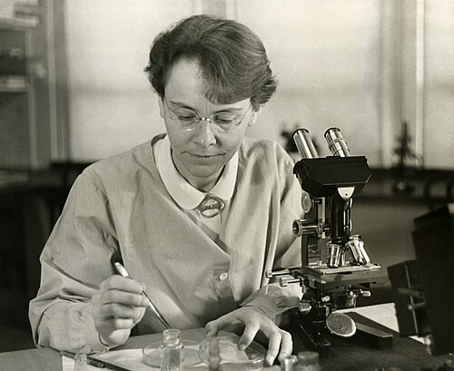
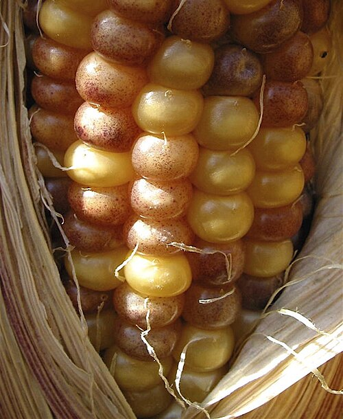

An ear of **[maize](kloom:e/maize)** is a crowd of separate experiments. Each kernel comes from its own fertilization, and the kernel's outer layer, the aleurone, shows its genes in its color: purple where a pigment gene works, pale where it does not. **[Barbara McClintock](kloom:e/barbara-mcclintock)**, born in 1902, learned to read both the kernels and the plant's ten **[chromosomes](kloom:e/chromosome)** as a student at **[Cornell University](kloom:e/cornell-university)**, where she took her doctorate in botany in 1927 in a small maize group that included George Beadle. Over the next twenty-five years she found in those kernels something no one had looked for: pieces of chromosome that moved.

## A crossover under the microscope

Geneticists had long assumed that in **[crossing-over](kloom:e/chromosomal-crossover)**, when genes swap partners between paired chromosomes, the chromosomes themselves swap pieces. Nobody had seen it. McClintock and a graduate student, **[Harriet Creighton](kloom:e/harriet-creighton)**, found a strain whose chromosome 9 was marked at both ends: a dark knob at the tip of the short arm, and at the other end a piece traded with chromosome 8. Between them sat two genes the kernels show, _C_ for colored aleurone and _wx_ for waxy starch. They bred plants whose two copies of chromosome 9 differed at all four points and examined the offspring's chromosomes.

The visible pieces and the genes traveled together. In one cross every colored kernel grew into a plant whose chromosome 9 had the knob, and every colorless kernel into one without it. Their paper of August 1931 concluded in a sentence: paired chromosomes "have been shown to exchange parts at the same time they exchange genes assigned to these regions." Curt Stern showed the same in fruit flies weeks later.

## Spots that keep time

In 1942 McClintock settled at the **[Carnegie Institution](kloom:e/carnegie-institution-for-science)**'s Department of Genetics at **[Cold Spring Harbor](kloom:e/cold-spring-harbor-laboratory)** on Long Island. The photograph shows her there in 1947. In the summer of 1944 she grew about 450 plants, each started from parents that had given it a chromosome 9 with a freshly broken end, and self-pollinated them. Among their seedlings came striped and streaked leaves she had not expected, and twin sectors side by side, one with more streaks and one with fewer, as if at one cell division one daughter cell had gained what the other lost. Following that clue, she found a site on the short arm of chromosome 9 where the chromosome broke, which she called _Ds_, for Dissociation. It broke only when a second factor, _Ac_, for Activator, was somewhere in the nucleus. In 1948 she found that both could move.

Her report of 1950 gives the case that showed what moving meant. A _Ds_ turned up at the _C_ gene, and the kernel went colorless, as though _C_ had been lost. But in cells where _Ds_ left again, _C_ worked as before, and pigment appeared. The plate draws the arm and a kernel:

| In the kernel                   | What _Ds_ does                       | What the kernel shows                  |
| ------------------------------- | ------------------------------------ | -------------------------------------- |
| _C_, no _Ds_ beside it          | Nothing to do                        | Purple all over                        |
| _Ds_ inserted at _C_, no _Ac_   | Stays put, silencing _C_             | Colorless, generation after generation |
| _Ds_ at _C_, one dose of _Ac_   | Leaves _C_ in some cells as it grows | Colorless, spotted with purple         |
| _Ds_ at _C_, two or three doses | Leaves later                         | Smaller spots                          |

Each purple spot is the family of one cell in which _Ds_ moved out: a large spot means early in the kernel's growth, a small one late. The photograph shows the same kind of spotting, made by another maize element, _Mutator_. The endosperm has three sets of chromosomes, so it can carry one, two or three doses of _Ac_, and "the higher the dose of _Ac_," she wrote, "the more delayed is the time of occurrence of mutations." She called _Ac_ and _Ds_ controlling elements, and thought them the cell's means of switching genes on and off in development.

## Was she ignored?

She presented the work at the Cold Spring Harbor symposium of 1951. The story long told, given its classic form in **[Evelyn Fox Keller](kloom:e/evelyn-fox-keller)**'s 1983 biography, is that the talk met "stony silence" and that she was ignored until the 1970s. **[Joshua Lederberg](kloom:e/joshua-lederberg)** answered that she would not have been invited unless the organizers had seen some glimmer of the work's importance. The historian **[Nathaniel Comfort](kloom:e/nathaniel-c-comfort)**, in a 1999 paper and his 2001 biography _The Tangled Field_, found that maize geneticists accepted transposition quickly; Royal Brink's group in Wisconsin confirmed it by 1951. What they doubted was her larger theory of control, which lost out to the operon of François Jacob and Jacques Monod. She published less. "I stopped publishing detailed reports long ago," she wrote in 1973.

## Everywhere

From the mid-1960s mobile elements were found in bacteria, carrying resistance to antibiotics from one cell to another. In 1983, at 81, McClintock received the **[Nobel Prize in Physiology or Medicine](kloom:e/nobel-prize-in-physiology-or-medicine)** alone, "for her discovery of mobile genetic elements." Such **[transposable elements](kloom:e/transposable-element)** turned out to fill much of many genomes: the first analysis of the human genome, in 2001, could recognize about 45 percent of it as derived from them. In maize itself, **[John Doebley](kloom:e/john-doebley)**'s group found in 2011 that an element called _Hopscotch_, inserted beside the domestication gene _teosinte branched1_, helps make the maize plant a single stalk; the insertion is older than maize, and the first farmers selected a variant teosinte already carried. The next section goes back to 1928, and to Frederick Griffith's mice.
