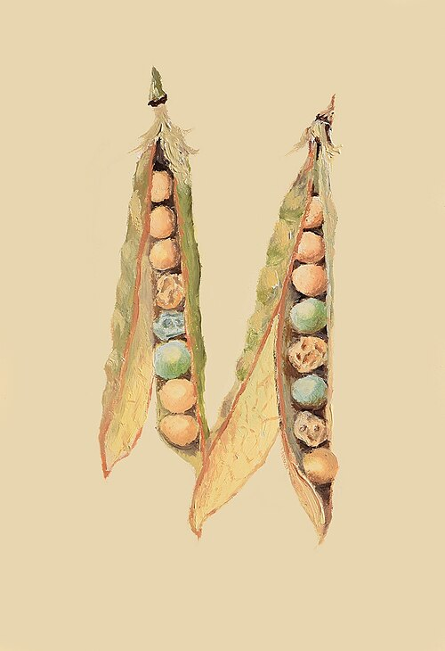

In the garden of **[St Thomas's Abbey](kloom:e/st-thomass-abbey-brno)** in **[Brno](kloom:e/brno)**, then the Moravian town of Brünn, an Augustinian friar grew peas for eight seasons, from 1856 to 1863, and counted them. **[Gregor Mendel](kloom:e/gregor-mendel)**, a farmer's son from Austrian Silesia, had joined the abbey in 1843. Twice he failed the examination for a certified science teacher, and between the attempts his abbot sent him to the **[University of Vienna](kloom:e/university-of-vienna)**, where from November 1851 to August 1853 he took courses in physics, chemistry, mathematics, zoology, botany and paleontology. The physicist **[Christian Doppler](kloom:e/christian-doppler)** had been one of the examiners of his first attempt. He came home to teach physics.

He read his results to the Natural History Society of Brünn on 8 February and 8 March 1865, and the society printed them in its proceedings for 1865, which appeared in 1866: **[_Versuche über Pflanzen-Hybriden_](kloom:e/experiments-on-plant-hybridization)**, "Experiments in Plant Hybridization." The English quoted here is the Royal Horticultural Society's translation of 1901, made mostly by Charles Druery, as William Bateson revised it in 1902.

## A plant that pollinates itself

Mendel chose the **[pea](kloom:e/pea)**, _Pisum sativum_, because a cross could be controlled. In a pea flower "the fertilising organs are closely packed inside the keel and the anther bursts within the bud, so that the stigma becomes covered with pollen even before the flower opens." Left alone, a pea pollinates itself. To cross two plants, "the bud is opened before it is perfectly developed, the keel is removed, and each stamen carefully extracted by means of forceps, after which the stigma can at once be dusted over with the foreign pollen." The plate draws the three steps. He tried 34 varieties bought from seedsmen for two years, kept 22 that bred true, and grew pot plants in a greenhouse as controls against the pea weevil, which opens the keel.

## Three to one

He chose seven characters that came in two clear forms. In every cross the hybrids looked like one parent only. Mendel called that form **[dominant](kloom:e/dominance-genetics)** and the hidden one recessive, because such characters "withdraw or entirely disappear in the hybrids, but nevertheless reappears unchanged in their progeny." In the next generation, grown from the hybrids' own seed, both forms came back, about three to one:

| Character        | Dominant form | Recessive form | Dominant | Recessive |  Ratio |
| ---------------- | ------------- | -------------- | -------: | --------: | -----: |
| Seed shape       | round         | wrinkled       |    5,474 |     1,850 | 2.96:1 |
| Seed color       | yellow        | green          |    6,022 |     2,001 | 3.01:1 |
| Seed coat        | gray-brown    | white          |      705 |       224 | 3.15:1 |
| Pod shape        | inflated      | constricted    |      882 |       299 | 2.95:1 |
| Unripe pod color | green         | yellow         |      428 |       152 | 2.82:1 |
| Flower position  | along stem    | at the top     |      651 |       207 | 3.14:1 |
| Stem length      | long          | short          |      787 |       277 | 2.84:1 |
| All seven        |               |                |   14,949 |     5,010 | 2.98:1 |

Then he sowed the dominant ones again. Of 565 plants from round seeds, 193 gave only round seeds and 372 split once more, three to one. So the three to one was really one to two to one: one part pure dominant, two parts hybrid, one part pure recessive, which he wrote A + 2Aa + a. A hybrid, he concluded, makes egg and pollen cells of both kinds in equal numbers, and "it remains, therefore, purely a matter of chance which of the two sorts of pollen will become united with each separate egg cell." Single plants would stray from the ratio; only large totals showed it, for "the greater the number the more are merely chance elements eliminated." His A and a are what we now call a **[gene](kloom:e/gene)** and its forms, a word coined only in 1909.

## Too good to be true?

In 1936 the statistician **[Ronald Fisher](kloom:e/ronald-fisher)** reconstructed Mendel's work year by year. He concluded that the paper was "to be taken entirely literally," but that its numbers fit too well. Summed over every experiment, **[Pearson's chi-squared test](kloom:e/pearsons-chi-squared-test)** gave 41.6 on 84 degrees of freedom: a fit so close would come by chance, by our arithmetic, about seven times in 100,000. Fisher pointed above all to the plants Mendel tested by growing ten seeds each. A hybrid has a 5.6 percent chance, (3/4)¹⁰ by our arithmetic, of giving ten dominant seedlings and being misread as pure, so the true expectation was 1.7 to 1, not 2 to 1; Mendel's counts matched 2 to 1, a deviation "only to be expected once in 444 trials." Fisher wrote that "the data of most, if not all, of the experiments have been falsified," perhaps by "some assistant who knew too well what was expected."

The replies have narrowed the charge. Daniel Hartl and Daniel Fairbanks showed in 2007 that the first series of tests does not differ significantly from Fisher's own expectation, and that Mendel, unhappy with one result (60:40), repeated it and printed both: pooled, 125:75 against Fisher's 125.8:74.2. In the second series he probably scored a trait visible in seedlings, so more than ten plants each. A 2008 book by Allan Franklin and four others, _Ending the Mendel–Fisher Controversy_, found no fabrication. Others, among them the statistician A. W. F. Edwards, accept that the fit is too close and blame unconscious bias, such as counts stopped when they looked right.

## Silence

Mendel ordered forty offprints. One went to **[Carl Nägeli](kloom:e/carl-nageli)** in Munich, who answered in February 1867 and wrote to him until 1873. The two worked on hawkweeds, **[_Hieracium_](kloom:e/hieracium)**, whose hybrids bred true, because, as no one then knew, many set seed without fertilization. The usual story is that Nägeli sidetracked him; Fairbanks argues that Mendel expected constant hybrids there, and many botanists were studying the genus. In 1868 Mendel became abbot, and his experiments ended. He died in 1884, cited a handful of times. "Each generation, perhaps," Fisher wrote, "found in Mendel's paper only what it expected to find."

From here a trail follows the ideas of heredity that went wrong. The main spine goes on to 1900, when three botanists found the paper again.
