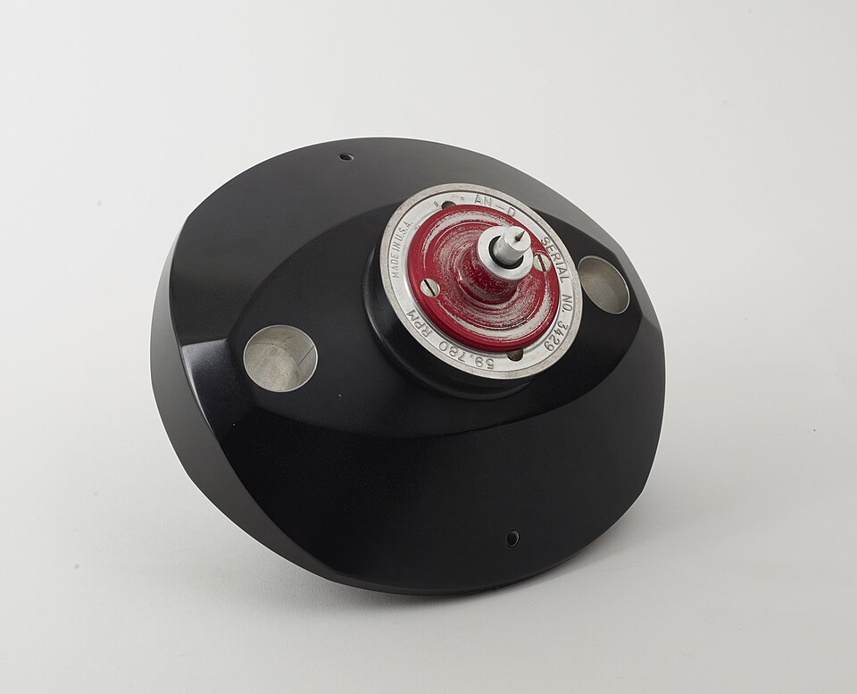

The double helix came with a promise. If each base pairs with only one partner, Watson and Crick wrote in May 1953, the two chains could separate and each serve as a template for a new one, so that every daughter molecule would carry one old chain and one new. Not everyone believed a helix could do it. Two long chains wound round each other would have to untwist to part, and **[Max Delbrück](kloom:e/max-delbruck)** of Caltech proposed in 1954 that the chains break and rejoin about once a turn as they are copied, scattering old and new along both. A third possibility was that the parent stayed whole and a wholly new copy was made beside it. The three schemes are now called **[semiconservative replication](kloom:e/semiconservative-replication)**, dispersive and conservative, and they make different predictions about where a parent's atoms end up.

## Heavy bacteria

The test, now called the **[Meselson–Stahl experiment](kloom:e/meselson-stahl-experiment)**, was made at the **[California Institute of Technology](kloom:e/california-institute-of-technology)** by two young scientists. **[Matthew Meselson](kloom:e/matthew-meselson)** was a chemistry graduate student of **[Linus Pauling](kloom:e/linus-pauling)**'s, and his dissertation committee included **[Richard Feynman](kloom:e/richard-feynman)**; **[Franklin Stahl](kloom:e/franklin-stahl)** was a phage geneticist who had come as a postdoctoral fellow in 1955. With the chemist Jerome Vinograd they invented a way of weighing molecules against one another. A strong solution of **[cesium chloride](kloom:e/caesium-chloride)** spun in an **[ultracentrifuge](kloom:e/ultracentrifuge)** settles into a smooth gradient, denser toward the outside of the rotor, and each molecule of **[DNA](kloom:e/dna)** drifts to the place where the solution is exactly as dense as itself, gathering there in a thin band.

Nitrogen is in every base of DNA. Its common isotope, nitrogen-14, has seven protons and seven neutrons; nitrogen-15 has one more neutron, the same chemistry, and more weight. Bacteria fed only on the heavy kind build heavy DNA. The experiment, published in the _Proceedings of the National Academy of Sciences_ in July 1958, ran this way:

| Step   | What Meselson and Stahl did                                                                                                   |
| ------ | ----------------------------------------------------------------------------------------------------------------------------- |
| Label  | Grew _E. coli_ B for 14 generations on a glucose medium whose only nitrogen was ammonium chloride, 96.5 percent nitrogen-15   |
| Switch | Added a tenfold excess of ordinary ammonium chloride; the bacteria went on dividing about every 50 minutes                    |
| Sample | Drew off about four billion bacteria at intervals, chilled them and burst them with detergent                                 |
| Spin   | Mixed a hundredth of a milliliter of lysate into cesium chloride of density 1.71 g/cm³ and spun it at 44,770 rpm for 20 hours |
| Read   | Photographed the spinning cell in ultraviolet light, where DNA absorbs, and traced each band's darkness                       |

The bacterium was **[_Escherichia coli_](kloom:e/escherichia-coli)**, which lives in our gut. Heavy and light DNA came to rest 0.014 g/cm³ apart, two clean bands in one tube. Their machine was a Spinco Model E, whose rotor, like the one shown, held the sample cell in one hole and a balancing cell in the other.

## Three bands

Generation by generation, the plate shows what they saw. Before the switch there was only heavy DNA. After one generation there was only one band, halfway between heavy and light; a mixture of samples showed it centered at 50 percent of the distance, give or take 2. After two generations there were two bands in equal amounts, that intermediate one and a light one. Later samples added light DNA while the intermediate band stayed.

| After        | Conservative predicts  | Dispersive predicts       | Semiconservative predicts | Seen              |
| ------------ | ---------------------- | ------------------------- | ------------------------- | ----------------- |
| 1 generation | Half heavy, half light | All intermediate          | All hybrid                | One band, halfway |
| 2            | ¼ heavy, ¾ light       | One band, a quarter heavy | ½ hybrid, ½ light         | Two bands, equal  |

The first generation ruled out the conservative scheme, and the second the dispersive one, whose single band should have kept drifting toward light. They went one step further. Heated to 100 °C for half an hour, the hybrid DNA came apart into a heavy piece and a light piece, each about half its weight. "The scheme for DNA duplication proposed by Delbrück is thereby ruled out," they wrote. They were careful too. Their results were "in exact accord" with Watson and Crick's model, but they had not shown that the two halves were single chains, only that each molecule held two parts, one passed intact to each daughter.

## The most beautiful experiment

John Cairns, a former director of the Cold Spring Harbor Laboratory, called it "the most beautiful experiment in biology" to the writer Horace Freeland Judson, and Frederic Lawrence Holmes took the phrase as the subtitle of his 2001 history of it. Holmes, who read the research logs, the films and the letters, found the path to it anything but simple, full of diversions from the original plans; its beauty, he argued, lay in the simplicity of the result.

The machine that does the copying had already been found. In 1956, at Washington University in St. Louis, **[Arthur Kornberg](kloom:e/arthur-kornberg)** and his colleagues, his wife Sylvy among them, isolated **[DNA polymerase](kloom:e/dna-polymerase)** from _E. coli_. Their first sign of it was some fifty counts of radioactivity out of a million added. Purified, it would build new DNA only from all four building blocks and only with old DNA present to copy, and in his Nobel lecture of 1959 Kornberg called it "unique in present experience in taking directions from a template". The polymerase chain reaction runs the same scheme in a tube: heat parts the two strands, and a polymerase builds a new partner on each.

Meselson went on to Harvard, and Stahl to Oregon, where he died in 2025. How a copied gene is read was the next question, and the genetic code its answer.
