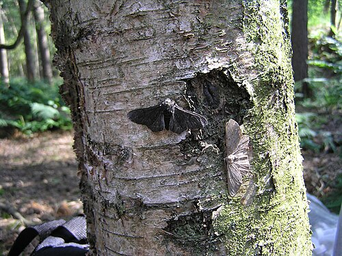

By 1900 nearly every biologist accepted that living things had evolved, and many doubted that natural selection had done it. **[Julian Huxley](kloom:e/julian-huxley)** later called these decades **[the eclipse of Darwinism](kloom:e/the-eclipse-of-darwinism)**. Mutationists such as Hugo de Vries, and for a time Thomas Hunt Morgan, thought new species arose in single jumps. The **[modern synthesis](kloom:e/modern-synthesis-20th-century)** of the 1930s and 1940s joined **[Charles Darwin](kloom:e/charles-darwin)**'s selection to Mendel's genes, through arithmetic about whole populations.

The usual story, told by the synthesis's own makers, is that quarrels between Mendelians and Darwinians held this up for twenty years. The historians Arlin Stoltzfus and Kele Cable argued in 2014 that it was not so: before 1918 the early geneticists already had selection acting on Mendelian genes, and the "eclipse" is partly a story the victors told.

## The arithmetic

Darwin had assumed that a child blends its parents. **[Ronald Fisher](kloom:e/ronald-fisher)** showed in _The Genetical Theory of Natural Selection_ (1930) what that would cost: under blending "the variance of the progeny generation is found to be exactly half the variance of the parental generation." Selection would run out of material in a few generations. Mendel's genes do not blend; they are passed on whole, so variation lasts, and Fisher had shown in 1918 that many such genes, each adding a little, give the smooth, bell-shaped variation of a trait such as height. The book's last five chapters turned the theory to eugenics, warning from the British census that the upper classes were having fewer children than the poor.

**[J. B. S. Haldane](kloom:e/j-b-s-haldane)** opened his series of papers in 1924: "A satisfactory theory of natural selection must be quantitative." He measured selection by a coefficient _k_: "if _k_ = ·01, a population of equal numbers of _A_ and _B_ would survive to form fertile unions in the proportion 100*A* : 99*B*." The black form of the **[peppered moth](kloom:e/peppered-moth)** was first caught in Manchester in 1848, and before 1901 it had "completely ousted" the pale one there. Assuming no more than 1 percent black moths in 1848, at least 99 percent in 1898, and one generation a year, he found that "at least 3 dominants must survive for every 2 recessives." Wikipedia's account of the moth gives his assumptions as 2 and 95 percent; his paper says 1 and 99.

How fast does a small advantage work? Take, as an invented example, a gene whose carriers leave 1 + _s_ offspring for every one left by the rest. Each generation multiplies its odds, its share over everyone else's, by 1 + _s_. Starting at 1 percent, odds of 1 to 99, it reaches 99 percent, odds of 99 to 1, after ln(99 × 99) ÷ ln(1 + _s_) generations. By our arithmetic:

| Advantage _s_ | Generations from 1% to 99% |
| ------------- | -------------------------- |
| 0.1           | 96                         |
| 0.01          | 924                        |
| 0.005         | 1,843                      |
| 0.001         | 9,195                      |

An advantage too small to see in a lifetime takes over in a few thousand years.

**[Sewall Wright](kloom:e/sewall-wright)** added chance. In small populations gene frequencies wander at random, **[genetic drift](kloom:e/genetic-drift)**, and in 1932 he drew evolution as a **[fitness landscape](kloom:e/fitness-landscape)**, its gene combinations graded like heights on a map. "The problem of evolution as I see it," he said, "is that of a mechanism by which the species may continually find its way from lower to higher peaks." Drift, he argued, lets a small population cross a valley that selection alone would never cross.

## Flies in the wild

Sergei Chetverikov's group in Moscow had studied wild flies in the 1920s, in Russian, little read in the West. **[Theodosius Dobzhansky](kloom:e/theodosius-dobzhansky)**, trained in Kiev and Leningrad, came to Morgan's group at Columbia in 1927. His lectures there in 1936 became **[_Genetics and the Origin of Species_](kloom:e/genetics-and-the-origin-of-species)** (1937), which put the mathematics in words a field biologist could use.

His animal was **[_Drosophila pseudoobscura_](kloom:e/drosophila-pseudoobscura)**. In its larvae's giant salivary-gland chromosomes, an inverted stretch shows as a loop, so arrangements of the third chromosome could be counted fly by fly; he named them for places, Standard and Chiricahua among them. On Mount San Jacinto their frequencies rose and fell with the seasons. To test for selection, he put 1,366 flies, 20.3 percent of their third chromosomes Standard, into a population cage at 25 °C on September 19, 1945:

| Month     | Standard, observed (%) | Expected (%) |
| --------- | ---------------------- | ------------ |
| September | 20.3                   | 20.3         |
| October   | 32.3                   | 35.1         |
| November  | 42.7                   | 47.0         |
| December  | 54.7                   | 54.8         |

The expectation took the flies carrying one of each arrangement as fittest, at 1.0, with two Standards at 0.7 and two Chiricahuas at 0.3. "The agreement is excellent," he wrote. Neither arrangement could win: in his and Wright's other cages the mixture settled near 70 percent Standard. Haldane soon used the same logic for people: in 1949 he suggested that red-cell disorders common where malaria is endemic persist because carriers resist the disease.

## Named, and what it left out

**[Ernst Mayr](kloom:e/ernst-mayr)** defined a species in 1942 as "groups of actually or potentially interbreeding natural populations, which are reproductively isolated from other such groups." **[George Gaylord Simpson](kloom:e/george-gaylord-simpson)** showed in 1944 that the fossil record fits the theory, and teased the geneticist as a person who "watched small flies disporting themselves in milk bottles, and thought that he was studying nature." Huxley's _Evolution: The Modern Synthesis_ gave it its name in 1942.

It left out the embryo: how genes build a body. Critics led by Kevin Laland call for an "extended evolutionary synthesis," in which development shares in steering evolution; Douglas Futuyma answers that its principles have held, apart from a far larger role for drift. What a gene did inside a cell was still unknown, and Beadle and Tatum took the question to a bread mold.
