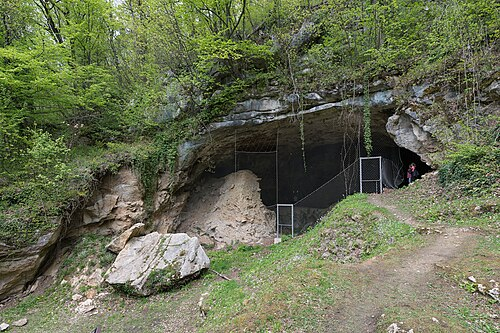
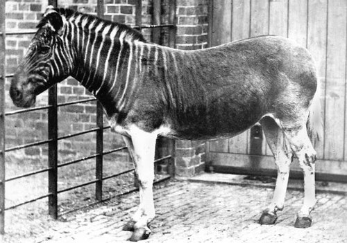

On 7 May 2010 a team of 56 scientists led by **[Svante Pääbo](kloom:e/svante-paabo)**, of the **[Max Planck Institute for Evolutionary Anthropology](kloom:e/max-planck-institute-for-evolutionary-anthropology)** in Leipzig, published a draft of the genome of the **[Neanderthals](kloom:e/neanderthal)**, who lived in Europe and western Asia for some 400,000 years before they died out. They had read about four billion letters of it from three bones, each from a different woman, found in **[Vindija Cave](kloom:e/vindija-cave)** in Croatia. To get them they drilled 50 to 100 milligrams of powder from inside each bone with a sterile dentist's drill. The result was the high point of a field, **[ancient DNA](kloom:e/ancient-dna)**, that had spent a quarter of a century learning not to fool itself.

## Learning not to be fooled

It began with a museum skin. In 1984 Russell Higuchi and his colleagues in **[Allan Wilson](kloom:e/allan-wilson-biologist)**'s laboratory at the University of California, Berkeley, extracted DNA from dried muscle on a specimen of the **[quagga](kloom:e/quagga)**, a half-striped zebra of South Africa extinct since 1883. It came out at about one percent of the yield of fresh muscle, in short pieces. They cloned it in bacteria and read 229 letters of its **[mitochondrial DNA](kloom:e/mitochondrial-dna)**, which differed from a mountain zebra's at 12 places. The next year Pääbo, a graduate student in Uppsala working on mummies in secret beside his official project on viruses, reported human DNA cloned from the mummy of a child 2,400 years old. He later acknowledged, as the Nobel committee put it, that it "likely suffered from contamination by DNA from contemporary humans".

Contamination was the field's curse, and the polymerase chain reaction, which copies a trace of DNA a billion times, made it worse: it copies a speck of a laboratory worker's skin as faithfully as a fossil. In the 1990s laboratories reported DNA from insects in amber and from dinosaur bones tens of millions of years old. None of it held up; the dinosaur sequence turned out to be human. Pääbo's group built clean rooms and insisted that results be repeated in a second laboratory. In 1997 they read 379 letters of mitochondrial DNA from **[Neanderthal 1](kloom:e/neanderthal-1)**, the bones found in the Neander valley in 1856, and Mark Stoneking's laboratory in Pennsylvania confirmed them from a piece of the same bone. The sequence fell outside the variation of 2,051 present-day people.

## How a broken molecule is read

A whole genome needed more. The 2010 paper names the problems and answers each:

| Problem                                                 | The answer in 2010                                                                                                                                              |
| ------------------------------------------------------- | --------------------------------------------------------------------------------------------------------------------------------------------------------------- |
| 95 to 99% of the DNA is from microbes in the bone       | Enzymes that cut DNA rich in the pair CG, common in bacteria, enriched Neanderthal DNA four to sixfold; each read is mapped to the human and chimpanzee genomes |
| The DNA is in pieces, most under 200 letters            | Every fragment read whole, from both ends, by high-throughput machines, rather than chosen stretches copied by PCR                                              |
| Cytosine decays into uracil, read as thymine            | An alignment that expects C read as T near the ends                                                                                                             |
| Present-day human DNA looks the same as Neanderthal DNA | A tag sequence, TGAC, attached to every molecule in the clean room; anything without it discarded                                                               |
| How much contamination is left?                         | The bones were female, so men's DNA shows as Y chromosome: 0 to 4 fragments found where 482 to 611 were expected from a male; under 1% by three methods         |

The decay is also a signature. At the first letter of a fragment "~40% of cytosine residues can appear as thymine residues," falling away further in, as the plate draws. The field now uses it to authenticate: a modern contaminant is longer and undamaged.

## What the genome said

The test was simple to state. At places where two living people differ, a Neanderthal should match each equally often, unless one has Neanderthal ancestors. Against a San and a Yoruba from Africa, a Frenchman, a Han Chinese and a Papuan, the Neanderthal matched each of the three non-Africans more often, by 3.8 to 5.3 percent, and matched them equally. The authors concluded that Neanderthals interbred with the ancestors of everyone outside Africa, probably in the Middle East, contributing 1 to 4 percent of their genomes. They named the alternative themselves: an old division within Africa could leave the same signal. Later work on the length of the shared segments favored interbreeding, about 47,000 to 65,000 years ago. A high-quality genome from a Siberian Neanderthal narrowed the share in 2014 to 1.5 to 2.1 percent. In 2020 Lu Chen, Joshua Akey and their colleagues found Neanderthal DNA in Africans too, about 0.3 percent, carried back by later migrations; David Reich thought the signal weak.

In 2010 the same team read DNA from the tip of a child's finger bone found two years earlier in **[Denisova Cave](kloom:e/denisova-cave)**, in the Altai Mountains of Siberia. It belonged to neither Neanderthals nor us: a new group, the **[Denisovans](kloom:e/denisovan)**, whose DNA makes up 4 to 6 percent of the genomes of people in New Guinea and Bougainville. The Neanderthal draft had read each letter only 1.3 times on average and the finger bone 1.9; better extraction soon read archaic genomes dozens of times over.

| Genome                      | Year |  Coverage |
| --------------------------- | ---- | --------: |
| Vindija Neanderthals, draft | 2010 |      1.3× |
| Denisovan finger bone       | 2010 |      1.9× |
| Denisovan finger bone       | 2012 | about 30× |
| Altai Neanderthal           | 2014 |       52× |
| Vindija Neanderthal         | 2017 | about 30× |

In 2022 Pääbo received the **[Nobel Prize in Physiology or Medicine](kloom:e/nobel-prize-in-physiology-or-medicine)** "for his discoveries concerning the genomes of extinct hominins and human evolution."

## Not only people

The same methods read other dead things. Herbarium leaves at Kew and Munich, blackened by blight from 1845 on, held 1 to 20 percent DNA of **[_Phytophthora infestans_](kloom:e/phytophthora-infestans)**, with the same C-to-T damage at its ends; in 2013 Kentaro Yoshida and his colleagues found that the famine was caused by one strain, HERB-1. Mitochondrial DNA from 15 ancient Iranian cattle let Ruth Bollongino's team estimate in 2012 that today's humpless cattle descend from about 80 tamed aurochs cows. In 2007 Joachim Burger's team found that none of nine early Europeans carried the variant that gives Europeans **[lactase persistence](kloom:e/lactase-persistence)**. And a **[maize](kloom:e/maize)** cob 5,310 years old from Mexico's Tehuacan Valley was closer to modern maize than to wild teosinte, yet carried many domestication genes still in their wild form.

From reading old genomes, the segment turns to writing new ones.
