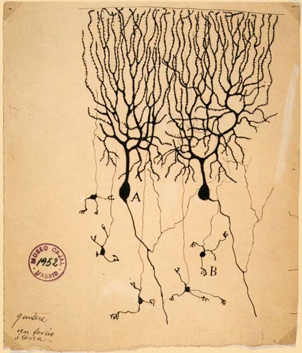

By the 1870s the cell theory held for every tissue but one. Nerve cells had been seen, but their branches thinned away into a tangle that no stain could follow, and most anatomists believed that the branches fused into one continuous net. **[Joseph von Gerlach](kloom:e/joseph-von-gerlach)** gave this **[reticular theory](kloom:e/reticular-theory)** its classic form in the early 1870s: nervous activity flowed through a web, not from cell to cell. The question was simple to ask and impossible to settle with the stains of the day. Was the nervous system a network, or was it made of separate cells?

## The black reaction

The answer began in a kitchen. **[Camillo Golgi](kloom:e/camillo-golgi)**, a young physician in charge of a hospital for the chronically ill at Abbiategrasso, near Milan, had set up a laboratory in a kitchen, his apartment's in one account and the hospital's in another. On 16 February 1873 he wrote to a friend, in Javier DeFelipe's translation: "I let the silver nitrate react with pieces of brain hardened in potassium dichromate. I have obtained magnificent results." He published it that August. Silver chromate crystallized inside a few nerve cells, by later estimates only one to five in a hundred, and filled each one completely, black against a clear yellow ground, while its neighbors stayed invisible. Nobody knew why it chose the cells it did. **[Golgi's method](kloom:e/golgis-method)** was the first **[staining](kloom:e/staining)** of the nervous system that showed a whole cell. As American pathologists printed it in 1897:

| Step       | Golgi's slow method                                    | Golgi's quick method                                                 |
| ---------- | ------------------------------------------------------ | -------------------------------------------------------------------- |
| Harden     | 2% potassium dichromate, two to six weeks, in the dark | 1 part 1% osmic acid to 4 parts 3.5% dichromate, three to eight days |
| Impregnate | ¾% silver nitrate, 24 to 48 hours                      | ¾% silver nitrate, one to six days                                   |
| Cut        | Thick sections, 1/20 to 1/10 mm, by razor or microtome | The same                                                             |
| Mount      | Without a cover glass, kept from light and dust        | The same; Cajal repeated both baths, his "double method"             |

The stain showed Golgi that the short branches, the dendrites, ended freely. The long fibers, the axons, he thought, divided and merged into what he called a "diffuse nerve network". He had the method that could have overturned the net, and he used it to describe one.

## Autonomous cantons

In 1887 the psychiatrist Luis Simarro showed **[Santiago Ramón y Cajal](kloom:e/santiago-ramon-y-cajal)**, a professor at Barcelona, aged 35, a slide stained Golgi's way. Cajal later described what such a slide showed, in DeFelipe's translation: "On the perfectly translucent yellow background sparse black filaments appeared that were smooth and thin or thorny and thick, as well as black triangular, stellate or fusiform bodies! One would have thought that they were designs in Chinese ink on transparent Japanese paper."

Cajal made two changes. He used the quick method on the brains of embryos and young animals, where the forest of branches is still thin enough to trace a single fiber to its end, and he repeated the impregnation for a fuller stain. In May 1888, in the first issue of the _Revista Trimestral de Histología Normal y Patológica_, he described the cerebellum of birds: the axons, too, ended freely, in baskets and tufts pressed against other cells, and never joined them. Each nerve cell, he wrote, as Jairo Rozo and colleagues translate it, was "an absolutely autonomous physiological canton." At a congress in Berlin in 1889 he took the leading German histologist, Albert von Kölliker, to a microscope, and Kölliker confirmed his findings within months. In 1891 **[Wilhelm Waldeyer](kloom:e/heinrich-wilhelm-gottfried-von-waldeyer-hartz)**, drawing on Kölliker, Golgi, Cajal, Auguste Forel and others, named the unit the **[neuron](kloom:e/neuron)**, and the **[neuron doctrine](kloom:e/neuron-doctrine)** took its name.

From the shapes Cajal read a direction. In the retina and the smell pathway the signal plainly travels one way, and he generalized it in 1891 as the _dynamic polarization_ of the neuron: impulses enter by the dendrites and cell body and leave by the axon, toward the next cell. The plate draws a neuron that way, its arrows his. In 1897 **[Charles Sherrington](kloom:e/charles-scott-sherrington)** named the point of contact the **[synapse](kloom:e/synapse)**.

## Stockholm, 1906

The two men shared the **[Nobel Prize in Physiology or Medicine](kloom:e/nobel-prize-in-physiology-or-medicine)** for 1906, "in recognition of their work on the structure of the nervous system". Golgi spoke first, on 11 December, and opened by saying that he had "always been opposed to the neuron theory", though its starting point lay in his own work. He ended: "I cannot abandon the idea of a unitary action of the nervous system." The next day Cajal told the same audience that nerve cells relate "in contiguity but not in continuity." Both used the same stain and similar microscopes, DeFelipe notes, and saw different things.

## Seeing the gap

A light microscope could not show whether two membranes touched. The **[electron microscope](kloom:e/electron-microscope)** could. In 1955 Eduardo De Robertis and H. Stanley Bennett found the membranes at frog and earthworm synapses separated by a space 100 to 150 ångströms across, and in 1956 Sanford Palay described synapses in the rat's brain "without any protoplasmic continuity across the synapse," the two cells parted by a cleft about 200 ångströms, 20 nanometers, wide. Cajal was right about most of the brain, but Golgi was not wholly wrong: at electrical synapses, joined by gap junctions, some neurons do share their cytoplasm, and they are more common than was once thought.

The neuron doctrine became the starting point for others. In 1943 **[Warren McCulloch](kloom:e/warren-sturgis-mcculloch)** and Walter Pitts began the paper that founded the **[artificial neuron](kloom:e/artificial-neuron)** with it: "The nervous system is a net of neurons, each having a soma and an axon." The next section leaves the microscope for the rocks, and deep time.
