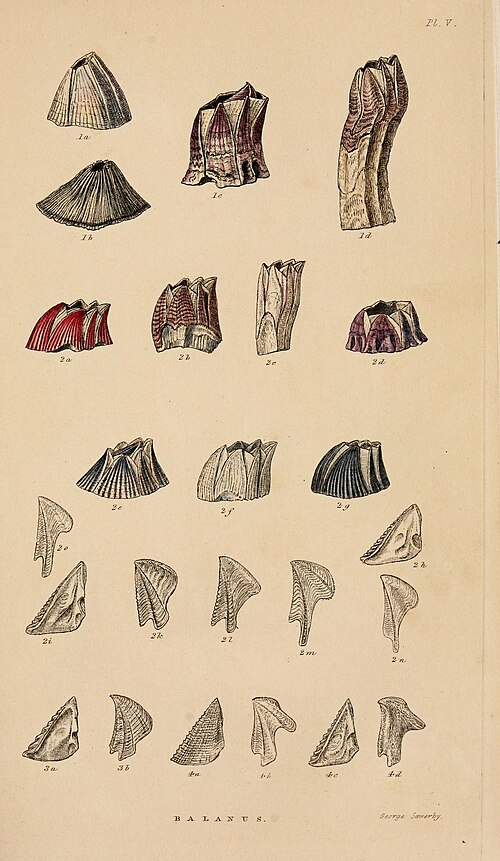

Back in London in 1837, **[Charles Darwin](kloom:e/charles-darwin)** handed his bird skins to the ornithologist **[John Gould](kloom:e/john-gould)**, and Gould's answers changed what the voyage meant. The mockingbirds Darwin had collected on different islands of the Galápagos were not varieties of one species but separate species. The dull little birds he had taken for wrens, blackbirds and finches were all finches, a new group of their own. If species could differ from island to island, perhaps they were not fixed. In July 1837 Darwin opened a small leather notebook, 17 by 10 centimeters, wrote "B" on its covers and headed its first page "Zoonomia," after the book in which his grandfather **Erasmus Darwin** had speculated on the descent of animals. It was the first of his notebooks on the _transmutation of species_.

## The tree on page 36

The notebook is a private argument, written fast, and through it grows a **[tree of life](kloom:e/tree-of-life-biology)**. On page 21 he wrote, "Organized beings represent a tree irregularly branched some branches far more branched — Hence Genera." A few pages on he tried a better image: "The tree of life should perhaps be called the coral of life, base of branches dead; so that passages cannot be seen." Then on page 36, after the words "I think," he drew it: a line rising from a circled "1," splitting, and splitting again, into some two dozen tips. Some tips end in a short crossbar and some do not. Four carry letters, A, B, C and D. Beside and below it he wrote what the drawing meant:

> (Case must be that one generation then should be as many living as now.) (To do this & to have many species in same genus (as is) requires extinction.) Thus between A & B. immense gap of relation, C & B. the finest gradation, B & D rather greater distinction. Thus genera would be formed.— bearing relation to ancient types.

The plate redraws the sketch as a schematic. Read with its notes, it encodes a new account of classification:

| In the sketch                       | What it stands for                                                        |
| ----------------------------------- | ------------------------------------------------------------------------- |
| The circled 1 at the root           | An ancestral species                                                      |
| A tip with a crossbar               | A species living now                                                      |
| A tip without one                   | A line that died out                                                      |
| B and C, on one fork                | Close kin: "the finest gradation"                                         |
| A and B, on branches that split low | Different genera: "immense gap," left by the lines between them dying out |

That last row is the point. Naturalists had long sorted living things into groups within groups, and **Jean-Baptiste Lamarck** had drawn a branching table of animals in 1809, but as parallel lines of progress, not a family. Darwin's sketch makes the groups a genealogy: species look alike because they share ancestors, and the gaps between genera are where branches were lost. On the next page he added the arithmetic of it. If one ancient species leaves thirteen living descendants, then, for the number of species to stay steady, twelve of its contemporaries "must have left no offspring at all." It is the best known of his early drawings of the tree, and it is described here rather than shown. Notebook B belongs to **[Cambridge University Library](kloom:e/cambridge-university-library)**. Missing since 2001 and presumed stolen, Notebook B was returned anonymously on 9 March 2022, wrapped in cling film in a pink gift bag, with a note: "Librarian Happy Easter X."

## A hundred thousand wedges

The tree showed what had happened, not why. The cause came on 28 September 1838, when Darwin read the sixth edition of **[Thomas Robert Malthus](kloom:e/thomas-robert-malthus)**'s **[_An Essay on the Principle of Population_](kloom:e/an-essay-on-the-principle-of-population)**: people breed faster than their food, and famine and death keep their numbers down. In Notebook D he applied it to every species. "One may say there is a force like a hundred thousand wedges," he wrote, driving "every kind of adapted structure" into the gaps in the economy of nature, "or rather forming gaps by thrusting out weaker ones." Crowding would preserve any small advantage. That was **[natural selection](kloom:e/natural-selection)**. In his autobiography he dated the reading to October 1838 and said he had read Malthus "for amusement"; the notebook's own date is a few days earlier.

## Twenty years

In June 1842 he wrote a sketch of the theory in pencil, 35 pages, and in 1844 an essay of 230. On 5 July 1844 he wrote to his wife, **Emma Darwin**, asking that if he died suddenly she spend £400 to have it edited and published, preferably by Lyell. That January he had written to the botanist **[Joseph Dalton Hooker](kloom:e/joseph-dalton-hooker)** that he was "almost convinced … that species are not (it is like confessing a murder) immutable." Then, from 1846 to 1854, he spent eight years describing every known living **[barnacle](kloom:e/barnacle)**, the plates of whose shells are drawn here, losing two of them to illness.

Why did he wait until 1856 to begin his big species book? From the middle of the twentieth century historians made the "delay" a central puzzle. The psychologist Howard Gruber and the biographers Adrian Desmond and James Moore put it down to fear: of colleagues, of the radical politics evolution was bound up with, of distressing Emma, who was devout. In 2007 the historian **[John van Wyhe](kloom:e/john-van-wyhe)** argued that there was no delay to explain. Darwin's belief was known to friends, the "murder" line was his usual joking, and he simply finished each book before starting the next. Both readings rest on the same letters.

In 1858 a letter from **[Alfred Russel Wallace](kloom:e/alfred-russel-wallace)** set out the same theory, and the book Darwin rushed out the next year carried one illustration: a branching tree of lettered species, the page 36 sketch grown up. That book is this trail's anchor, **[_On the Origin of Species_](kloom:e/on-the-origin-of-species)**.
