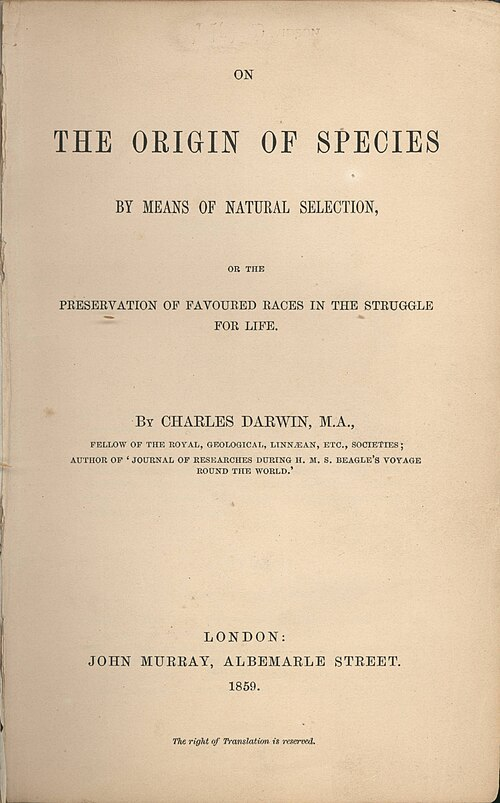

On Thursday 24 November 1859 the London firm of **[John Murray](kloom:e/john-murray-publishing-house)** published a book with a long title: **[_On the Origin of Species_](kloom:e/on-the-origin-of-species)** _by Means of Natural Selection, or the Preservation of Favoured Races in the Struggle for Life_. Its author, **[Charles Darwin](kloom:e/charles-darwin)**, had been gathering evidence for it for twenty years, and had been writing it up since 1856 as a much larger work, his "big book." The essay that **[Alfred Russel Wallace](kloom:e/alfred-russel-wallace)** sent him from the Moluccas in 1858 made him write it down quickly, and its introduction still calls it an "Abstract". Murray had taken it in April 1859 after seeing three chapters, and talked him out of putting the word "abstract" in the title.

## One long argument

"As this whole volume is one long argument," Darwin wrote in his last chapter, he would sum it up. The argument runs in four steps, and the introduction gives them in a single paragraph:

| Step                   | The claim                                                                                               | Chapters |
| ---------------------- | ------------------------------------------------------------------------------------------------------- | -------- |
| Variation              | Plants and animals, wild and domestic, differ from one another, and much of the difference is inherited | I–II     |
| Struggle for existence | Far more are born than can survive, since every species increases geometrically if unchecked            | III      |
| Natural selection      | A variation that helps its owner, however slight, gives it a better chance of living and leaving young  | IV       |
| Divergence             | The most different descendants take the most places in nature, and the forms between them die out       | IV       |

The struggle, he wrote, "is the doctrine of **[Malthus](kloom:e/thomas-robert-malthus)** applied with manifold force to the whole animal and vegetable kingdoms; for in this case there can be no artificial increase of food, and no prudential restraint from marriage." He had read Malthus on population in October 1838, by his own later account. The result he put in one sentence: any being that varies "however slightly in any manner profitable to itself … will have a better chance of surviving, and thus be _naturally selected_." So **[natural selection](kloom:e/natural-selection)** got its name.

## How to read the diagram

The book has one figure, a folded lithograph facing page 117, and the plate redraws it. Along the bottom stand eleven letters, A to L (there is no J): the species of one large genus, spaced unequally because some are more alike than others. Each horizontal line, I to XIV, marks a thousand generations, though "it would have been better if each had represented ten thousand"; later he lets it stand for a million or a hundred million, or for a layer of rock. From the common, widespread species A rises a fan of dotted lines, its varying offspring. Where a line reaches a horizontal, a small letter marks a variety distinct enough to be recorded: _a_¹ and _m_¹ after the first thousand generations.

Follow the fan upward. The outermost lines survive, because the most different descendants compete least. By the tenth line A has three forms, _a_¹⁰, _f_¹⁰ and _m_¹⁰, and by the fourteenth eight new species, while species I has given six. A itself, I, and the forms between them have died out. Only F goes up unchanged. The gaps between the groups at the top were made by extinction, and the groups within groups are what naturalists had been classifying all along. Darwin warned that he did not suppose "the process ever goes on so regularly."

## The evidence

He began with what breeders do. "I have kept every breed which I could purchase or obtain," he wrote of pigeons, and he joined two London pigeon clubs. The carrier and the tumbler differ in beak and skull, yet all, he argued, came from the **[rock dove](kloom:e/rock-dove)**, _Columba livia_. Then came the rest of natural history. Fossils were few and gappy because of "the extreme imperfection of the geological record." Islands were stocked from the nearest mainland: of the twenty-six land birds of the **[Galápagos Islands](kloom:e/galapagos-islands)**, which he had visited in the **[_Beagle_](kloom:e/hms-beagle)**, the ornithologist John Gould ranked twenty-five as species found nowhere else, and yet a naturalist there "feels that he is standing on American land." Embryos showed descent too: "the embryo is the animal in its less modified state."

## What it left out

Two things. "The laws governing inheritance are quite unknown," he admitted in chapter I, and the theory needed them; [Gregor Mendel](kloom:e/gregor-mendel)'s work on peas began, in 1866, to supply them. And people: in March 1859 he had asked **[Charles Lyell](kloom:e/charles-lyell)** to tell Murray "that I do not discuss origin of man." The book gives humanity one sentence near the end: "Light will be thrown on the origin of man and his history."

Nor did it say **[evolution](kloom:e/evolution)**. The last word of the first edition was "evolved," but the noun first appears in the sixth edition of 1872, which also dropped "On" from the title. The fifth, of 1869, took up **[Herbert Spencer](kloom:e/herbert-spencer)**'s phrase "survival of the fittest." In 1861 Darwin added a sketch of his predecessors, and by 1866 a footnote on **[Aristotle](kloom:e/aristotle)**, in whose _Physics_ he read natural selection "shadowed forth".

## How it sold

| Edition | Year | Copies printed |
| ------- | ---- | -------------- |
| 1st     | 1859 | 1,250          |
| 2nd     | 1860 | 3,000          |
| 3rd     | 1861 | 2,000          |
| 4th     | 1866 | 1,500          |
| 5th     | 1869 | 2,000          |
| 6th     | 1872 | 3,000          |

Darwin remembered that the whole first edition "was sold on the day of publication." The bibliographer R. B. Freeman, who went through Murray's accounts, found something different: booksellers at Murray's sale on 22 November asked for about 1,500 copies, but only some 1,170 were left for them once review and presentation copies were taken out, so it was oversubscribed, not sold to readers in a day. The second edition, of 3,000, followed on 7 January 1860, the largest printing in his lifetime; the six editions came to 12,750 copies, by our arithmetic.

The reviews divided at once. **[Thomas Henry Huxley](kloom:e/thomas-henry-huxley)** praised the book, anonymously, in _The Times_ on 26 December 1859. **[Richard Owen](kloom:e/richard-owen)**, Britain's leading anatomist, attacked it, also anonymously, in the _Edinburgh Review_ in April 1860. The quarrel went public at Oxford the following summer. The trail from here, _The Beagle_, goes back to where the argument began.
