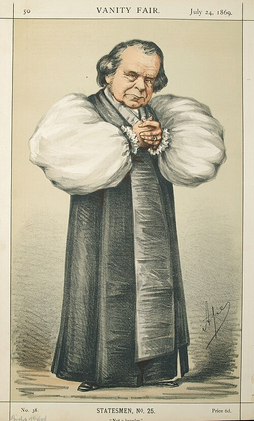
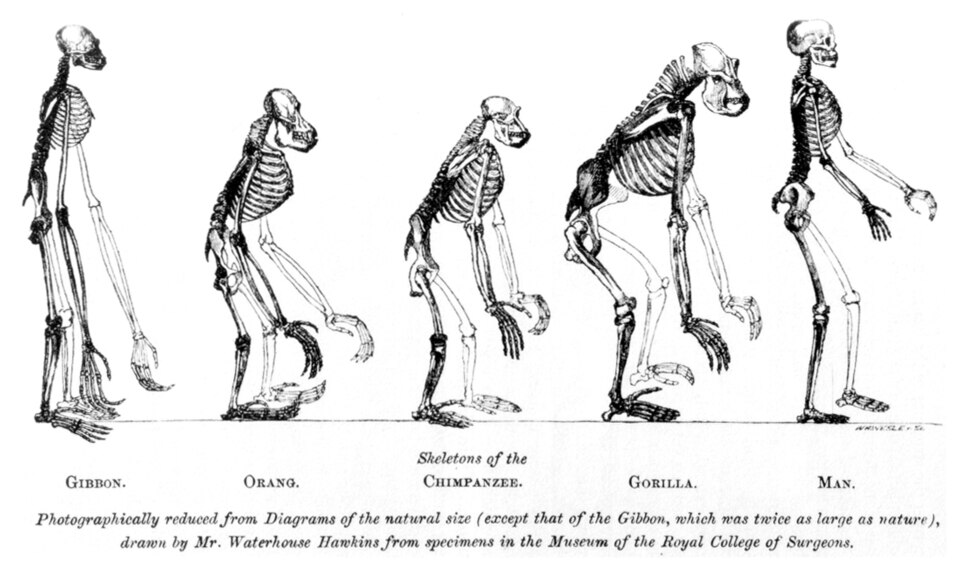

At the end of June 1860 the **[British Association for the Advancement of Science](kloom:e/british-science-association)** held its annual meeting at Oxford, in the new **[University Museum](kloom:e/oxford-university-museum-of-natural-history)**. Darwin, ill, stayed at home. On Thursday 28 June, in the zoology section, **[Richard Owen](kloom:e/richard-owen)** said that the gorilla's brain differed more from a man's than from the lowest primate's; **[Thomas Henry Huxley](kloom:e/thomas-henry-huxley)** contradicted him flatly and promised the evidence. On Saturday 30 June the American chemist **[John William Draper](kloom:e/john-william-draper)** read a paper "On the Intellectual Development of Europe, considered with reference to the views of Mr. Darwin and others." The crowd had come for the discussion after it. Between 700 and 1,000 people, Hooker guessed, filled the museum's long west room, with ladies packed into the window seats. **[John Stevens Henslow](kloom:e/john-stevens-henslow)**, Darwin's old teacher, took the chair. **[Samuel Wilberforce](kloom:e/samuel-wilberforce)**, bishop of Oxford and one of the great speakers of the age, had written a long review of the _Origin_ for the _Quarterly Review_ and was expected to demolish it.

Huxley nearly stayed away. In 1891 he recalled that he had meant to leave Oxford that day, and that **[Robert Chambers](kloom:e/robert-chambers-publisher-born-1802)**, the anonymous author of the evolutionary _Vestiges_ of 1844, met him in the street and accused him of deserting the cause.

## What was said, and how we know

Nobody took the words down. What survives is a set of letters, reports and memories, written from two days to thirty-eight years afterward, and they do not agree:

| Witness                                                  | Written      | The bishop asked                                                                                                                                    | Huxley answered                                                                                                                                      |
| -------------------------------------------------------- | ------------ | --------------------------------------------------------------------------------------------------------------------------------------------------- | ---------------------------------------------------------------------------------------------------------------------------------------------------- |
| Hooker, letter to Darwin                                 | 2 July 1860  | (no words given) he "ridiculed you badly & Huxley savagely"                                                                                         | "answered admirably & turned the tables," but "could not throw his voice over so large an assembly"                                                  |
| _Reading Mercury_                                        | 7 July 1860  | "would you rather have had an ape for your grandfather or grandmother?"                                                                             | "I would rather have had apes on both sides for my ancestors … than human beings so warped by prejudice that they were afraid to behold the truth"   |
| _Athenaeum_, the semi-official report                    | 14 July 1860 | (no question reported)                                                                                                                              | Darwin's theory was an explanation of facts, as the wave theory of light was                                                                         |
| _Oxford Chronicle_                                       | 21 July 1860 | "whether he would prefer an ape for his grandfather, and a woman for his grandmother, or a man for his grandfather, and an ape for his grandmother" | he would rather descend from apes than from a man who "misused his gifts to ridicule the laborious investigators of science"                         |
| Alfred Newton, letter to his brother                     | July 1860    | whether he had "a preference for the descent being on the father's side or the mother's side"                                                       | "he would sooner claim kindred with an Ape than with a man like the Bp."                                                                             |
| Huxley, letter to Frederick Dyster                       | 9 Sept. 1860 | (his own paraphrase of the question)                                                                                                                | "I unhesitantly affirm my preference for the ape"                                                                                                    |
| "Reminiscences of a Grandmother," _Macmillan's Magazine_ | Oct. 1898    | "was it through his grandfather or his grandmother that he claimed his descent from a monkey?"                                                      | "He was not ashamed to have a monkey for his ancestor; but he would be ashamed to be connected with a man who used great gifts to obscure the truth" |

The famous lines are the last, set down nearly forty years on. **[Joseph Dalton Hooker](kloom:e/joseph-dalton-hooker)** thought it was his own speech, after Huxley's, that "smashed" the bishop; Wilberforce wrote three days later, "I think I thoroughly beat him." Darwin's old captain, **[Robert FitzRoy](kloom:e/robert-fitzroy)**, rose to regret the book and was shouted down.

## The serious critics

Wilberforce's arguments came, Hooker thought, from Owen, whose own anonymous review in the _Edinburgh Review_ that April had confessed "our disappointment" in Darwin's facts while quoting "Professor Owen" in the third person as an authority. Their quarrel over the brain ran for three years, until Huxley's **[_Evidence as to Man's Place in Nature_](kloom:e/mans-place-in-nature)** (1863) set the skeletons of the apes and of man side by side.

Harder objections came from outside biology. In 1862 the physicist William Thomson, later **[Lord Kelvin](kloom:e/lord-kelvin)**, calculated from the heat leaking out of the earth that its crust had set between 20 and 400 million years ago, most probably 98 million: too short, Darwin feared, for selection to have done its work. Darwin called Thomson's figure "one of my sorest troubles." In 1867 the engineer **[Fleeming Jenkin](kloom:e/fleeming-jenkin)** argued that a single favorable variation would be "swamped by numbers," diluted away in a few generations of crossing; he illustrated it with a racist story of a white sailor wrecked among Black islanders. In 2024 Thierry Hoquet argued that the usual modern reading of the review, as an objection to blending inheritance, is itself a myth. Darwin's own theory of heredity, [pangenesis](kloom:e/pangenesis), came the next year.

## The defenders, and the myth

Hooker had backed natural selection in print in December 1859. In America **[Asa Gray](kloom:e/asa-gray)** arranged an authorized edition, defended the book in the _Atlantic Monthly_ in 1860, with Darwin paying to reprint the essays, and broke with his Harvard colleague **[Louis Agassiz](kloom:e/louis-agassiz)** over it. Huxley took the public part.

How much of the Oxford story is legend? In 1979 the philosopher J. R. Lucas called it "a legendary encounter." The version everyone knows took shape in the biographies by Darwin's son Francis (1887) and Huxley's son Leonard (1900), the second of which called it "the open clash between Science and the Church." Frank James showed that the _Athenaeum_ had smoothed over a quarrel that embarrassed the association, and David Livingstone counted "that Huxley defeated Wilberforce" among the myths of science and religion. In 2017 Richard England found the _Oxford Chronicle_'s fuller report: the clash was real, and the official account had cut it. Clergymen held high offices in the association itself; this was a quarrel over who spoke for science as much as one between science and faith. The question Darwin could not answer, heredity, opens the next part of the story.
