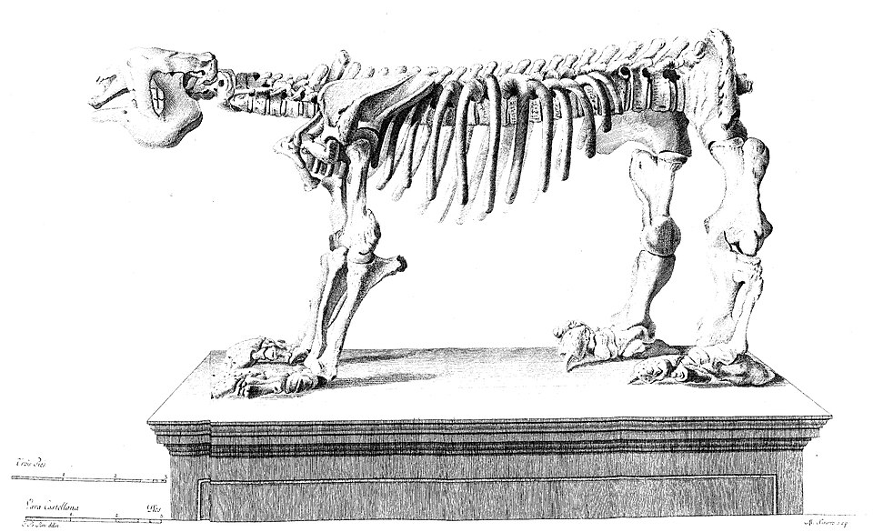
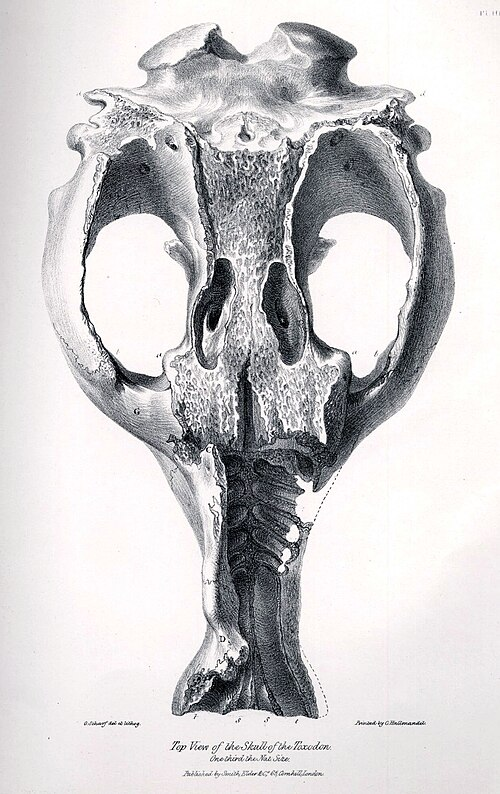

In September 1832 the _Beagle_ lay at **[Bahía Blanca](kloom:e/bahia-blanca)**, a frontier fort on the Argentine coast founded four years before, while her officers surveyed the harbor. On the 22nd [Darwin](kloom:e/charles-darwin) went cruising round the bay with [FitzRoy](kloom:e/robert-fitzroy) and stopped at Punta Alta, about ten miles from the ship, a low cliff where shingle and red clay held "numerous shells & the bones of large animals." Next day he walked back. "To my great joy," he wrote in his diary, "I found the head of some large animal, imbedded in a soft rock.— It took me nearly 3 hours to get it out." He dug there on and off until mid-October, and again in August 1833. All the bones, he noted, came out of a patch of beach no more than about 150 yards square.

## What came out of the cliff

Darwin had no comparative collection to check against, only books and what he knew of living animals. The paleontologists Juan Carlos Fernicola, Sergio Vizcaíno and Gerardo De Iuliis have set his field guesses beside the names **[Richard Owen](kloom:e/richard-owen)** gave the bones in London:

| The find                             | Darwin's first name for it | Owen, 1838–45                     | Today                          |
| ------------------------------------ | -------------------------- | --------------------------------- | ------------------------------ |
| Head, September 23, 1832             | "allied to the Rhinoceros" | _Megatherium_ (skull fragments)   | _Megatherium americanum_       |
| Jaw with one tooth, October 8, 1832  | _Megatherium_              | _Megalonyx_                       | _Mylodon darwinii_             |
| A spread of bony polygonal plates    | the armor of _Megatherium_ | an armored relative of armadillos | a glyptodont                   |
| Large molars                         | "an enormous Rodentia"     | _Toxodon_                         | _Toxodon_                      |
| A nearly whole skeleton, August 1833 | none recorded              | _Scelidotherium_, a new sloth     | _Scelidotherium leptocephalum_ |
| A tooth like "the common horse"      | a horse (_Journal_, 1839)  | _Equus curvidens_                 | an extinct horse               |

Which head Darwin first took for a rhinoceros is disputed. The historian **[Frank Sulloway](kloom:e/frank-sulloway)** took it for the _Scelidotherium_; Fernicola and his colleagues point out that the skeleton came out a year later, so the head must be one of the skulls Owen gave to the great ground sloth.

His mistakes came from the best authority of the day. **[Georges Cuvier](kloom:e/georges-cuvier)** had named **[_Megatherium_](kloom:e/megatherium)**, the great ground sloth, in 1796 from a skeleton dug up near Luján in 1787 and mounted in Madrid, and he had accepted a report that it wore armor. So wherever Darwin found bony plates, he assigned the big bones beside them to _Megatherium_. His first instinct about the plates had been better. "Immediately I saw them," he wrote to [Henslow](kloom:e/john-stevens-henslow), "I thought they must belong to an enormous Armadillo, living species of which genus are so abundant here." Owen showed in 1839 that they belonged to the **[glyptodonts](kloom:e/glyptodont)**, armored giants related to armadillos.

## The dead and the living

The shells in the gravel were of species still living in the bay, "in nearly the same proportional numbers," so the giants had died recently, geologically speaking, and the bones had not washed in from older rock: one skeleton still lay in place, its kneecap included. And the dead resembled the living. The _Journal_ of 1839 calls it "the law that existing animals have a close relation in form with extinct species." South America had perhaps nineteen living species of sloths, armadillos and anteaters, Darwin counted, and the rest of the world five. "If, then, there is a relation between the living and the dead, we should expect that the Edentata would be numerous in the fossil state," and so they were. In 1845 he called it "this wonderful relationship in the same continent between the dead and the living," and said that it would "throw more light on the appearance of organic beings on our earth, and their disappearance from it, than any other class of facts." By 1859, in the _Origin_, it was evidence of descent.

At Port St Julian in January 1834 he found half a skeleton of "some large animal, I fancy a Mastodon." Owen named it **[_Macrauchenia_](kloom:e/macrauchenia)** and judged it a relative of the camels, so it stood beside the guanaco as **[_Toxodon_](kloom:e/toxodon)** stood beside the capybara. Then Darwin asked what had killed them. "In the Pampas, the great sepulchre of such remains, there are no signs of violence, but on the contrary, of the most quiet and scarcely sensible changes." This was **[extinction](kloom:e/extinction)** without a catastrophe, against Cuvier's revolutions of the globe.

Some of the evidence has turned over since. _Toxodon_ is not a giant rodent, nor _Macrauchenia_ a camel: proteins and DNA from their bones place both nearer the horses and rhinoceroses. The glyptodonts descend from armadillos, not the other way round. Sulloway argued that Darwin's own confusions in the field had hidden what the fossils implied; Fernicola and his colleagues suggest that Owen's errors, by tying each fossil to a living neighbor, made the evidence look stronger than it was. The giants died out about 12,000 years ago, after people reached the Americas, and some were butchered.

## Where the bones went

Darwin bought the most complete skull of all, a _Toxodon_'s, on a farm in Uruguay in November 1833 "for the value of eighteen pence"; boys had been knocking out its teeth with stones. The bones went to Henslow, then to Owen, whose _Fossil Mammalia_ (1838–40) began by noting that the South American fossils known before amounted to "three species of Mastodon, and the gigantic Megatherium." They were kept at the Royal College of Surgeons, in the **[Hunterian Museum](kloom:e/hunterian-museum-london)**. Bombs struck it in 1941 (in May, says the museum's history; Fernicola and colleagues give April), and about 95 percent of its fossil collection was lost, 175 specimens left of 5,000. Darwin's specimens of _Toxodon_, _Macrauchenia_, _Mylodon_ and _Scelidotherium_ were among the survivors. From 1946 nearly all of them went to the **[Natural History Museum](kloom:e/natural-history-museum-london)**, where they remain.

The trail goes on up the Pacific coast, to islands where the living differed from place to place.
