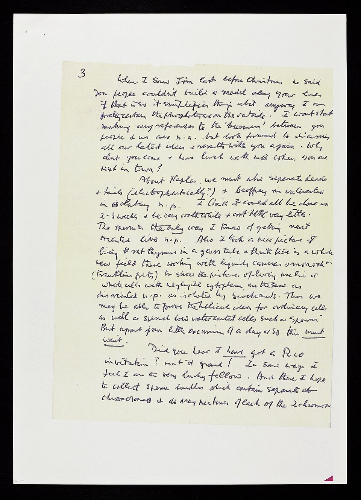

In January 1951 **[Rosalind Franklin](kloom:e/rosalind-franklin)**, a 30-year-old physical chemist who had spent nearly four years in Paris reading the structure of coal and carbon from X-ray patterns, joined the Medical Research Council's biophysics unit at **[King's College London](kloom:e/kings-college-london)**. Its director, **[John Randall](kloom:e/john-randall-physicist)**, had written to her that she would take over the X-ray work on **[DNA](kloom:e/dna)**, and he gave her a PhD student, **[Raymond Gosling](kloom:e/raymond-gosling)**. He did not tell his deputy, **[Maurice Wilkins](kloom:e/maurice-wilkins)**, a physicist who had worked on the Manhattan Project and who, with Gosling, had already coaxed a sharp pattern out of DNA fibers in 1950 ("I must be the first person ever to make genes crystallize," Gosling remembered thinking). Wilkins came back from holiday to treat her as a colleague in his project; she had been told it was hers. Gosling, in his telling, "spent my life going from one to the other, giving messages, trying to play the peacemaker."

## Two forms

Franklin built a camera whose humidity she could set with saturated salt solutions, and her first finding was that DNA comes in two forms. Pulled into fibers and held at about 75 percent humidity it was crystalline, her _structure A_, with sharp, crowded spots. Wetter, it took up water, grew about 30 percent longer and turned into _structure B_, with a simpler, blurrier pattern; drying turned it back. Earlier workers had photographed a mixture of the two, which is why their pictures were muddy. Randall split the work: Franklin kept the purest DNA and the A form, which gave over a hundred spots to calculate from, and Wilkins took the B form.

On Friday 2 May 1952 Franklin and Gosling set up the camera on a B fiber, and on Tuesday 6 May they developed the plate: 62 hours of exposure, recorded in Franklin's notebook as photograph number 51. Accounts differ over whose hands took it. King's College's own history says Franklin with Gosling; Wikipedia says Gosling, working under her.

## How an X means a helix

**[Photo 51](kloom:e/photo-51)** is not a shadow picture. X-rays scattered by a repeating structure reinforce one another in some directions only, and distances on the film are reciprocal: a long repeat along the fiber makes rows of spots close together, a short one puts them far out. Franklin and Gosling read it this way in _Nature_:

| On the film                                                               | What it measures                                | Their value                               |
| ------------------------------------------------------------------------- | ----------------------------------------------- | ----------------------------------------- |
| Evenly spaced horizontal rows of spots, the _layer lines_                 | One turn of the helix along the fiber           | 34 Å                                      |
| A strong spot on the vertical axis, on the tenth layer line               | The spacing of the bases stacked along the axis | 3.4 Å, ten to a turn                      |
| Innermost spots of layer lines 1, 2, 3 and 5 on straight lines: the cross | A helix; the angle of the arms gives its radius | About 10 Å to the phosphates              |
| No spot on the fourth layer line                                          | A second chain, displaced along the axis        | Two chains, three-eighths of a turn apart |

The cross is what a helix seen from the side does to X-rays: its zigs and zags scatter at two angles, which the theory worked out at King's by Alec Stokes and at Cambridge by Cochran, Vand and **[Francis Crick](kloom:e/francis-crick)** predicted. The missing fourth row was Franklin's own deduction. Two identical chains, one shifted three-eighths of a turn along, scatter waves that differ by that fraction on the first row, twice it on the second, and so on; on the fourth the difference is, by our arithmetic, 4 × ⅜ = 1½ waves, and the two cancel. The plate draws the pattern and the helix that makes it. Their paper concluded that "the structure is probably helical", with the phosphates outside.

## How it reached Cambridge

On 30 January 1953 **[James Watson](kloom:e/james-watson)** came to King's with a manuscript by **[Linus Pauling](kloom:e/linus-pauling)** proposing a DNA structure Watson knew was wrong, and by his own account quarreled with Franklin. Wilkins then showed him Photo 51. Franklin was leaving for Birkbeck College, Gosling now reported to Wilkins, and he had given Wilkins the print, with Franklin's knowledge, he said later; a King's history says she never knew it went to Watson. In mid-February **[Max Perutz](kloom:e/max-perutz)** gave Crick a December 1952 report to the Medical Research Council that carried Franklin's measurements, among them the 34 Å repeat and a symmetry implying chains running in opposite directions. Perutz wrote in 1969 that it had not been confidential. Wilkins had kept Crick and Watson abreast of the King's work since 1951, in talk and in letters like the one shown here.

Historians weigh the photograph differently. Brian Sutton's 2023 account for King's says it "played a crucial role". Matthew Cobb and Nathaniel Comfort, writing in _Nature_ the same year from Franklin's notebooks, find it played little part beside the report and six weeks of model building, and call her "an equal contributor". Watson and Crick's paper said they had not been "aware of the details". Watson's **[_The Double Helix_](kloom:e/the-double-helix)** (1968) made the photograph a eureka and Franklin a caricature, "Rosy"; Gosling called the book "a novel". Franklin had not seen the base pairing, nor that the two chains run in opposite directions; Watson and Crick did.

## After

_Nature_ printed three papers on 25 April 1953: Watson and Crick's model, Wilkins, Stokes and Wilson's data, and Franklin and Gosling's, with Photo 51 as its figure. At Birkbeck Franklin turned to viruses. She showed in 1955 that the particles of **[tobacco mosaic virus](kloom:e/tobacco-mosaic-virus)** all share one length, and in 1956, with Donald Caspar, that its RNA winds along the inside of the hollow particle; **[Aaron Klug](kloom:e/aaron-klug)** joined her in 1954. She died of ovarian cancer on 16 April 1958, aged 37. In 1962 Watson, Crick and Wilkins shared the Nobel Prize in Physiology or Medicine; she had never been nominated, and it is not given to the dead. Klug won the chemistry prize in 1982 for the work they had begun together.

The double helix suggested how DNA might copy itself, and five years later two young scientists at Caltech weighed the copies.
