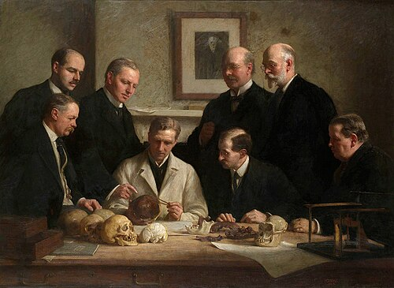

On 18 December 1912, at a meeting of the **[Geological Society of London](kloom:e/geological-society-of-london)**, a Sussex solicitor and amateur antiquarian, **[Charles Dawson](kloom:e/charles-dawson)**, and the Keeper of Geology at the [British Museum (Natural History)](kloom:e/natural-history-museum-london), **[Arthur Smith Woodward](kloom:e/arthur-smith-woodward)**, showed the remains of a new kind of early human. Dawson told the story. Some years before, he had noticed brown flints mending a farm road near Piltdown Common, and found the gravel pit they came from; a laborer there had handed him "a small portion of an unusually thick human parietal bone". In the autumn of 1911 he picked a larger piece of the same skull from the pit's spoil heaps and took it to Woodward, and through 1912 the two of them sifted the gravel. They found more pieces of a thick human braincase, part of a jaw with two worn molars, flints, and the teeth of extinct animals. Woodward named the creature _Eoanthropus dawsoni_, Dawson's dawn man. It became known as **[Piltdown Man](kloom:e/piltdown-man)**.

## What they hoped to find

The braincase, Woodward reckoned, had held at least 1,070 cubic centimeters, and was in many ways like a modern human's. The jaw, apart from its human-looking molars, was like a young chimpanzee's. Together they fitted what many British anatomists expected of a human ancestor. "The growth of the brain preceded the refinement of the features," the anatomist **[Grafton Elliot Smith](kloom:e/grafton-elliot-smith)** wrote in the published paper: a big brain first, the face to follow. The flints, and later a slab of bone carved into the shape of a cricket bat, made the dawn man a toolmaker too. It also gave Britain a leading place in the story of human evolution.

Some doubted at once. At the same meeting the anatomist David Waterston said that the skull was human and the jaw an ape's, and "very difficult to believe" were one animal's. Then the finds answered their critics. When **[Arthur Keith](kloom:e/arthur-keith)** of the Royal College of Surgeons ridiculed Woodward's reconstruction on 11 August 1913, a canine tooth, much like the one Woodward had modeled into the jaw, was found eighteen days later by the young Jesuit **[Pierre Teilhard de Chardin](kloom:e/pierre-teilhard-de-chardin)**. In 1915 Dawson reported more pieces of skull and a molar from a second site nearby, which won over doubters: an ape's jaw might fall beside a man's skull once by chance, but not twice. Dawson died in August 1916, and after his death nothing more was found.

## Forty years of the wrong ancestor

In 1925 the anatomist **[Raymond Dart](kloom:e/raymond-dart)** described a child's skull from a quarry at Taung, in South Africa, the **[Taung Child](kloom:e/taung-child)**: a small brain, the size of an ape's, on a creature whose skull suggested it walked upright and whose teeth were like a human's. Keith, Elliot Smith and Woodward, three of the men in the painting, judged it an ape. Piltdown had taught them to expect the brain to come first. Only in 1947 did Keith write to _Nature_ that "Prof. Dart was right and that I was wrong". By then fossils from China, Java and Africa had made Piltdown, with its ape's jaw under a modern braincase, the one that fitted nothing.

## How it was undone

In 1949 **[Kenneth Oakley](kloom:e/kenneth-oakley)** of the British Museum (Natural History) applied the fluorine test: buried bone slowly takes up fluorine from groundwater, so the bones of one deposit should carry similar amounts. Neither skull nor jaw held enough to be as old as was claimed. Then the Oxford anatomist **[Joseph Weiner](kloom:e/joseph-weiner)** suggested the jaw might be a modern ape's, filed and stained, and showed that a chimpanzee's teeth, rubbed down and colored, looked astonishingly like Piltdown's. With Oakley and **[Wilfrid Le Gros Clark](kloom:e/wilfrid-le-gros-clark)** he tested every piece, and on 21 November 1953 they published the result:

| Test                 | Skull pieces                              | Jaw and teeth                                                 | What it showed                              |
| -------------------- | ----------------------------------------- | ------------------------------------------------------------- | ------------------------------------------- |
| Fluorine (percent)   | 0.1, one later piece 0.03                 | under 0.03 to 0.04                                            | The jaw and teeth were modern               |
| Nitrogen (percent)   | 1.4 on average                            | 3.9 in the jaw; fresh bone holds 4.1                          | The jaw still held its protein              |
| Iron stain           | Up to 8 percent, right through            | 7 percent at the surface, 2 to 3 deeper                       | The jaw was stained on the outside to match |
| Chromate             | In the pieces Dawson had dipped to harden | In the jaw too, though it was dug up before Woodward's eyes   | The jaw was stained before it was "found"   |
| Microscope and X-ray | —                                         | Molars planed flat, sharp-edged and scratched; canine painted | The teeth had been filed                    |

The excavators, they concluded, had been "the victims of a most elaborate and carefully prepared hoax."

## Who did it

The suspects have included Woodward, Teilhard, Keith, a museum volunteer named Martin Hinton, and Arthur Conan Doyle. In 2016 Isabelle De Groote of Liverpool John Moores University and colleagues at the Natural History Museum, as the British Museum (Natural History) is now called, reexamined everything with CT scans, ancient DNA and X-ray spectrometry. The jaw, the canine and the second site's molar all came from one **[orangutan](kloom:e/orangutan)**, from Borneo, probably southwest Sarawak, and the skull pieces from at least two humans, possibly medieval. The pieces were stained alike, packed with gravel like Piltdown's and patched with one putty. One forger made them all, they concluded, most likely Dawson, though whether he worked alone is uncertain. The archaeologist Miles Russell had already found at least 38 fakes in Dawson's collection. Dawson, they suggest, wanted recognition; he was nominated for the Royal Society in 1913.

In 1953 Weiner and his colleagues called the faking "extraordinarily skilful"; the 2016 team found inexpert work, with bones cracked, teeth split in the filing and putty that set too fast. The forgery stood for forty years because it gave the experts what they expected, and because most of them studied casts while the bones stayed locked away. The trail's next wrongs were not a hoax but a program, done by some people to others.
