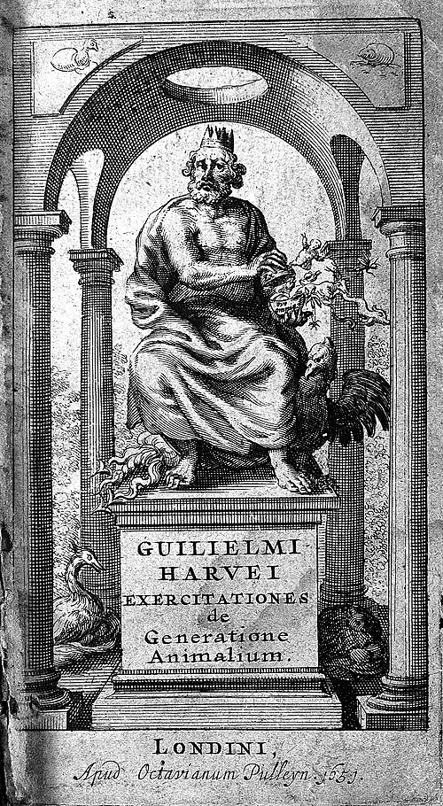
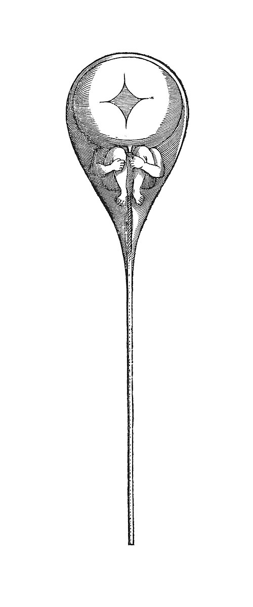

How does an egg become a chick? **[Aristotle](kloom:e/aristotle)** had answered that it is built up step by step, the parts formed one after another from matter that has no form yet. **[William Harvey](kloom:e/william-harvey)**, who opened hens' eggs day by day and dissected the King's deer, agreed in his _On the Generation of Animals_ of 1651. "The generation of the chick from the egg," he wrote, in Robert Willis's translation, "is the result of epigenesis," its parts "not fashioned simultaneously, but emerge in their due succession and order." **[Epigenesis](kloom:e/epigenesis-biology)** was his word for it. Two decades later a new instrument seemed to show the opposite.

## Already there

In 1672 **[Marcello Malpighi](kloom:e/marcello-malpighi)**, who had turned his microscope on the frog's lung a decade before, turned it on the hen's egg. In eggs laid the day before and not yet put under a hen, he held the little sac in the yolk up to the sun and saw an embryo inside, its head and spine already drawn. "Therefore it is right to confess," he concluded, in William Locy's translation of 1905, "that the beginnings of the chick pre-exist in the egg." He had looked, he wrote, in the heat of the previous August, and Locy passed on the suggestion of the French embryologist Camille Dareste that in such heat the eggs had begun to develop before Malpighi opened them. **[Jan Swammerdam](kloom:e/jan-swammerdam)** in Amsterdam found the folded wings and legs of a butterfly inside a caterpillar about to pupate. Development, it seemed, was only the unfolding and swelling of parts already there: **[preformationism](kloom:e/preformationism)**. The philosopher **[Nicolas Malebranche](kloom:e/nicolas-malebranche)** carried it to its end, each germ holding the germs of every generation after it, a nesting the French called _emboîtement_, boxes in boxes. Swammerdam pictured the whole human race folded in the ovary of Eve.

## Ovists and spermists

But which parent held the germ? In November 1677 **[Antonie van Leeuwenhoek](kloom:e/antonie-van-leeuwenhoek)** wrote to Viscount Brouncker of the Royal Society that he had looked at the semen of a healthy man within six beats of the pulse and seen "so great a number of living animalcules" that at times more than a thousand moved in the space of a grain of sand, each smaller than the globules that make blood red, with a tail five or six times its body's length (our translation of his Latin). A medical student, Johan Ham, had shown him the first. Leeuwenhoek came to see them as the germ of the new animal, and the egg as only its food.

In 1694 the lens maker **[Nicolaas Hartsoeker](kloom:e/nicolaas-hartsoeker)**, then in Paris, claimed the discovery as his own in his _Essay de dioptrique_ and printed the drawing that became the emblem of the whole idea: a curled infant in the head of a sperm. His text calls it a guess. "If one could see the little animal through the skin that hides it," he wrote, "we would see it perhaps as this figure represents it, except that the head would perhaps be larger" (our translation). Each such animal, he went on, might contain an infinity of smaller ones, "and so on", so that the first males were created with every one of their kind to come.

| Camp       | Where the new animal comes from         | Who held it                            | What they pointed to                               |
| ---------- | --------------------------------------- | -------------------------------------- | -------------------------------------------------- |
| Epigenesis | Built part by part from unformed matter | Aristotle; Harvey (1651); Wolff (1759) | Parts appearing one after another in the chick     |
| Ovism      | Preformed in the mother's egg           | Swammerdam; Malpighi (1672); Bonnet    | A chick in an "unincubated" egg; the virgin aphid  |
| Spermism   | Preformed in the father's animalcule    | Leeuwenhoek; Hartsoeker (1694)         | Living animalcules in every sample of semen (1677) |

## A mother without a mate

Ovism won the eighteenth century, and an insect helped. In May 1740 the young Genevan **[Charles Bonnet](kloom:e/charles-bonnet)** reared an **[aphid](kloom:e/aphid)** alone from the moment of its birth. "I constantly watched it from Day to Day, and from Hour to Hour, for above a Month," he wrote in a letter the Royal Society printed, "usually beginning my Observations about Four or Five in the Morning, and scarcely discontinuing them till towards Nine or Ten at Night." After about twelve days it began to bear young, 95 of them, all alive, and he reared virgin mothers so for four generations. A female with no male had borne young: to Bonnet it proved the germ lay in the mother. **[Lazzaro Spallanzani](kloom:e/lazzaro-spallanzani)**, who fertilized frogs' eggs by hand in the 1780s, still thought the semen only woke a germ already in the egg.

## The chick again

In 1759 a Berlin tailor's son of twenty-six, **[Caspar Friedrich Wolff](kloom:e/caspar-friedrich-wolff)**, argued in his dissertation at Halle, _Theoria generationis_, that he could watch the chick's organs form where nothing had been. The great physiologist **[Albrecht von Haller](kloom:e/albrecht-von-haller)** opposed him, and Wolff found an academic post only in 1767, in St. Petersburg. His study of how the chick's intestine folds up out of a flat layer, of 1768, Karl Ernst von Baer later called "the greatest masterpiece of scientific observation which we possess." It went little read for decades. Epigenesis came back as observation outran the idea of nesting, which atoms finally made impossible: by our arithmetic, a homunculus the length of a sperm's head, 5 micrometers in a man of 1.7 meters, would carry in its own sperm one about 15 picometers long, smaller than the smallest atom.

Preformation was a good wrong idea. It explained why like bred like and why species stayed fixed, and to a mechanist who could not see how mere matter in motion could organize itself into a chick, it was the only explanation that did not need a vital force. It fitted what the best microscopes showed. A century later Charles Darwin would set Bonnet's "famous but now exploded theory" aside to propose an explanation of his own.
