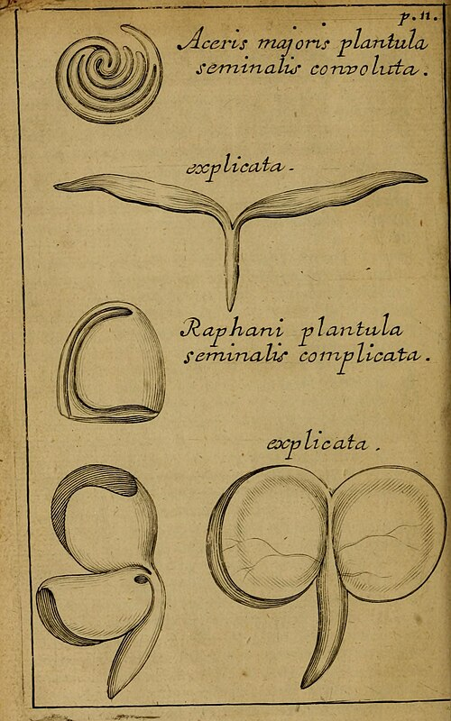

**[John Ray](kloom:e/john-ray)** was born in 1627 at Black Notley in Essex, the son of the village blacksmith, and went up to Cambridge at sixteen. He became a fellow of **[Trinity College, Cambridge](kloom:e/trinity-college-cambridge)**, and his first book, in 1660, listed the 630 or so plants of Cambridgeshire. In 1662 he gave up his fellowship rather than make the declaration the Act of Uniformity demanded, and lived from then on chiefly on the friendship of a former pupil, **[Francis Willughby](kloom:e/francis-willughby)**, a rich young naturalist.

## Two men and every living thing

Ray and Willughby set out to describe all living things: Ray would take the plants, Willughby the birds, beasts, fishes and insects. From 1663 to 1666 they toured Europe's collections and fish markets together. Willughby died in 1672, aged 36, and Ray finished his friend's books: the _Ornithology_ (in Latin in 1676, in English in 1678) and, in 1686, the _History of Fishes_, **[_De Historia Piscium_](kloom:e/de-historia-piscium)**, which the **[Royal Society](kloom:e/royal-society)** printed with 187 plates.

The plates ruined it: it sold badly, and the historian Sachiko Kusukawa judges the loss perhaps the main reason the Society could not pay for Newton's **[_Principia_](kloom:e/philosophiae-naturalis-principia-mathematica)** the next year. **[Edmond Halley](kloom:e/edmond-halley)** paid for that himself, and was later given unsold copies of the fishes in place of salary.

## What makes a species

His own **[_Historia plantarum_](kloom:e/historia-plantarum-ray-book)** came out in three volumes from 1686 to 1704, and before describing a single plant it asked what a **[species](kloom:e/species)** is. In our translation of its Latin:

> After long and much searching, none has occurred to us more certain than distinct propagation from seed. Whatever differences arise from the seed of one plant, whether of the individual or of the species, are accidental, not specific. … Thus we do not hold carnations with a full or double flower to be a species distinct from carnations with a single flower, because they spring from the seed of these, and their own seed, sown, brings forth single carnations again.

A species breeds true, and anyone can test it by sowing. He had sent his reasons to the Royal Society twelve years before. On 17 December 1674 its secretary, **[Henry Oldenburg](kloom:e/henry-oldenburg)**, presented them to a meeting, where they were read and "ordered to be registered". Herbalists, Ray said, had "unnecessarily multiplied beings". Color proved nothing: "one may, with as good reason, admit a blackmore and European to be two species of men, or a black cow and a white to be two sorts of kine". In 1692 he put all dogs in one species, "they mingling together in generation, and the breed of such Mixtures being prolifick." Ray's is often called the first biological definition of a species; the philosopher Marc Ereshefsky counts him among those who made a fertile cross its mark, the test Darwin would attack. But Ray's species were also fixed. Their number, the _Historia_ says in our translation, is "certain and determined", because God rested on the sixth day "from the creation of new species".

## One seed leaf or two

At the same meeting the Society heard Ray on seeds. "The greatest number of plants, that come of seed, spring at first out of the earth with two leaves," which "are by our gardeners not improperly called the seed-leaves", and these are "nothing but the two lobes of the seed having their plain sides clapt together, like the two halfs of a walnut." Cereals and grasses, "corns" to him, come up otherwise: one blade, on a tuft of roots. Their seed holds a pulp that feeds the young plant, and he showed it by pulling up sprouting grain day after day:

> if you pluck of it up at first springing, you shall find the pulp in the grain almost entire; but afterwards plucking of it up from day to day, as it is older and older, you shall find still less and less of the pulp remaining, till at last there be nothing left, but the empty husk sticking to the bottom of the plant.

| Seeds Ray opened    | What comes up                              | What feeds it                     |
| ------------------- | ------------------------------------------ | --------------------------------- |
| Bean, pea           | Two lobes, left under the ground           | The two lobes                     |
| Kidney bean, lupine | Two seed leaves, lifted above the ground   | The two lobes                     |
| Pumpkin, melon      | Two seed leaves, the seed's halves opened  | The two lobes                     |
| Wheat, barley, oats | One blade, on fibrous roots                | A pulp around the young plant     |
| Iris, asparagus     | Leaves like the later ones, no seed leaves | A "gristly" pulp; he did not know |

The plate draws one of each kind. In Bologna **[Marcello Malpighi](kloom:e/marcello-malpighi)** was cutting open the same seeds and called the seed leaves cotyledons. Ray took his word, and his drawings, for the _Methodus plantarum nova_ of 1682, which sorted plants by as many shared characters as it could rather than by one; in 1703 he named the two groups. The **[monocotyledons](kloom:e/monocotyledon)** are still a natural group; DNA has shown the dicots are not.

## The wisdom of God

In 1691 Ray published _The Wisdom of God Manifested in the Works of the Creation_, a book of what came to be called **[natural theology](kloom:e/natural-theology)**: the fit of living things to their lives as evidence of their designer. Its second edition, of 1692, reckoned how many kinds there were, starting from the 6,000 plants in **[Gaspard Bauhin](kloom:e/gaspard-bauhin)**'s _Pinax_ of 1623, which Ray thought the world held three times over. "How great, nay immense," he concluded, "must needs be the Power and Wisdom of him who form'd them all!"

| Group                 | Ray's count, 1692         | Described by 2026                       |
| --------------------- | ------------------------- | --------------------------------------- |
| Beasts and serpents   | "not above 150"           | 28,497 mammals, reptiles and amphibians |
| Birds                 | "near 500"                | 11,185                                  |
| Fishes, not shellfish | "as many" as birds        | 37,630                                  |
| Insects               | 20,000 on the whole earth | 1,008,355                               |
| Plants                | more than 18,000          | 401,452 ferns, mosses and seed plants   |

The 2026 sums are ours, from the IUCN Red List. One thing troubled Ray. Shells found in rock looked like living ones, and in 1693 he admitted where that led: "many Species have been lost out of the World", among them the ammonites, "none whereof at this day appear in our or other Seas". He could not "fully satisfie" himself; the Steno frame takes up those stones. Two years after Ray died, in 1705, Linnaeus was born, who would give every species two names.
