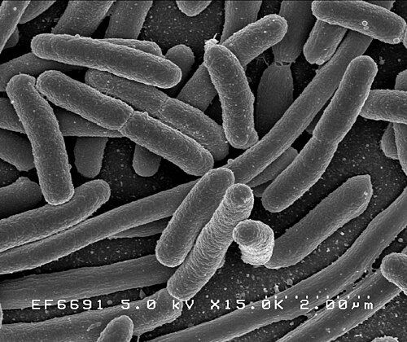

In November 1973 the _Proceedings of the National Academy of Sciences_ printed a five-page paper from two laboratories forty miles apart. **[Stanley Cohen](kloom:e/stanley-norman-cohen)** and his research technician Annie Chang worked at **Stanford University**; **[Herbert Boyer](kloom:e/herbert-boyer)** and Robert Helling, a visitor on sabbatical, at the **University of California, San Francisco**. They had opened rings of bacterial DNA, joined pieces of two of them into one ring, and put it into the gut bacterium **[_Escherichia coli_](kloom:e/escherichia-coli)**, which copied it as its own. The new rings, they wrote, "are shown to be biologically functional replicons that possess genetic properties and nucleotide base sequences from both of the parent DNA molecules." It was the first cloning of **[recombinant DNA](kloom:e/recombinant-dna)**: DNA from different sources, joined outside a cell and multiplied inside one.

## Scissors, glue and a carrier

Three things came together. **[Plasmids](kloom:e/plasmid)** are small rings of DNA that live in bacteria apart from the chromosome, copy themselves, and often carry genes for resistance to antibiotics. Cohen studied them because they were spreading drug resistance through hospitals, and by 1972 his laboratory could get plasmid DNA back into _E. coli_, borrowing a trick Morton Mandel and Akiko Higa had found for viruses.

**[Restriction enzymes](kloom:e/restriction-enzyme)** are how bacteria destroy the DNA of invading viruses. **[Werner Arber](kloom:e/werner-arber)** in Geneva traced the effect in the 1960s; in 1970 **[Hamilton Smith](kloom:e/hamilton-o-smith)** at Johns Hopkins described one that cuts only where a particular short sequence appears, and in 1971 **[Daniel Nathans](kloom:e/daniel-nathans)** used it to cut the DNA of the monkey virus **[SV40](kloom:e/sv40)** into eleven pieces, which could be told apart on a gel. The three shared the 1978 Nobel Prize in Physiology or Medicine. Boyer's laboratory worked on **[EcoRI](kloom:e/ecori)**, an enzyme named for the _E. coli_ strain it came from, and in November 1972 three groups at once reported what mattered most about it: it cuts the two strands of the double helix a few bases apart, so every fragment it leaves ends in the same short single-stranded overhang, and any two such ends will pair. **[DNA ligase](kloom:e/dna-ligase)**, known since 1967 from work on a virus whose DNA closes into a circle the same way, seals the join. The plate draws a plasmid circle, the staggered cut, the pairing ends and the closed ring with its insert.

**[Paul Berg](kloom:e/paul-berg)**, also at Stanford, had already joined DNA from two sources, by building matching tails onto the ends of each: SV40, which causes tumors in some animals, spliced to a piece of a bacterial virus carrying genes of _E. coli_. He did not take the next step. The biologist Robert Pollack had asked him what would follow if such a hybrid were propagated in a bacterium that lives in the human gut, and Berg set that part of the work aside.

## The experiment and its numbers

Cohen and Boyer's design was simple to state: cut two plasmids with the same enzyme, let the pieces pair and be sealed, put the mixture into bacteria, and then grow the bacteria on antibiotics so that only cells carrying both of the resistance genes survive. The surviving colony's DNA could be cut again and run on a gel, and its fragments matched both parents. The paper's own counts, transformed cells for each microgram of DNA, show what the ligase was worth:

| DNA used                | Tetracycline resistant | Kanamycin resistant | Both |
| ----------------------- | ---------------------: | ------------------: | ---: |
| Two plasmids, untreated |                200,000 |           1,000,000 |  200 |
| Treated with EcoRI      |                 10,000 |               1,100 |   70 |
| EcoRI, then DNA ligase  |                 12,000 |               1,300 |  570 |

The doubly resistant cells in the first row simply held two plasmids at once. Those in the third held a single new ring carrying both genes, and sealing the joins made it about eight times as common, by our arithmetic from the paper's table. Within months the two laboratories had put genes of _Staphylococcus_, and then the ribosomal genes of an African frog, into _E. coli_: DNA from another kingdom, copied by a bacterium. Cohen reported in 1977 that the carrier they had used, the plasmid pSC101, was not what they had believed: it was a natural plasmid that had got into their samples, not a fragment of the large one they had been breaking apart.

## A delicatessen, a company and a patent

The collaboration began, in Cohen's telling forty years afterwards, at a meeting on plasmids in Honolulu in November 1972, during a late walk near Waikiki with Boyer, the microbiologist Stanley Falkow and others, in search of somewhere to eat. Over sandwiches, he writes, the two of them sketched the plan on napkins from the table. It is one man's memory of one evening, written in 2013; the papers are the record of what followed.

In January 1976 the venture capitalist **Robert A. Swanson** telephoned Boyer, and the two founded **[Genentech](kloom:e/genentech)** with $500 each. In 1977 the company's collaborators made a small human hormone, somatostatin, in bacteria; in 1978 they made the two chains of human **[insulin](kloom:e/insulin)**, published in 1979, and **Eli Lilly and Company** carried the product through to approval in 1982, the first drug from recombinant DNA. Stanford, meanwhile, had filed in November 1974 on Cohen and Boyer's method. Neither man had wanted a patent at first. The first of the three was granted in December 1980; the license was offered to anyone for a flat fee of $10,000 a year and a royalty, 468 companies took one, and by the time the patents expired in December 1997 they had earned Stanford and the University of California about $255 million.

The method also raised the alarm. The letter calling for a pause, and the conference that followed, are the next frame's.
