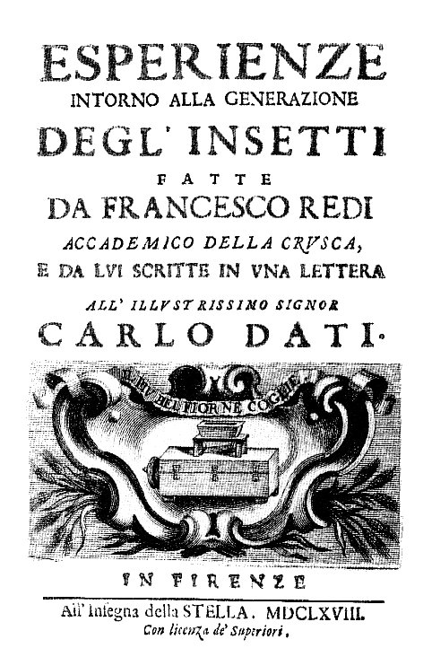
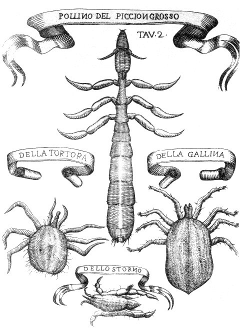

Everyone could see that meat left out in summer filled with worms. The usual explanation was **[spontaneous generation](kloom:e/spontaneous-generation)**: living things arising, without parents, from rotting matter. It had the best authority there was. **[Aristotle](kloom:e/aristotle)**, in the [_History of Animals_](kloom:e/history-of-animals), wrote that some animals "spring from parent animals according to their kind, whilst others grow spontaneously and not from kindred stock," among them "a number of insects" that come "from putrefying earth or vegetable matter." Flies, he wrote, "grow from grubs in the dung that farmers have gathered up into heaps," and lice "are generated out of the flesh of animals." Two thousand years later the Jesuit scholar **[Athanasius Kircher](kloom:e/athanasius-kircher)** still printed a recipe for breeding flies: soak dead flies in honey-water, warm them on a copper plate over ashes, and tiny worms appear.

In 1668 **[Francesco Redi](kloom:e/francesco-redi)**, physician to **[Ferdinando II de' Medici](kloom:e/ferdinando-ii-de-medici)**, Grand Duke of Tuscany, tested the idea, and wrote up what he found as a long letter to his friend **[Carlo Roberto Dati](kloom:e/carlo-roberto-dati)**: _Esperienze intorno alla generazione degl'insetti_, Experiments on the generation of insects. His English translator, Mab Bigelow, worked from the fifth edition of 1688, and her translation of 1909 is quoted here.

## Sealed, open and veiled

Redi began by watching. In June he left three dead snakes in an open box. They were soon covered with worms, which grew, went still, turned into hard egg-shaped cases, and after eight to twenty-one days hatched into flies of three kinds. He tried pigeon, veal, horse, capon, sheep's heart, frogs and fish, and each time saw flies about the meat before it grew wormy, of the same kinds that later bred in it. So he set up the test:

> Belief would be vain without the confirmation of experiment, hence in the middle of July I put a snake, some fish, some eels of the Arno, and a slice of milk-fed veal in four large, wide-mouthed flasks; having well closed and sealed them, I then filled the same number of flasks in the same way, only leaving these open.

The open flasks were soon wormy, with "flies … seen entering and leaving at will." In the closed ones, "I did not see a worm, though many days had passed," though now and then a maggot crawled about on the paper cover outside, looking for a way in. The meat inside rotted all the same: the fish dissolved into a turbid fluid, and the veal went hard and dry.

There was an obvious objection. The sealed flasks kept out the air, and perhaps air was what brought rotting matter to life. So Redi put meat and fish in a vase "closed only with a fine Naples veil, that allowed the air to enter," and stood it in a frame covered with the same net. No worms appeared in the meat. Flies landed on the net instead and left their worms there, some dropping them before they reached it.

| Vessel                           | What was in it                  | What Redi saw                                     |
| -------------------------------- | ------------------------------- | ------------------------------------------------- |
| Four flasks, open                | Snake, fish, Arno eels and veal | Flies going in and out; worms in the meat         |
| Four flasks, sealed              | The same                        | No worms inside; a few crawling on the cover      |
| A vase under a fine Naples veil  | Meat and fish                   | No worms in the meat; flies left them on the veil |
| Meat buried in the ground, weeks | Meat                            | No worms                                          |

The plate draws the three vessels. Wikipedia's article on Redi describes a different arrangement, six jars in two groups of three, with gauze on one group; Bigelow's translation describes the one above. Redi's conclusion was that rotting meat is only "a place, or suitable nest, where animals deposit their eggs."

## What he still believed

Redi did not reject spontaneous generation everywhere. Oak **[galls](kloom:e/gall)**, the hard round growths on oak twigs and leaves, each hold a grub that becomes a small winged insect. He had first suspected the right answer, that a fly "makes a small slit in the young twigs of the oak and hides one of her eggs," and that the gall grows around it. But galls appear on leaves while they are still in the bud, and each kind of gall has its own insect, so he changed his mind: the same living principle in the tree that makes its fruit, he decided, made the grubs. He thought the same of worms in fruit and inside animals. Bigelow credits the correction to Redi's pupil **[Antonio Vallisneri](kloom:e/antonio-vallisneri)**, whose _Dialoghi_ of 1700 argued that insects come from eggs laid by females of their own kind; Wikipedia names **[Marcello Malpighi](kloom:e/marcello-malpighi)** as Vallisneri's master.

Where he could look, he looked. Against Aristotle's claim that the nits of lice produce nothing, Redi pointed to the eggs on the feathers of eagles and kestrels, large enough to see the "well-formed lice inside," and drew the lice of birds, the ass and the camel.

## Physician, academician, poet

Redi was born in Arezzo in 1626 and took his doctorate at Pisa. At the Medici court he was head physician, ran the grand duke's laboratory, and was sent on errands of diplomacy. He was also a scholar of Tuscan, a member of the **[Accademia della Crusca](kloom:e/accademia-della-crusca)** who helped compile its dictionary, and a poet whose dithyramb in praise of Tuscan wine, _Bacco in Toscana_, is still read in Italy.

His flasks settled the question for flies. They could not settle it for things too small to see, which no veil would stop. Eight years later, in Delft, **[Antonie van Leeuwenhoek](kloom:e/antonie-van-leeuwenhoek)** found such creatures in a drop of water, and the argument moved to them, until the swan-neck flasks.
