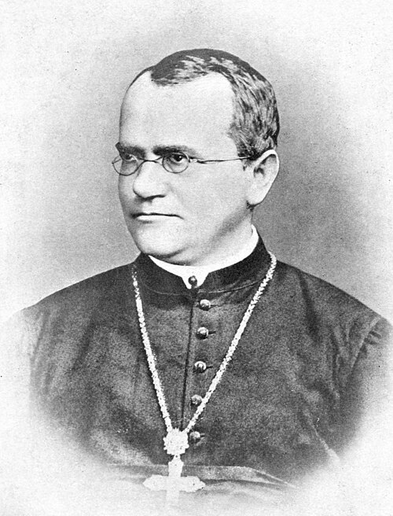

Mendel's paper waited thirty-four years. In the spring of 1900 three botanists, each crossing plants of his own, reached his result and then found that he had reached it first. All three wrote it up for the same German journal, the _Berichte der Deutschen Botanischen Gesellschaft_, within twelve weeks:

| Botanist            | Where     | Plants                                     | Paper received |
| ------------------- | --------- | ------------------------------------------ | -------------- |
| Hugo de Vries       | Amsterdam | poppies, maize, evening primroses and more | 14 March 1900  |
| Carl Correns        | Tübingen  | peas and maize                             | 24 April 1900  |
| Erich von Tschermak | Vienna    | peas                                       | 2 June 1900    |

**[Hugo de Vries](kloom:e/hugo-de-vries)** of the University of Amsterdam had crossed a dozen and more species since the 1890s. In his German paper he put the share of plants showing the recessive form, averaged over all of them, at 24.93 percent, and wrote the hybrids' offspring as (_d_ + _r_)(_d_ + _r_) = _d_² + 2*dr* + _r_², dominant times recessive. He named **[Gregor Mendel](kloom:e/gregor-mendel)** in it, and added a footnote, here in our translation: "This important treatise is so seldom cited that I myself came to know it only after I had concluded most of my experiments and derived from them the propositions given in the text." A short note he sent to the Paris Academy of Sciences, printed on 26 March, did not name Mendel at all. Historians still argue over how much of his result de Vries reached before he read Mendel, and whether he understood it until he had.

**[Carl Correns](kloom:e/carl-correns)** at Tübingen read that French note and wrote at once. He had found the same rule in peas and maize, he said: "it went with me as it evidently goes with de Vries now: I took it all for something new." Then he had found Mendel's paper, which he called "among the best that has ever been written about hybrids." Correns had studied under Carl Nägeli, the botanist who corresponded with Mendel for six years and never grasped it. **[Erich von Tschermak](kloom:e/erich-von-tschermak)**, in Vienna, came last, and since the 1980s several historians have argued that he never fully understood the rule he was credited with finding.

## Two rules

What the three confirmed came to be stated as two rules of **[Mendelian inheritance](kloom:e/mendelian-inheritance)**. The first, segregation: each plant carries two factors for a character, and they separate when egg and pollen form, half the cells taking one and half the other. The second, independent assortment: each pair separates regardless of the others. Mendel had shown the second with one cross, round yellow peas by wrinkled green. The hybrids' 556 seeds came in four kinds, near 9:3:3:1:

| Seeds            | Mendel counted | 9:3:3:1 predicts (our arithmetic) |
| ---------------- | -------------: | --------------------------------: |
| Round, yellow    |            315 |                            312.75 |
| Wrinkled, yellow |            101 |                            104.25 |
| Round, green     |            108 |                            104.25 |
| Wrinkled, green  |             32 |                             34.75 |

The plate draws why, as a **[Punnett square](kloom:e/punnett-square)**: four kinds of pollen meet four kinds of egg, sixteen ways, and nine of the sixteen carry at least one dominant factor of each pair.

## Mendel's bulldog

In Cambridge **[William Bateson](kloom:e/william-bateson)** had argued since 1894 that new forms arise in jumps rather than by insensible degrees. He took Mendel up at once, had the Royal Horticultural Society's translation reprinted, and in 1902 published _Mendel's Principles of Heredity: A Defence_, against **[Raphael Weldon](kloom:e/raphael-weldon)** of Oxford. Weldon and **[Karl Pearson](kloom:e/karl-pearson)**, the biometricians, followed **[Francis Galton](kloom:e/francis-galton)**: they measured traits that vary continuously, like height, and treated heredity as a statistical pull from all of a creature's ancestors. In the journal they had founded, _Biometrika_, Weldon wrote that "the fundamental mistake which vitiates all work based upon Mendel's method is the neglect of ancestry." Bateson answered that he had read the criticism "with a regret approaching to indignation."

Bateson's book opened with that photograph of Mendel, sent by the abbot of Brno. In a letter of 18 April 1905 Bateson proposed a name for the new science, **[genetics](kloom:e/genetics)**, and used it in public at a conference in London the next year. The quarrel lost its heat when Weldon died in 1906, at forty-six, and its substance in 1918, when Ronald Fisher showed that many Mendelian factors, each adding a little, give exactly the smooth bell curve the biometricians measured. De Vries, meanwhile, turned to the new forms that appeared suddenly in evening primroses, each of which he called a **[mutation](kloom:e/mutation)**.

## Where the factors are

Something in the cell had to separate as the factors did. At Columbia University in 1902, **[Walter Sutton](kloom:e/walter-sutton)**, studying the chromosomes of a grasshopper, saw them in pairs, one from each parent, parted again when sperm form. "I may finally call attention to the probability," he wrote, "that the association of paternal and maternal chromosomes in pairs and their subsequent separation during the reducing division … may constitute the physical basis of the Mendelian law of heredity." In Germany in the same years **[Theodor Boveri](kloom:e/theodor-boveri)** showed, in sea-urchin eggs, that each **[chromosome](kloom:e/chromosome)** carries different hereditary qualities. Sutton and Boveri's chromosome theory waited for proof until the fly room at Columbia. First, though, a question the Mendelians could not answer went to a mathematician.
