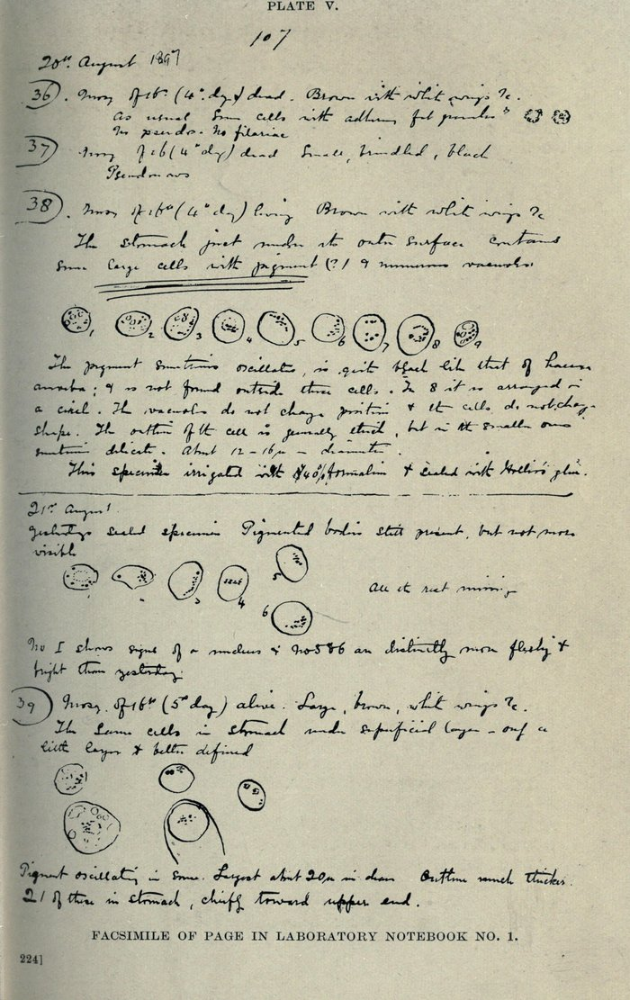
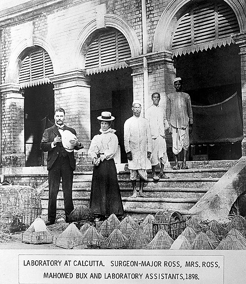

Late in 1880 a French army physician at Constantine, in Algeria, **[Alphonse Laveran](kloom:e/charles-louis-alphonse-laveran)**, was looking at fresh blood from patients with fever. (Wikipedia dates his first sight of the parasite to 20 October; he reported it in December.) Inside the red cells he found pigmented bodies, some shaped like crescents, and on the edge of one he saw "filiform elements resembling flagellae which were moving very rapidly, displacing the neighbouring red cells." He had found the parasite of **[malaria](kloom:e/malaria)**, now called [_Plasmodium_](kloom:e/plasmodium). How it passed from one person to the next was still unknown. In 1894 **[Patrick Manson](kloom:e/patrick-manson)**, who had shown in China that a mosquito carries the filarial worm, argued that the moving filaments could only be meant for life outside the body, in an insect that sucks blood. He found a man to test it in **[Ronald Ross](kloom:e/ronald-ross)**, a surgeon of the Indian Medical Service, then on leave in London.

## Dissection by dissection

Ross went back to India in 1895, and for two years he fed [mosquitoes](kloom:e/mosquito) on patients and cut them open, without result. His method, as he described it in his Nobel lecture of 1902, was to have larvae collected and bred in bottles, so that every insect was clean; to release the hatched adults inside a mosquito net with a patient whose blood held crescents; to keep the gorged insects for several days; and then to dissect each one and search "almost every cell." He worked from eight in the morning until three or four, at a microscope whose screws were "rusted with sweat" and with a cracked eyepiece. He could not name the insects. Without books, he sorted them himself into brindled, gray and dappled-winged kinds, and the gray and brindled ones showed nothing.

At **[Secunderabad](kloom:e/secunderabad)**, on 16 August 1897, a bottle of larvae hatched into a dozen large dappled-winged mosquitoes, now known to be an [_Anopheles_](kloom:e/anopheles). Ross's patient, Husein Khan, was put under the net, and in five minutes ten of them had fed. "Husein Khan received one anna for each," Ross wrote in his _Memoirs_ of 1923. (Wikipedia's article on Ross gives eight annas.) The notebook he kept, in his own retelling, runs:

| Mosquito | Fed    | Dissected | What Ross found                                                                     |
| -------- | ------ | --------- | ----------------------------------------------------------------------------------- |
| 32, 33   | 16 Aug | 17 Aug    | Nothing; he spoiled the dissections                                                 |
| 35       | 16 Aug | 19 Aug    | "Peculiar vacuolated cells in stomach," not followed up                             |
| 36       | 16 Aug | 20 Aug    | Nothing; it had died in the night                                                   |
| 38       | 16 Aug | 20 Aug    | Twelve round cells about 12 microns across in the stomach wall, with black granules |
| 39       | 16 Aug | 21 Aug    | Twenty-one such cells, larger after a day's growth                                  |

Of the twentieth he wrote: "In each of these cells there was a cluster of small granules, black as jet and exactly like the black pigment granules of the _Plasmodium_ crescents." The pigment was the parasite's mark, and it sat not in the stomach's contents but in its wall. A day later the cells had grown, so they were alive. That evening he penciled a poem: "This day designing God / Hath put into my hand / A wondrous thing." Revised a few days later, it ends "I find thy cunning seeds, / O million-murdering Death."

## Birds in Calcutta

Ross was then posted away from his patients, and when he reached [Calcutta](kloom:e/kolkata) in February 1898, plague riots had made people afraid to have their fingers pricked. He turned to birds, whose malaria parasite, now [_Plasmodium relictum_](kloom:e/plasmodium-relictum), was close to the human ones. With his assistant **Mahomed Bux**, he fed gray mosquitoes on caged sparrows, larks and crows:

| Experiment, Calcutta 1898                                | Result                       |
| -------------------------------------------------------- | ---------------------------- |
| Gray mosquitoes fed on birds infected with _Halteridium_ | 0 of 34 with pigmented cells |
| Gray mosquitoes fed on birds infected with _Proteosoma_  | 5 of 9 with pigmented cells  |
| Wild Calcutta sparrows examined                          | 15 of 111 infected           |
| Healthy sparrows bitten by infected mosquitoes           | 22 of 28 infected            |
| Healthy birds kept under nets, safe from bites           | None infected, one doubtful  |

In July he followed the pigmented cells as they burst and scattered thread-like bodies through the insect, and on 8 July found them packed in the salivary gland, whose duct opens through the biting stylet. The parasite left the mosquito with its saliva. The plate draws the whole cycle as it is known now, including the stage in the liver, which Henry Shortt and Cyril Garnham found only in 1948 (Frank Cox's history gives both 1947 and 1948).

## Who solved it

Ross had proved the cycle in birds; the human one was proved in Rome. **[Giovanni Battista Grassi](kloom:e/giovanni-battista-grassi)**, a zoologist, with Amico Bignami and Giuseppe Bastianelli, bred _Anopheles claviger_ from larvae, fed them on a patient with crescents, and let them bite a healthy man in a place without malaria. He fell ill with tertian fever, as their note read to the Lincei Academy on 4 December 1898 reported, and by 22 December they had traced the human parasite through every stage in the mosquito. Ross called their work "simply a repetition and imitation of mine" and accused Grassi of misdating his notes. **[Robert Koch](kloom:e/robert-koch)**, consulted by the Nobel committee, sided with Ross, and the 1902 prize went to him alone. The historian Ernesto Capanna writes that historians now give the two "equal merit": Ross found the clue, Grassi's zoology identified the insect.

## The mosquito, not the marsh

In 1899 Ross went to Sierra Leone for the new **[Liverpool School of Tropical Medicine](kloom:e/liverpool-school-of-tropical-medicine)**, found _Anopheles_ larvae in pools on the ground, and recommended drainage, oil on the water, screens and, in his words, the "segregation of Europeans"; he wrote that the discovery might "open continents to civilization." In Panama, the American army physician **[William C. Gorgas](kloom:e/william-c-gorgas)** drained, oiled and screened along the canal:

| Year                         | 1906 | 1907 | 1908 | 1909 | 1910 | 1911 | 1912 | 1913 |
| ---------------------------- | ---- | ---- | ---- | ---- | ---- | ---- | ---- | ---- |
| Malaria admissions per 1,000 | 821  | 426  | 282  | 215  | 187  | 184  | 110  | 76   |

Ross had found malaria in a mosquito's gut. The next year, in tobacco leaves, a cause of disease turned up that no microscope could find at all.
