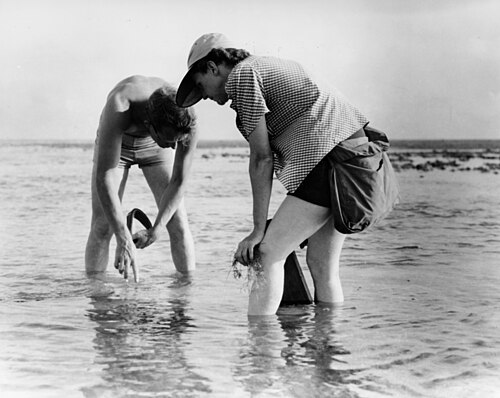

**[Rachel Carson](kloom:e/rachel-carson)** came to the poisons by way of the sea. A zoologist trained at Johns Hopkins, she joined the US Bureau of Fisheries in 1936, the second woman it hired for a full-time professional post, and stayed for sixteen years as it became the **[US Fish and Wildlife Service](kloom:e/united-states-fish-and-wildlife-service)**, rising to chief editor of its publications. _The Sea Around Us_ (1951) stayed on the _New York Times_ best-seller list for 86 weeks and won the National Book Award, and with the money she left government in 1952 to write.

She had first tried to interest editors in **[DDT](kloom:e/ddt)** in 1945, and found the subject thought dull. Late in the 1950s, as federal programs sprayed it and newer poisons from the air against gypsy moths and fire ants, she began four years of reading and interviews with scientists. **[_Silent Spring_](kloom:e/silent-spring)** was serialized in _The New Yorker_ from June 1962 and published on September 27 that year.

## What she assembled

Her argument rested on two properties of the new chlorinated insecticides: they did not break down, and animals stored them in their fat. So a dose too small to kill could be passed up a **[food chain](kloom:e/food-chain)**, concentrating at every step, which is now called **[biomagnification](kloom:e/biomagnification)**. Her clearest case was **[Clear Lake](kloom:e/clear-lake-california)**, in the hills north of San Francisco, where a swarming gnat that does not bite had been fought three times, in 1949, 1954 and 1957, with DDD, a close relative of DDT. Her source, cited in her notes, was a report by Eldridge Hunt and Arthur Bischoff of the California Department of Fish and Game, published in 1960:

| Clear Lake                                   | DDD, parts per million | Measured                                |
| -------------------------------------------- | ---------------------- | --------------------------------------- |
| Lake water after the 1954 and 1957 treatment | 0.02                   | 1 part in 50 million, by our arithmetic |
| Plankton                                     | about 5                | in Carson's account, not in 1960        |
| Sacramento blackfish, a plankton eater       | 7 to 20                | edible flesh, 1958                      |
| Largemouth bass, a predator                  | 5 to 138               | edible flesh, 1958                      |
| Fish visceral fat                            | up to 2,500            | brown bullhead, March 1958              |
| Western grebe                                | 723 to 1,600           | fat; 1,600 in two birds that died       |

The plate draws these levels on a log scale. Dead **[western grebes](kloom:e/western-grebe)** were found after each dosing: 100 in December 1954, about 75 in December 1957. Before the first treatment the lake had more than 1,000 nesting pairs; in 1958 and 1959 the surveyors saw fewer than 25, and no young. Hunt and Bischoff found no disease in the dead birds, but they could not measure the plankton, and wrote that the "theory of DDD transmission through a food chain would be more acceptable if the presence of DDD in plankton organisms could have been established." Carson's figure of about 5 parts per million for plankton is one the 1960 report did not have.

The **[American robin](kloom:e/american-robin)** made the case on land. From 1954 **[Michigan State University](kloom:e/michigan-state-university)** sprayed its campus elms against Dutch elm disease; by 1962 all 2,000 trees got DDT at least once a year. The DDT reached the soil, earthworms took it up, and robins, which feed on worms in spring, ate it; Roy Barker had traced that chain in Illinois in 1958. Every spring dead and dying robins were brought to George Wallace, a zoologist at the university. His student Gilbert Twiest found only 12 nests on the 184-acre North Campus in 1962, about one pair to fifteen acres, where good robin habitat holds one or two pairs an acre. Worms by a failed nest held 50 parts per million of DDT; by a nest that fledged young, 8. Twiest found too that the nests that were built succeeded about as often as on an unsprayed wildlife area nearby: the loss was in the robins that died before they could nest.

## The attack and the answer

Before publication Velsicol, the only maker of chlordane and heptachlor, threatened to sue the publisher, Houghton Mifflin. Robert White-Stevens, a biochemist at American Cyanamid, said that to follow "the teachings of Miss Carson" would "return to the Dark Ages." On April 3, 1963, the CBS documentary _The Silent Spring of Rachel Carson_ showed her, already ill with cancer, reading from the book, with White-Stevens among its critics. On May 15 John F. Kennedy's **[President's Science Advisory Committee](kloom:e/presidents-science-advisory-committee)** reported on pesticides. It found that "until the publication of 'Silent Spring' by Rachel Carson, people were generally unaware of the toxicity of pesticides," and recommended the "orderly reduction in the use of persistent pesticides." Carson died on April 14, 1964.

The new **[Environmental Protection Agency](kloom:e/united-states-environmental-protection-agency)** canceled nearly all uses of DDT on June 14, 1972, effective at the end of the year, keeping it for public health. Ospreys, pelicans and the **[bald eagle](kloom:e/bald-eagle)** had been laying eggs with shells too thin to hatch. In 1963 the Fish and Wildlife Service knew of only 417 nesting pairs of bald eagles in the lower 48 states (its own table says 487); it estimates 71,467 pairs for 2018–19.

| Year    | Breeding pairs   |
| ------- | ---------------- |
| 1963    | 487              |
| 1974    | 791              |
| 1984    | 1,757            |
| 1994    | 4,449            |
| 2006    | 9,789            |
| 2009    | 30,548, estimate |
| 2018–19 | 71,467, estimate |

## DDT and malaria

A later charge holds that Carson's book, by ending DDT, cost millions of lives to **[malaria](kloom:e/malaria)**; in 2012 eleven scientists writing to _Nature_ cited estimates of 60 to 80 million deaths. Her text does not call for that. "It is not my contention that chemical insecticides must never be used," she wrote, and her chapter on resistance warned that spraying everything bred mosquitoes the spray no longer killed, quoting a Dutch official's advice: "Spray as little as you possibly can." The American ban never covered other countries or public health. The **[Stockholm Convention](kloom:e/stockholm-convention-on-persistent-organic-pollutants)** of 2001 ended DDT's farm use worldwide and kept it for fighting disease carriers. Socrates Litsios, a former World Health Organization scientist, called the charge "outrageous"; malaria's return is generally put down to resistance, bred largely by farm spraying, and to programs that were not kept up. The next frame turns from poisons to islands, and the theory that counts how many species a place can hold.
