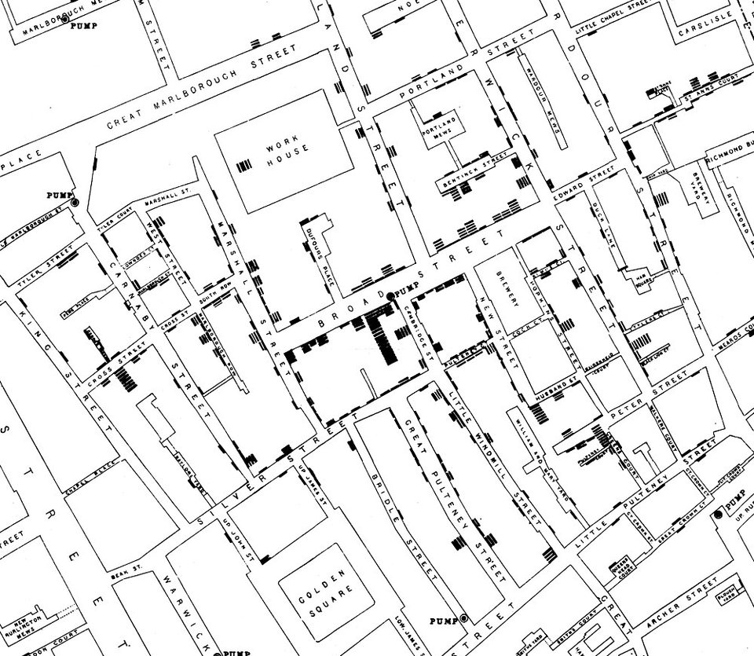

**[Cholera](kloom:e/cholera)** reached Britain in 1831 and came back in 1848–49 and 1853–54, killing within hours by a flood of watery diarrhea. Most physicians blamed foul air, the **[miasma](kloom:e/miasma-theory)** rising from filth and the river mud. **[John Snow](kloom:e/john-snow)**, born in York in 1813, was a London physician best known as the leading expert on anesthesia: he had given **[Queen Victoria](kloom:e/queen-victoria)** [chloroform](kloom:e/chloroform) for the birth of Prince Leopold in April 1853. He thought the air theory wrong, and in 1849 he published a pamphlet, _On the Mode of Communication of Cholera_, to say why. The disease began in the gut, not the blood, so its cause "must be swallowed accidentally," and since it multiplied in the body it "must necessarily have some sort of structure, most likely that of a cell." The likeliest vehicle was drinking water fouled by the evacuations of the sick.

## Broad Street

In the night between 31 August and 1 September 1854, cholera broke out around Broad Street, in **[Soho](kloom:e/soho)**. "Within two hundred and fifty yards of the spot where Cambridge Street joins Broad Street," Snow wrote, "there were upwards of five hundred fatal attacks of cholera in ten days." He suspected the street pump at that corner. He took a list of the deaths from the **[General Register Office](kloom:e/general-register-office-for-england-and-wales)** and went from house to house. Of 83 deaths registered in the last three days of the first week, 61 were of people who drank the pump's water, constantly or now and then; six could not be traced and six were said not to have drunk it. Of ten deaths in houses nearer another pump, five families sent to Broad Street because they preferred its water, and three of the dead were children who went to school near it.

The exceptions told the most. The **workhouse** in Poland Street, nearly surrounded by houses of the dead, had its own well and lost five of its 535 inmates. The brewery in Broad Street lost none of its seventy men, who drank malt liquor and had a deep well of their own. A widow in Hampstead, who had not been near Soho for months, had a large bottle of the pump water brought out to her by cart because she liked it, and died of cholera on 2 September; a niece who drank it with her died too. The ornithologist **[John Gould](kloom:e/john-gould)**, who lived near the pump, came home on the 2nd and sent for water that smelled offensive.

On the evening of 7 September Snow put his figures to the parish Board of Guardians, and the next day the pump's handle was taken off. The map he published in 1855 marked each death as a bar at its house, and the plate redraws its 578 bars around the 13 pumps. Snow's own table counted 616 fatal attacks; Wikipedia's article gives 420 deaths. He was careful not to claim that the handle ended the outbreak:

"The attacks had so far diminished before the use of the water was stopped," he wrote, "that it is impossible to decide whether the well still contained the cholera poison in an active state."

## The grand experiment

His stronger proof was south of the river. Two companies piped Thames water into the same streets, often to neighboring houses. In 1852 the **[Lambeth Company](kloom:e/lambeth-waterworks-company)** had moved its intake upstream to Thames Ditton, above the reach of London's sewage; the **[Southwark and Vauxhall Company](kloom:e/southwark-and-vauxhall-waterworks-company)** still drew from Battersea, below it. Some 300,000 people, Snow wrote, had been "divided into two groups without their choice." He walked the districts asking each house of a cholera death which company it paid, and when tenants could not say, told the waters apart by their salt: silver nitrate threw down a heavy cloud from the sewage-laden water and barely a trace from Lambeth's. He had told **[William Farr](kloom:e/william-farr)** of his first results, and at Farr's suggestion the registrars began recording the water supply of every cholera death.

| First seven weeks of the 1854 epidemic |  Houses | Deaths from cholera | Deaths per 10,000 houses |
| -------------------------------------- | ------: | ------------------: | -----------------------: |
| Southwark and Vauxhall Company         |  40,046 |               1,263 |                      315 |
| Lambeth Company                        |  26,107 |                  98 |                       37 |
| Rest of London                         | 256,423 |               1,422 |                       59 |

The mortality, he concluded, was "between eight and nine times as great."

## Not believed

The parish's own Cholera Inquiry Committee set the curate of St Luke's, Berwick Street, the Rev. **[Henry Whitehead](kloom:e/henry-whitehead-priest)**, to check Snow. He began a skeptic and ended confirming him. In the spring of 1855 he found in the register an infant at 40 Broad Street, five months old, taken ill on 28 August; her mother had soaked her napkins and poured the water into a cesspool in front of the house, a few feet from the well. The committee's surveyor opened them and found the cesspool leaking into it. The report gave no names; later accounts call her Baby Lewis. Her doctor doubted that it had been cholera at all.

The government was not persuaded. The General Board of Health's scientific committee wrote in 1855: "After careful inquiry, we see no reason to adopt this belief." Farr himself long tied cholera to the low ground by the river, and accepted the water only in a later epidemic, in 1866. Snow died of a stroke on 16 June 1858, aged 45. What he had shown was that something in water caused cholera; what it was, Robert Koch would show in 1884, and his method is the trail's next frame.
