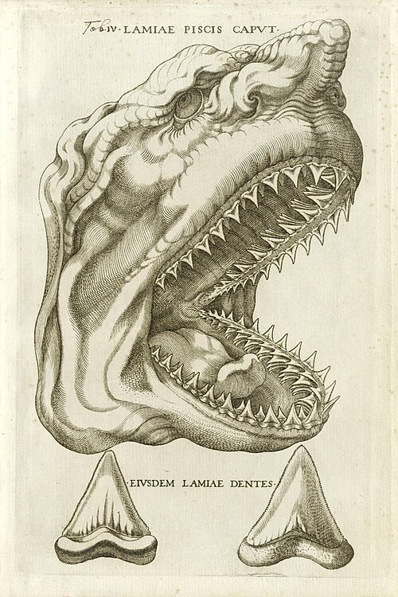

In October 1666 two fishermen caught a huge female shark off Livorno, on the coast of Tuscany. The Grand Duke, **[Ferdinando II de' Medici](kloom:e/ferdinando-ii-de-medici)**, had its head sent to his physician in **[Florence](kloom:e/florence)**, a 28-year-old Danish anatomist named Niels Steensen, known by the Latin form of his name, **[Nicolas Steno](kloom:e/nicolas-steno)**. He had come to the court in 1665 or 1666 (his biographers differ), and he worked among the naturalists of the **[Accademia del Cimento](kloom:e/accademia-del-cimento)**, among them **[Francesco Redi](kloom:e/francesco-redi)**. Steno opened the head and looked at its teeth. They were the shape of the "tongue stones", _glossopetrae_, that were dug out of the rocks of **Malta** and sold all over Europe.

## Stones from the sky

The tongue stones had a long history. **[Pliny the Elder](kloom:e/pliny-the-elder)** had written, in Winter's English, that the glossopetra "is not produced (nasci) in the earth, as tradition relates, but falls from heaven at the time of the waning moon." Others held that the rocks grew them, as they grew crystals. In 1616 **[Fabio Colonna](kloom:e/fabio-colonna)** had burned some and argued from what was left that they were the teeth of sharks, not stone, but few were persuaded.

Steno's report, _The Head of a Shark Dissected_, was printed in Florence in 1667 together with a book on muscles. It carried an engraving of a shark's head and two of its teeth. The engraving was not of Steno's shark: it had been made late in the sixteenth century for **[Michele Mercati](kloom:e/michele-mercati)**, a papal physician who also owned a white shark's head, and was reused, so Wikipedia's account goes, because a drawing of the real specimen was thought unfit for readers. The fish was a **[great white shark](kloom:e/great-white-shark)**.

Steno argued his case as if in court. In the translation of John Garrett Winter, he wrote that "just as in court, therefore, one man takes the rôle of defendant, another of plaintiff, while both submit to the decision of the judge, so I shall present, as a result of my observations, the reasons for ascribing such substances to animals." He set out what he had seen in the hills of Tuscany, then six conjectures, and came to his verdict, here in Troels Kardel's translation: since the tongue stones resemble a shark's teeth "as one egg resembles another," those who say they are teeth "are not far from the truth."

## A solid inside a solid

The teeth raised a wider question. If a tooth can lie inside rock, how did any hard thing come to be inside another? Steno's answer, the _Prodromus_ of 1669, gave a rule: of two solids in contact, the one that "first became hard" is the one whose surface is printed on the other. A shell or a tooth whose shape is pressed into the stone around it was hard first, so the rock was once soft mud around it. **[Fossils](kloom:e/fossil)** were made like the parts of living animals, "in precisely the same manner and place." He even answered the objection that Malta had too many teeth to come from sharks: there are "six hundred and more teeth to each shark," sharks swim in shoals, and the earth from Malta held shells of the sea as well.

Mud settles in layers, and Steno read the layers. Three of his rules are still the first ones taught in geology:

| Principle              | Steno, 1669, in Winter's translation                                                                                                                          | What it lets you read                       |
| ---------------------- | ------------------------------------------------------------------------------------------------------------------------------------------------------------- | ------------------------------------------- |
| Superposition          | "At the time when the lowest stratum was being formed, none of the upper strata existed"                                                                      | Lower beds are older                        |
| Original horizontality | "Strata either perpendicular to the horizon or inclined toward it, were at one time parallel to the horizon"                                                  | A tilted bed has been moved                 |
| Lateral continuity     | "In whatever place the bared sides of the strata are seen, either a continuation of the same strata must be sought, or another solid substance must be found" | Beds on two sides of a valley were once one |

The first is now called the **[law of superposition](kloom:e/law-of-superposition)**. Wikipedia's article on Steno puts the name of original horizontality on a different sentence, one saying only that a lower stratum was already solid when the next was laid on it. The plate draws the three. Steno used them to tell the history of Tuscany in six stages of flooding, drying and collapse, and he fitted that history to Scripture and its few thousand years.

## Hooke got there first?

In London much the same argument had already been printed. In [_Micrographia_](kloom:e/micrographia) (1665) **[Robert Hooke](kloom:e/robert-hooke)** looked at petrified wood under the microscope and concluded that fossil shells owed their shapes "not to any kind of Plastick virtue inherent in the earth, but to the Shells of certain Shel-fishes." Historians have weighed the two ever since. Ellen Tan Drake and Paul Komar argued in 1981 that Hooke went further than Steno, toward extinction and fossils as a record of time. Toshihiro Yamada, in 2009, found no decisive evidence that Hooke influenced Steno, and pointed to a source for both in **[Robert Boyle](kloom:e/robert-boyle)**, whose ideas Steno's teacher Ole Borch may have carried. The Royal Society's secretary, **[Henry Oldenburg](kloom:e/henry-oldenburg)**, put the _Prodromus_ into English in 1671.

## The bishop

Steno never wrote the dissertation the _Prodromus_ introduced. He became a Catholic in 1667, a priest in 1675 and, in 1677, a bishop for the Catholics of northern Germany and Scandinavia. He gave his income to the poor and sold his bishop's ring and cross, and he died in Schwerin in 1686, worn out by fasting. Cosimo III de' Medici had his body brought to Florence. Pope John Paul II beatified him in 1988.

He left the fossil a history: the remains of a creature, buried in a layer that could be placed in time. A century later Georges Cuvier asked the next question, whether the creatures were still alive.
