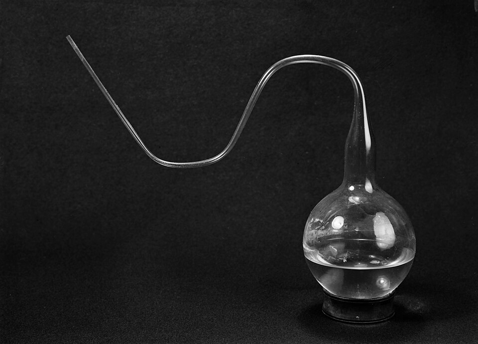
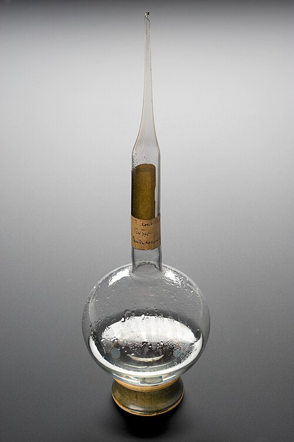

By 1859 few still thought that flies or mice arose from mud. The argument had shrunk to the smallest living things, the microbes that cloud a broth within days, and there **[spontaneous generation](kloom:e/spontaneous-generation)** still had able defenders. In December 1858 **[Félix Archimède Pouchet](kloom:e/felix-archimede-pouchet)**, director of the natural history museum at Rouen, told the **[French Academy of Sciences](kloom:e/french-academy-of-sciences)** that microbes had grown from heated hay, in boiled water, under air that had itself been heated, and in 1859 he published _Hétérogénie_, a book on life arising anew. The Academy set the question of its Alhumbert Prize for 1862, in our translation: "Try, by well-made experiments, to throw new light on the question of so-called spontaneous generations." **[Louis Pasteur](kloom:e/louis-pasteur)**, a chemist of 37, entered.

## Spallanzani's sealed flasks

The question was a century old. In the 1740s the English priest **[John Needham](kloom:e/john-needham)** heated broths in closed vessels and watched them fill with life. In 1765 the Italian priest **[Lazzaro Spallanzani](kloom:e/lazzaro-spallanzani)** sealed nineteen vessels of vegetable infusions in the flame and boiled them, sealed, for an hour, and nothing grew. Needham replied, as Pasteur quoted him (in our translation), that such "torture" had destroyed the infusions' "vegetative force" and corrupted "the little portion of air" left in them. When Gay-Lussac later found no oxygen in sealed jars of preserved food, the objection looked stronger: perhaps life needed air, and boiling a sealed flask spoiled it. Theodor Schwann let in heated air in 1837, and others air filtered through cotton, but each could be said to change the air.

## A neck open to the air

Pasteur's answer, in his memoir of 1862, was the **[swan-neck flask](kloom:e/swan-neck-flask)**, which left the air alone. He put yeast water, urine, beet juice or pepper water in a glass flask, drew the neck out in a flame into a long, bending tube, and boiled the liquid until steam poured from the open tip. Then he let it cool, open. "Strange thing," he wrote, in our translation, "well made to astonish anyone used to the delicacy of experiments on so-called spontaneous generations: the liquid of this flask will remain indefinitely without alteration." Air rushed back in while the liquid was still near boiling, then entered so slowly that it left "in the moist bends of the neck all the dust" able to start a growth. Cut the neck off with a file, and molds and microbes appeared within two days. The plate draws both flasks. Flasks he laid before the Academy on 6 February 1860 were still clear eighteen months later.

"Gases, various fluids, electricity, magnetism, ozone, things known or things occult," he concluded: nothing in ordinary air but its solid particles made a broth putrefy or ferment.

## Flasks on the glacier

If life came from dust, still or high air should carry less of it. In 1860 he boiled yeast water in flasks, sealed their drawn-out points, and broke them open in chosen places, holding each above his head with tongs passed through a flame, then sealed them again. In September he took 73 to the Jura and to the Montanvert, beside the **[Mer de Glace](kloom:e/mer-de-glace)** on the Mont Blanc massif:

| Where opened, 1860                     | Flasks | Spoiled | Percent, by our arithmetic |
| -------------------------------------- | -----: | ------: | -------------------------: |
| Paris Observatory, courtyard           |     11 |      11 |                        100 |
| Paris Observatory, cellars             |     10 |       1 |                         10 |
| Countryside at the foot of the Jura    |     20 |       8 |                         40 |
| A mountain of the Jura, 850 m          |     20 |       5 |                         25 |
| The Montanvert, Mer de Glace, 2,000 m  |     20 |       1 |                          5 |
| Opened on the glacier, left in the inn |     13 |      10 |                         77 |

The still air of the Paris Observatory's cellars had spared nine flasks in ten. The last row was an accident: on the ice the glare hid his flame, he could not reseal the first thirteen, and they spent the night open in the little inn. The Wellcome Collection's catalog calls the flask in the photograph swan-necked; its neck is drawn to a sealed point, the kind he took to the Alps.

On 29 December 1862 the Academy gave Pasteur the prize unanimously, on a report by **[Claude Bernard](kloom:e/claude-bernard)**. Pouchet replied that air taken anywhere on the globe would "constantly" fill sealed flasks with life. In June 1864, before a commission named to watch both sides, he and his colleagues Joly and Musset withdrew, objecting that it meant to begin with Pasteur's test. Pasteur showed it three Montanvert flasks of 1860, still clear; one, opened, still held air with 21 percent oxygen.

## The loose end

Historians disagree over how clean the victory was. Gerald Geison, who read Pasteur's notebooks, argued that across his career Pasteur published the results that fitted his conviction that life differs in kind from chemistry, and explained away contrary ones as faulty technique. The commission, for its part, recorded that Pouchet's side walked out. Pouchet's infusions were of hay. In 1876 **[Ferdinand Cohn](kloom:e/ferdinand-cohn)** showed that what grew in boiled hay infusions was **[_Bacillus subtilis_](kloom:e/bacillus-subtilis)**, whose spores survive boiling, and in 1877 **[John Tyndall](kloom:e/john-tyndall)** found infusions of old, dry hay the hardest to sterilize, one growing microbes after eight hours of boiling. Heating again at intervals worked: each rest let surviving spores germinate, and the next heating killed them.

Pasteur had come to the question from **[fermentation](kloom:e/fermentation)**. In 1861 he told the Chemical Society of Paris that he took it up because "the true ferments were organized beings," and he had to know where they came from. That conviction led him to heat wine against its "diseases", patented in 1865, and **[Joseph Lister](kloom:e/joseph-lister)** to antiseptic surgery; Eduard Buchner later showed that the fermenting was done by enzymes inside the yeast cell. The trail that branches here follows the **[germ theory of disease](kloom:e/germ-theory-of-disease)**, from Fracastoro's seeds of contagion to Koch's postulates. The main spine goes on to the nerve cell.
