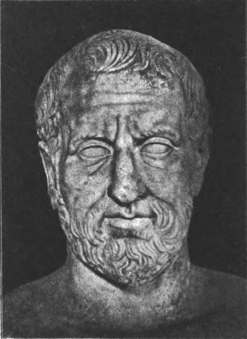
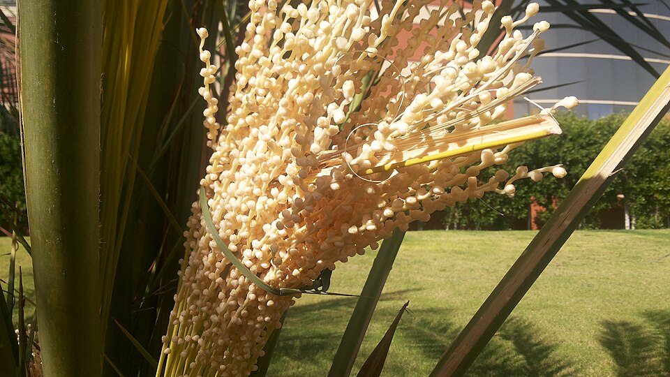

**[Theophrastus](kloom:e/theophrastus)** was born on [Lesbos](kloom:e/lesbos), at Eresos, in about 371 BC. He was [Aristotle](kloom:e/aristotle)'s colleague on the island in the 340s BC, and it seems to have been there that the two divided living things between them: Aristotle took the animals and Theophrastus the plants. He followed Aristotle to Athens, and when Aristotle left the city in 323 BC Theophrastus became head of his school, the **[Lyceum](kloom:e/lyceum-classical)**, for thirty-six years. In his will he left the school its garden, with its house and colonnades.

He wrote on almost everything, but his two great books are about plants: the **[_Enquiry into Plants_](kloom:e/historia-plantarum-theophrastus)**, nine books describing about 500 kinds of plant, and _On the Causes of Plants_, which tries to explain what the first describes. They are the earliest systematic botany that survives, and **[Carl Linnaeus](kloom:e/carl-linnaeus)** later called him the father of the science. The _Enquiry_ reads like a teacher's notes, which it probably was, revised for years and never finished: lists of examples, general rules, exceptions, and frank doubts.

## Four kinds of plant

Theophrastus begins, as Aristotle did with animals, by sorting. "The first and most important classes, those which comprise all or nearly all plants, are tree, shrub, under-shrub, herb." Then he defines each by how it grows from the root, in the translation of **[Arthur Hort](kloom:e/arthur-hort)**:

| Class       | Theophrastus's definition                                                   | His examples   |
| ----------- | --------------------------------------------------------------------------- | -------------- |
| Tree        | Springs from the root with a single stem, having knots and several branches | Olive, fig     |
| Shrub       | Rises from the root with many branches                                      | Bramble        |
| Under-shrub | Rises from the root with many stems as well as many branches                | Savory, rue    |
| Herb        | Comes up from the root with its leaves, and has no main stem                | Corn, potherbs |

The plate draws the four from those definitions. They are a rough tool, and he says so at once: they "must be taken and accepted as applying generally and on the whole." A garden mallow left to grow becomes "as great as a spear, and men accordingly use it as a walking-stick." A myrtle that is not pruned turns into a shrub. Gardeners make trees of apples and pomegranates by cutting off the side stems. A class that cultivation can change was not, to him, a fact about the plant's nature, and he did not pretend it was.

## Male and female

The _Enquiry_ is full of farming, and some of its best observations came from farmers. Fig growers hung branches of wild figs in their orchards, a practice called caprification, because tiny "gall-insects" came out of the wild fruit, entered the cultivated figs and stopped them dropping before they ripened. Date growers did something stranger:

> With dates it is helpful to bring the male to the female; for it is the male which causes the fruit to persist and ripen. … The process is thus performed: when the male palm is in flower, they at once cut off the spathe on which the flower is, just as it is, and shake the bloom with the flower and the dust over the fruit of the female, and, if this is done to it, it retains the fruit and does not shed it.

Date palms are male or female trees, and the "dust" is pollen. Growers still pollinate them by hand, tying strands of male flowers into the female cluster. Theophrastus knew that the fruit-bearing tree "is called 'female'", and he saw that in the fig and the date alike "the 'male' renders aid to the 'female.'" But he did not conclude that plants have sex. His gall-insects, he thought, were bred from the wild figs' seeds. They are fig wasps, which carry pollen from fig to fig. The sex of plants was shown by experiment only in 1694, when **[Rudolf Jakob Camerarius](kloom:e/rudolf-jakob-camerarius)** cut the male flowers off [maize](kloom:e/maize) and castor-oil plants and found that they set no seed.

## Plants from the edge of the world

Theophrastus traveled in Greece and asked the people who handled plants for a living, root-cutters and drug-sellers among them. But his book reaches much farther, to Arabia and India. **[Alexander the Great](kloom:e/alexander-the-great)**, Aristotle's pupil, took observers east with him, and from their reports Theophrastus describes cotton, pepper, cinnamon, myrrh, frankincense and the banyan, the "Indian fig," which "sends out roots from the shoots till it has a hold on the ground and roots again; and so there comes to be a continuous circle of roots round the tree."

Reading him now has a difficulty of its own: knowing which plant each Greek name meant. Hort, whose 1916 translation was the first in English, wrote that he was "not, as he should be, a botanist," and the identifications in his index of plants were all the work of the botanist **[William Thiselton-Dyer](kloom:e/william-turner-thiselton-dyer)**. Every reading of the _Enquiry_ rests on such guesses.

The book was translated into Latin by Theodore Gaza and printed at Treviso in 1483, and with Dioscorides it became a foundation of the printed herbals, the next frame, made eighteen centuries after it.
