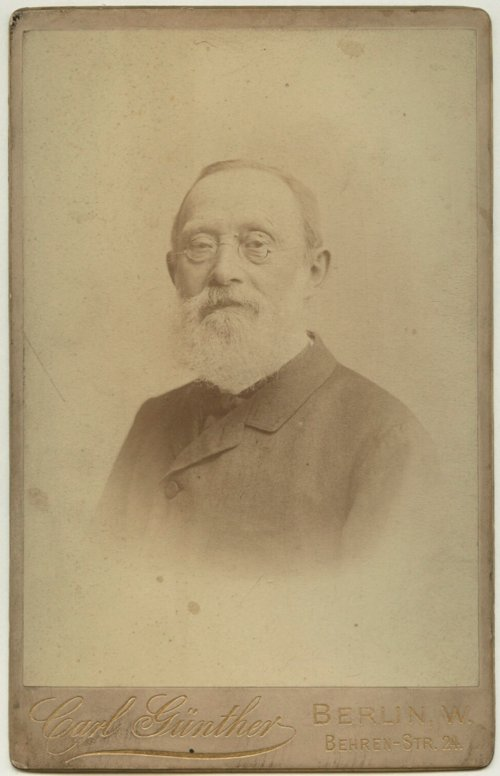

In February 1848 the Prussian government sent two doctors from the Charité hospital in Berlin to **[Upper Silesia](kloom:e/upper-silesia)**, in the far southeast of the kingdom, where an epidemic of **[typhus](kloom:e/epidemic-typhus)** had been spreading among the Polish-speaking peasants since the summer before, on top of failed potato harvests and hunger. The junior of the two was **[Rudolf Virchow](kloom:e/rudolf-virchow)**, twenty-six, a pathologist who had trained under [Johannes Müller](kloom:e/johannes-peter-muller). He stayed about two weeks, did four autopsies, and wrote a report of 182 pages.

## Medicine and politics

The figures he was given varied: in one community of Ratibor county about 9 percent of the people had fallen ill, and just over 40 percent of those had died, while the doctors of Rybnik guessed deaths at anything from one in ten to one in three. Virchow thought the cause was a miasma, a poison of decay, made worse by damp, crowded houses and hunger. But the remedy he proposed was political. The report's last pages, the historian Carsten Timmermann notes, are a call for revolution, summed up in three words: "full, unrestricted democracy".

He got back to Berlin on 10 March 1848, and within a week he was on the barricades at the corner of Friedrichstrasse and Taubenstrasse during the **[Revolutions of 1848](kloom:e/revolutions-of-1848)**, with a pistol. That summer he started a weekly, _Die medicinische Reform_, and in its November issue wrote the line most quoted from him: "Medicine is a social science, and politics nothing but medicine at a larger scale." Doctors, he wrote, were "the natural advocates of the poor". In 1849, pushed out of his post at the Charité, he went to the new chair of pathological anatomy at Würzburg.

He is often called the father of **[social medicine](kloom:e/social-medicine)**. Timmermann argues that the title was given him a century later, by historians in America such as George Rosen and Henry Sigerist, looking for a pedigree for their own field, and that the report itself shows a young man disgusted by the people he was studying as well as by their conditions: lice, he wrote, were "permanent guests" on their bodies.

## Every cell from a cell

Virchow's science was the cell. Schleiden and [Schwann](kloom:e/theodor-schwann) had said that cells crystallize out of a formless fluid, the _cytoblastema_, and pathologists applied the idea to disease: pus and tumors were thought to form from exudates, fluids poured out into the tissues. Under the microscope Virchow found cells growing from cells instead. His first paper, in 1845, described a woman of fifty whose blood at autopsy was crowded with white cells; the Edinburgh physician John Hughes Bennett described a case the same year. In 1847 Virchow named the disease **[leukemia](kloom:e/leukemia)**, "white blood". In his lectures of 1858 he gave the counts:

| Blood             | Colorless corpuscles to colored ones, in Chance's translation |
| ----------------- | ------------------------------------------------------------- |
| Ordinary          | "seldom … more than one … to about three hundred"             |
| Advanced leukemia | One to every three, "or even two"                             |
| Some cases        | "the greater numbers are in favour of the colourless"         |

Those twenty lectures, given at his new Pathological Institute in Berlin in February to April 1858, became _Die Cellularpathologie_, translated by Frank Chance in 1860 as _Cellular Pathology_. Every animal, Virchow said, "presents itself as a sum of vital unities, every one of which manifests all the characteristics of life", and disease is a change in those units. "Where a cell arises, there a cell must have previously existed (_omnis cellula e cellula_), just as an animal can spring only from an animal, a plant only from a plant."

The rule was not his alone. **[Robert Remak](kloom:e/robert-remak)**, a Jewish physician in Berlin whom Prussia barred from a professorship, had seen blood cells dividing in chick embryos in 1841, and in 1852 he published his evidence that every cell of the frog embryo comes from the egg by division. The extracellular origin of animal cells, he wrote, in our translation, had been to him "as improbable as the spontaneous generation of organisms" ever since [cell theory](kloom:e/cell-theory) became known. His last paragraph turned to disease: diseased tissues too, he ventured, are not formed in a formless fluid but are "descendants or products of normal tissues". Virchow took up the same view by 1855 without crediting him, and the historian Paul Weindling calls it plagiarism; in the 1858 lectures Remak appears only in passing, for his embryos and his glands. The Latin phrase itself had been used before, by the French chemist François-Vincent Raspail.

## The rest of a long life

Virchow sat for the Progressive Party in the Prussian parliament and the Reichstag, fought [Bismarck](kloom:e/otto-von-bismarck), and pressed for Berlin's water supply and sewers. He doubted that germs caused disease, calling them settlers of tissue already sick, and in 1877 he argued in Munich that [Darwin](kloom:e/charles-darwin)'s theory was unproven and should not be taught in schools. He judged the first [Neanderthal](kloom:e/neanderthal) skull a diseased modern human. He organized a survey of the hair, eye and skin color of 6,758,827 German schoolchildren, counting Jewish children separately; the results, published in 1886, found the colors mixed everywhere, and were read as a blow against the idea of a pure German or Jewish race.

Cell division itself was seen in detail only after his rule was laid down. In 1882 **[Walther Flemming](kloom:e/walther-flemming)** at Kiel, staining salamander cells with aniline dyes, drew the threads of the dividing nucleus stage by stage and named the process **[mitosis](kloom:e/mitosis)**; the plate draws his stages. The next frame is Pasteur's flasks, which settled spontaneous generation for whole organisms.
