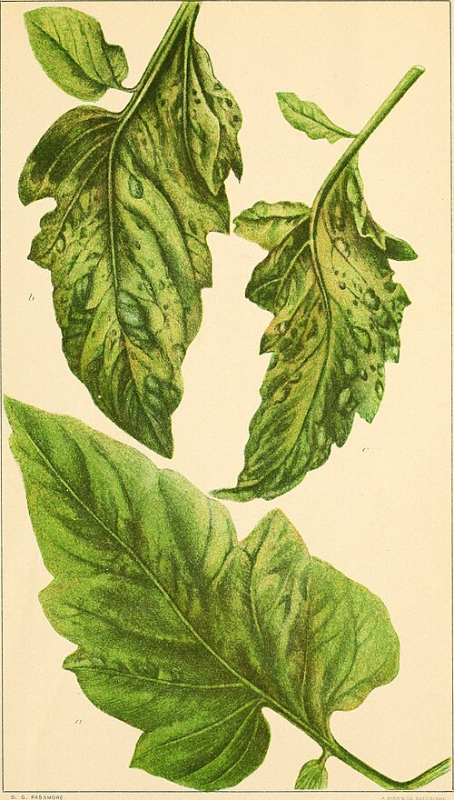

Tobacco growers in the Dutch provinces of Utrecht and Gelderland had lost crops for twenty years to a disease that mottled the leaves light and dark green. **[Adolf Mayer](kloom:e/adolf-mayer)**, a German agricultural chemist who directed the experiment station at Wageningen, named it the mosaic disease, and in a paper of 1886 he showed that it was catching. He ground a sick leaf with a few drops of water, sucked the green juice into fine glass capillaries and stuck them into the veins of a healthy plant: "in nine cases out of ten one will be successful in making the healthy plant ... heavily diseased," he wrote, in James Johnson's 1942 translation. The mottling appeared after ten or eleven days, always in the youngest leaves. He found no fungus and no bacterium, and concluded that the cause must be a bacterium too hard to see.

## Through the porcelain

The test that settled what the cause was not came from Louis Pasteur's laboratory. In 1884 **[Charles Chamberland](kloom:e/charles-chamberland)** made a filter of unglazed porcelain, a hollow "candle" through whose walls liquid could be pressed while bacteria were held back. The **[Chamberland filter](kloom:e/chamberland-filter)** became bacteriology's proof that a fluid was free of germs. The plate draws one in section.

On 12 February 1892 **[Dmitri Ivanovsky](kloom:e/dmitri-ivanovsky)**, a young botanist sent by the Russian government to study the disease in the Crimea, told the Academy of Sciences at St. Petersburg that "the sap of leaves attacked by the mosaic disease retains its infectious qualities even after filtration through Chamberland filter-candles." He did not believe what he had found. Either the bacteria made a toxin that passed the filter, he suggested, or they had slipped through it, though he had checked his candles by trying to force air through them under water.

**[Martinus Beijerinck](kloom:e/martinus-beijerinck)**, who had worked beside Mayer at Wageningen, was a microbiologist of the soil: by his own account he had grown the bacteria of the root nodules of peas and beans in 1887, the bacteria now called **[_Rhizobium_](kloom:e/rhizobium)**. He took the mosaic disease up again in 1897 in his new laboratory at the Polytechnic in Delft. His sap passed porcelain and stayed infectious, and he asked the question a toxin could not answer: did the agent grow? It did. "A small drop" of the filtrate could infect "numerous leaves and branches," and the sap of those could infect "an infinite number of healthy plants," so "the contagium, although fluid, reproduces itself in the living plant." A poison would have been diluted away. He then set drops of sap on thick agar for about ten days, cleaned and scraped off the surface, and inoculated plants with the layers beneath. Both made them sick, so the agent had soaked at least two millimeters into the jelly, where bacteria could not go. Beijerinck called it a **contagium vivum fluidum**, a contagious living fluid, and used for it the old Latin word for a poison, **[virus](kloom:e/virus)**. It multiplied, he found, only in tissue whose cells were dividing.

| Who, year        | What was done to the sap                       | Result                                |
| ---------------- | ---------------------------------------------- | ------------------------------------- |
| Mayer, 1886      | Passed through filter paper                    | Still infectious, a little less so    |
| Mayer, 1886      | Passed through double filter paper until clear | No longer infectious                  |
| Mayer, 1886      | Heated to 80 °C for several hours              | No longer infectious                  |
| Ivanovsky, 1892  | Passed through a Chamberland porcelain candle  | Still infectious                      |
| Beijerinck, 1898 | Filtered, then passed from plant to plant      | Infectious without end: it multiplies |
| Beijerinck, 1898 | Left on agar, the layers beneath inoculated    | Infectious: it spreads into the jelly |

## 1892 or 1898?

Who discovered viruses is still argued. Ivanovsky made the decisive experiment first; Beijerinck, who had not read him, understood it, and later acknowledged his priority. In 1944 **[Wendell Stanley](kloom:e/wendell-meredith-stanley)** wrote that there was "considerable justification for regarding Ivanovsky as the father of the new science of Virology," and the American Society for Microbiology's journal marked the centenary of virology in 1992, while the American Phytopathological Society's centenary book of 1999 named Beijerinck. The French virologist Hervé Lecoq concluded in 2001 that the two should share it. Beijerinck was also wrong in one thing: the agent was not a fluid. In 1898 **[Friedrich Loeffler](kloom:e/friedrich-loeffler)** and Paul Frosch passed the cause of **[foot-and-mouth disease](kloom:e/foot-and-mouth-disease)** in cattle through a porcelain filter, the first virus of animals, but a finer filter stopped it, so it was a particle.

## Seeing the particle

In 1915 **[Frederick Twort](kloom:e/frederick-twort)**, in London, saw colonies of micrococci turn glassy and watery, passed the glassy matter through a porcelain filter, and found that it dissolved fresh colonies; he suggested it might be "an ultramicroscopic virus" or "an enzyme with the power of growth." In 1917 **[Félix d'Hérelle](kloom:e/felix-dherelle)**, at the Pasteur Institute, found an "invisible microbe" that killed dysentery bacilli and left clear spots on a culture. He counted the spots in dilutions, which only discrete particles allow, and called the thing a **[bacteriophage](kloom:e/bacteriophage)**, an eater of bacteria.

Stanley, at the Rockefeller Institute, purified **[tobacco mosaic virus](kloom:e/tobacco-mosaic-virus)** as a protein chemist would. He froze diseased Turkish tobacco and ground it, pressed out the juice and precipitated it again and again with ammonium sulfate, until in 1935 it came out as tiny crystals whose suspension had "a satin-like sheen." A milliliter holding a billionth of a gram of them usually infected a plant. He called the crystals a protein; Frederick Bawden and Norman Pirie found in 1936 that they also held nucleic acid, which Stanley at first doubted. He shared the 1946 Nobel Prize in Chemistry with the two chemists who had crystallized enzymes. In 1939 Kausche, Pfankuch and **[Helmut Ruska](kloom:e/helmut-ruska)** photographed the virus through the new **[electron microscope](kloom:e/electron-microscope)**: rods, which Stanley measured at about 15 by 280 nanometers. The full length is now put at 300.

Pasteur's flasks had kept out germs carried on dust. A filter from his own laboratory let through a germ smaller than any he had imagined.
