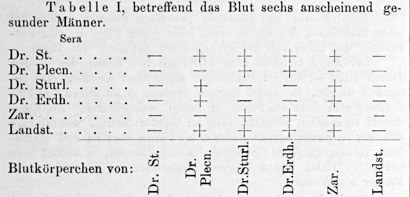

In February 1900 a young assistant at the pathological-anatomical institute of the **[University of Vienna](kloom:e/university-of-vienna)** added a footnote to a long paper on the chemistry of serum. "The serum of healthy people," it begins, in our translation, "agglutinates not only animal blood cells but often human ones too, coming from other individuals." He could not yet say whether the difference was inborn or the mark of some damage, bacterial perhaps, and he added that he had found it most marked in the blood of the seriously ill. The assistant was **[Karl Landsteiner](kloom:e/karl-landsteiner)**, and on 14 November 1901 the _Wiener klinische Wochenschrift_ printed the short paper in which he answered his own question. Human blood comes in kinds, the kinds are fixed, and we call them **[blood groups](kloom:e/blood-type)**. That was the beginning of the **[ABO blood group system](kloom:e/abo-blood-group-system)**.

## Six men, thirty-six mixtures

His method fits in a sentence, and he gave it in one. Roughly equal quantities of serum and of a suspension of about 5% blood in 0.6% salt solution were mixed and watched, either in a _hanging drop_ (a drop hung under a coverslip over a hollow slide, the bacteriologist's way of watching a living culture) or in a test tube. A plus sign meant **[agglutination](kloom:e/agglutination-biology)**: the red cells, evenly spread through the fluid at first, gathered into clumps that could be seen with the eye or under the microscope. A minus meant they stayed apart. In a tube the clumps settle as grains, leaving the fluid clear. Their counterfeit is _rouleaux_, cells stacked loosely like coins, which early workers mistook for clumping under the microscope.

He took blood from six apparently healthy men, himself among them, named in the paper by abbreviations, and mixed every man's serum with every man's suspended cells. His Table I is the result, as he printed it:

| Serum of ↓ / cells of → | Dr. St. | Dr. Plecn. | Dr. Sturl. | Dr. Erdh. | Zar. | Landst. |
| ----------------------- | :-----: | :--------: | :--------: | :-------: | :--: | :-----: |
| Dr. St.                 |    −    |     +      |     +      |     +     |  +   |    −    |
| Dr. Plecn.              |    −    |     −      |     +      |     +     |  −   |    −    |
| Dr. Sturl.              |    −    |     +      |     −      |     −     |  +   |    −    |
| Dr. Erdh.               |    −    |     +      |     −      |     −     |  +   |    −    |
| Zar.                    |    −    |     −      |     +      |     +     |  −   |    −    |
| Landst.                 |    −    |     +      |     +      |     +     |  +   |    −    |

Read it by columns. Two men's cells, Dr. St.'s and Landsteiner's own, were clumped by nobody. Their sera, in turn, clumped the cells of all four others. Those four fell into two pairs, Plecn. with Zar. and Sturl. with Erdh., and each pair's serum clumped the other pair's cells but never its own. Every serum left its own cells alone.

Landsteiner tried more: six women after childbirth, then cord blood and mothers' sera, then ten more people in 42 further combinations. All 22 sera from healthy adults gave the reaction against somebody's cells, a result he could not have had, he noted, without testing each serum against many different cells. The pattern held in nearly all of them, and he named three groups:

| Landsteiner's group (1901) | Its serum clumps the cells of | Its cells are clumped by the serum of | Name since 1927 |
| -------------------------- | ----------------------------- | ------------------------------------- | --------------- |
| A                          | B                             | B and C                               | A               |
| B                          | A                             | A and C                               | B               |
| C                          | A and B                       | nobody                                | O               |

There must be at least two kinds of agglutinin, he wrote (in our translation), "one in A, the other in B, both together in C", and a person's cells are naturally insensitive to the agglutinins in his own serum. The paper does not say which pair of his colleagues was A.

## Why it mattered at the bedside

The six sera of Table I, tested again nine days later, behaved the same: a person's group did not change from week to week. A drop of blood dried on linen and kept fourteen days still worked, so the reaction might show that two bloodstains were not from the same person. And the paper's last sentence says that these observations "allow one to explain the varying consequences of therapeutic transfusions of human blood". A transfusion between two people of one group would pass quietly. Between groups, the recipient's serum could clump the donor's cells.

**[Reuben Ottenberg](kloom:e/reuben-ottenberg)**, at **[Mount Sinai Hospital](kloom:e/mount-sinai-hospital-manhattan)** in New York, worked out which direction mattered. Writing in 1911, he found that a donor whose serum clumped the patient's cells was the safer mismatch, because the patient's own blood diluted and absorbed the donor's agglutinin; a donor whose cells the patient's serum clumped was the danger. He urged that tests for agglutination and hemolysis "ought to be made before transfusion". Wikipedia's article on him dates his first matched transfusion, the two bloods tested against each other first, to 1907.

## A discovery on the shelf

For about a decade little changed at the bedside. In 1902 Alfred von Decastello and Adriano Sturli found the rare fourth group, whose cells every other serum clumps and whose serum clumps nobody's; A. D. Farr's history dates their paper 1901, but the reference he gives is to 1902. the Czech Jan Janský (1907) and William Moss in Baltimore (1910) numbered the four groups I to IV in opposite orders, so that "group IV" meant the commonest blood in one hospital and the rarest in another. Ottenberg wrote in 1911 that surgeons had done "a large number of transfusions without making any serum tests", and Farr quotes a Boston surgeon recalling that in 1910 nobody once suggested he wait for blood tests. Only in 1927 did Landsteiner, by then in New York, propose the letters O, A, B and AB, and in 1930 he received the **[Nobel Prize in Physiology or Medicine](kloom:e/nobel-prize-in-physiology-or-medicine)**.

The trail from here, _Beyond ABO_, follows the groups found after these, and what they were used for; the main spine goes on to the chemistry that let blood wait in a bottle.
