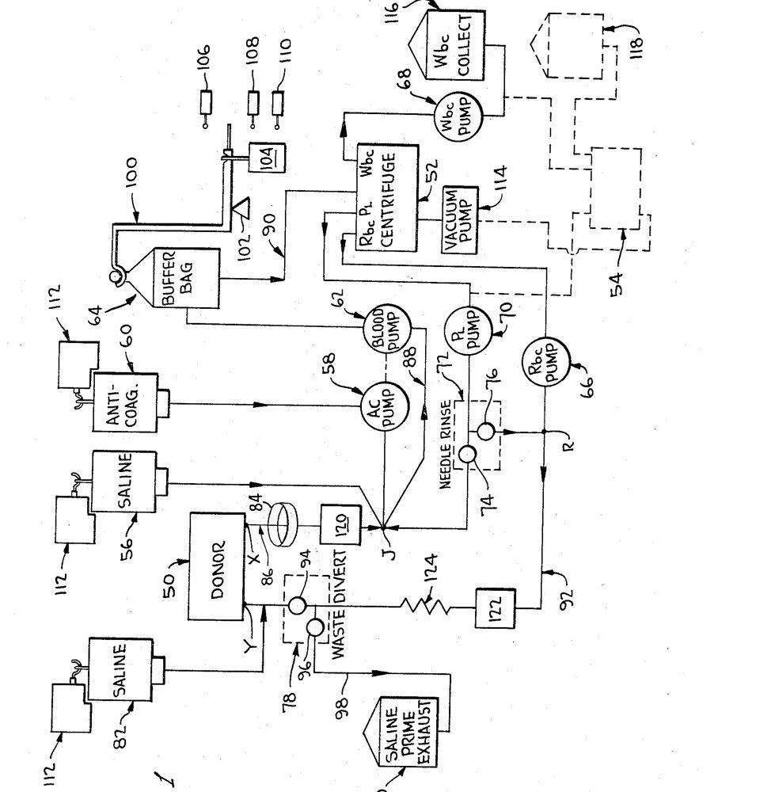

At the **[National Cancer Institute](kloom:e/national-cancer-institute)** in the late 1950s, children with acute [leukemia](kloom:e/leukemia) died most often of bleeding, because the disease and its drugs left them without [platelets](kloom:e/platelet). **[Emil J. Freireich](kloom:e/emil-j-freireich)**, a young physician at the NCI's Clinical Center in Bethesda, showed that fresh blood stopped the bleeding and banked blood did not, because platelets kept cold in the blood bank soon fell apart. A child's blood volume could not take enough whole blood to give enough platelets. The answer was to take from a donor only the part that was wanted and give the rest back, which is what **[apheresis](kloom:e/apheresis)** means: from the Greek for a taking away.

## Two bags, then a machine

Freireich and a clinical associate, Alan Kliman, did it first by hand, with the new plastic bags. In his telling, recorded by the NIH's oral history project in 1997, they bled a donor into one bag, kept the needle open with a drip, spun the bag, kept the platelet-rich plasma and ran the red cells back into the donor; then they did it again with a second bag. One unit of fresh blood raised a child's platelet count by about 5,000 per microliter; two units of platelet-rich plasma raised it by about 12,000, and the effect lasted twice as long. Volunteers living at the NIH's Clinical Center were bled to find how much a donor could safely give, and the limit they found, he said, was about a litre a week.

Then the leukemic children began dying of infection instead, because they had no **[granulocytes](kloom:e/granulocyte)**, the white cells that fight bacteria. A person has some 10¹¹ of them in the circulation; four units of blood gave about a hundredth of a dose. To collect a dose from a healthy donor, the whole blood volume would have to pass through a centrifuge at least twice. Doing that in batches, Freireich reckoned, would take three days. He needed blood to flow through a centrifuge continuously, out of one arm and back into the other.

## Judson's centrifuge

In Freireich's telling, an engineer named George Judson walked into his office one day. Judson's son had chronic granulocytic leukemia, and Judson worked for **[IBM](kloom:e/ibm)** at Endicott, New York. Freireich gave him a list of what the machine must do; IBM paid Judson's salary while he worked in the NCI laboratory, and he built a first model from spare parts. The list appears in their paper of October 1965, with Robert H. Levin, in _Cancer Research_: separate white cells by sedimentation, run continuously, vein to vein, with an anticoagulant that does not anticoagulate the donor, lose little of the platelets, red cells and plasma, keep a closed system with no air-blood interface, and hold under 500 mL of blood outside the body at any time.

The machine they described had a vertical cylinder spinning at 850 rpm, about 42 × _g_, holding 190 mL. Blood entered at the top and separated as it flowed down, by density: red cells against the outer wall, plasma at the inner wall, the white cells in a thin buffy layer between them. A port at each layer drew it off through its own [peristaltic pump](kloom:e/peristaltic-pump), and by setting the pumps against one another the operator held the boundary at the white-cell port. Red cells and plasma were joined again and returned through a needle in the other arm.

| What the 1965 paper reported                   | Value                                          |
| ---------------------------------------------- | ---------------------------------------------- |
| Flow through the centrifuge (in vitro)         | up to 50–60 mL a minute                        |
| Blood run through, test of 4,500 mL            | 55 mL drawn off at the white-cell port         |
| White cells in that 55 mL                      | 58% of all of them, a fifty-fold concentration |
| Largest single run in a patient                | 11,000 mL of blood processed                   |
| Citrate's effect on the donor                  | none below 50 mL a minute; tingling above it   |
| White cells recovered in patients (CML donors) | 2–22%, median 12%                              |

The machine was safe, but in patients it recovered far fewer white cells than in the test tube, and the authors did not know why. The anticoagulant was acid-citrate-dextrose, metered by one roller pump squeezing two tubes at once, and its citrate binds the donor's calcium: the tingling about the face and fingers is the sign, and slowing the return reversed it. A bag between donor and centrifuge let the donor bleed in spells, with a pressure cuff and rests, while the centrifuge ran continuously. A water bath at 38 °C warmed the returning blood after early chills. The patent, filed in August 1966 and granted in January 1970 to Judson and Freireich, added a trap for air bubbles and an alarm for an occluded vein, and assigned the invention to the United States through the Surgeon General.

## A dose from one donor

IBM built the machine under an NCI contract, and Freireich said in 1997 that its descendant, sold by COBE after IBM left the business, still did the seven things on his list. The same principle collects platelets. Under US regulations, as of October 2026, platelets separated from one whole-blood donation must count at least 5.5 × 10¹⁰; a plateletpheresis unit, by the usual quality-control standard, holds at least 3.0 × 10¹¹, about five and a half whole-blood units by our arithmetic, from one donor, so a patient meets fewer donors' antigens and infections. The donor is protected by rules: a platelet count of at least 150,000 per microliter before, not below 100,000 after, and no more than 24 collections in a year. And marrow transplantation, which began with a needle in the hip, now takes most of its stem cells from blood through these machines.
