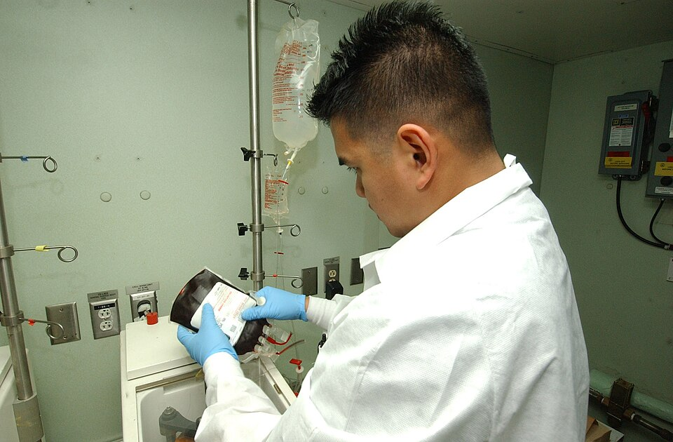

Twice the United States had gone to war without a whole-blood supply and built one under fire. After Korea the armed services kept one of their own: a programme that collects blood from the military community, processes and stores it, and can ship it to a war. It is the **Armed Services Blood Program**, run jointly by the Army, the Navy and the Air Force.

## Two founding dates

The sources give two dates. The services' own 2011 handbook says the **[United States Department of Defense](kloom:e/united-states-department-of-defense)** established the Armed Services Blood Program Office in 1952 as a joint field operating agency, and an Army release of 2007 says the programme was "formally established as the Military Blood Program in 1952 by Presidential Order as part of the National Blood Program". That order is probably the one Kendrick's history describes, by which **[Harry S. Truman](kloom:e/harry-s-truman)** on 10 December 1951 set up the coordination of a single National Blood Program; the Korean War frame shows why it was needed. The Army's official history of Vietnam gives the second date. In May 1962 the Secretary of Defense made the Secretary of the Army responsible for the whole-blood programme in the United States, and on 17 July 1962 the Army's Surgeon General set up the Military Blood Program Agency, staffed by medical officers of all three services, "to support emergency requirements for whole blood in war." Army accounts since speak of the programme as the military's sole blood provider "since 1962". By our reading, 1952 is the policy and the office, and 1962 the working agency.

The agency joined the three services' donor centres into one system. By the late 1960s, 42 donor centres named by the three Surgeons General flew their blood to a triservice Armed Services Whole Blood Processing Laboratory at [McGuire Air Force Base](kloom:e/joint-base-mcguire-dix-lakehurst) in New Jersey, where group O blood was titred, groups and Rh types were checked again, and the boxes were re-iced for the flight to Japan. When Vietnam needed a thousand units a week in 1966, this was the machinery that answered; the next frame tells that story.

## The chain

The 2011 handbook lays the chain out as it would run in a war. Its two processing laboratories stand at McGuire and at **[Travis Air Force Base](kloom:e/travis-air-force-base)** in California, which an Air Force report of 2003 called one of the two triservice storage and distribution centres for liquid and frozen blood. Blood moves left to right; requests move back the other way:

| Link                                        | What it does                                                                                                                                                                        |
| ------------------------------------------- | ----------------------------------------------------------------------------------------------------------------------------------------------------------------------------------- |
| Blood donor centres (Army, Navy, Air Force) | collect from service members and families on military installations; civilian contracts only to cover a shortfall                                                                   |
| Two whole blood processing laboratories     | directed by the Air Force and staffed by all three services: retype ABO and Rh, pack, ice and palletise; hold about 150 liquid red-cell units, 1,000 plasma and 200 cryoprecipitate |
| Expeditionary blood transshipment centre    | at a theatre airhead, usually run by the Air Force: inspects, re-ices and issues up to 3,000 units a week                                                                           |
| Blood products depots                       | in the Pacific, European and Central commands: frozen red cells stored ahead of need, thawed when a war begins                                                                      |
| Blood supply units                          | store blood for the hospitals of an area and ship it forward by truck, helicopter or air drop                                                                                       |
| Treatment facilities and ships              | send a daily blood report: stock on hand, units used, units needed in the next 12 to 48 hours, units expiring within seven days                                                     |

Liquid red cells are kept at 1 to 6 °C, shipped at 1 to 10 °C in a cardboard-and-Styrofoam box holding 30 units and 14 pounds of wet ice, never chemical ice packs, and re-iced every 48 hours, or every 24 to 30 hours above 90 °F. A 463L aircraft pallet carries 120 such boxes, 3,600 units and 5,400 pounds. For planning, the handbook allows three units of red cells, 1.6 of plasma and 0.15 of platelets for each casualty wounded in action or injured outside battle, numbers to set beside the Second World War's one pint a man.

## Frozen blood

The depots hold blood in a form the earlier wars lacked. Red cells frozen with **[glycerol](kloom:e/glycerol)** last ten years at −65 °C or colder. Glycerol is toxic, so a thawed unit must be washed free of it in a cell washer before it is given: the handbook allows one technician with three washers twelve units in twelve hours, and the washed cells keep 14 days if the bag's closed system is intact. Frozen cells are meant for the first days of a war, before liquid blood can arrive from home.

The photograph shows a Navy laboratory technician deglycerolizing frozen red cells aboard the hospital ship **[USNS Mercy](kloom:e/usns-mercy)** in 2005.

## The blood bank officer

In 1953 Lieutenant Colonel Arthur Steer had asked for one medical officer in a theatre responsible for blood and nothing else. The handbook puts one in every combatant command: the joint blood program officer, "usually a laboratory officer who is a specialist in blood banking". The officer plans blood for the command's operations from the casualty projections, moves stock between supply units, watches for shortages of blood and of the supplies to collect, deglycerolize and transfuse it, and keeps the system within the **[Food and Drug Administration](kloom:e/food-and-drug-administration)**'s regulations and the standards of the **[AABB](kloom:e/aabb)**, formerly the American Association of Blood Banks, as far as war allows. When stock runs short, a hospital's trauma director and blood bank officer may decide to draw fresh whole blood from soldiers on the spot, and report it to that officer, a practice the frame on the walking blood bank describes.

In 2007 the programme had about 81 blood banks and donor centres around the world, 21 of them licensed by the FDA, and in 2017 the Army reported that the military blood programme had provided more than 1.5 million units since the Korean War. We have found no more recent official figures.
