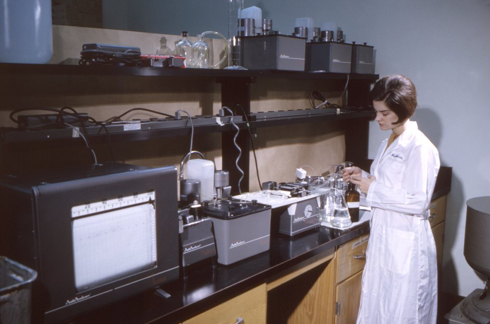

In the early 1950s **Leonard Skeggs** ran the chemistry laboratory of a thousand-bed Veterans Administration hospital in Cleveland with three or four technicians, who also drew the blood, washed and sterilized their own glass syringes and sharpened their own needles. Each day, he remembered, they had "hundreds of manual operations to perform". Worried about the results, he slipped unknowns into every batch and found "frequent, very bad errors". His answer was the **[AutoAnalyzer](kloom:e/autoanalyzer)**, which he described in 1957 and Technicon made: a machine that did chemistry not in test tubes, one sample at a time, but in a stream that never stopped.

## Urea by hand

The test it was built for was **[blood urea nitrogen](kloom:e/blood-urea-nitrogen)**, a measure of the nitrogen waste the kidneys should clear from the blood, and so of how well they work. The standard manual method came from **[Otto Folin](kloom:e/otto-folin)** and **[Hsien Wu](kloom:e/hsien-wu)** at Harvard, in "A System of Blood Analysis" (1919), and it shows what the machine replaced. First the proteins had to go, because they spoil every color test:

| Step      | Folin and Wu's procedure                                                                          |
| --------- | ------------------------------------------------------------------------------------------------- |
| Filtrate  | blood, 7 volumes of water, 1 of 10% sodium tungstate, 1 of ⅔ normal sulfuric acid; shake, filter  |
| Hydrolyze | 5 mL of filtrate (0.5 mL of blood), two drops of pyrophosphate buffer, 0.5–1 mL of urease extract |
| Warm      | 5 minutes in a beaker of warm water, not over 55 °C                                               |
| Distill   | add borax and boil 4 minutes, driving the ammonia into 2 mL of 0.05 normal hydrochloric acid      |
| Color     | dilute, add 2.5 mL of Nessler's reagent, make up to 25 mL                                         |
| Compare   | against a standard of 0.3 mg of nitrogen in 100 mL, in a visual colorimeter                       |

The urease was an extract of jack-bean meal, which splits **[urea](kloom:e/urea)** into ammonia; Nessler's reagent colors it, more deeply the more ammonia there is. In a visual **[colorimeter](kloom:e/colorimeter-chemistry)** of Duboscq's kind the analyst compared unknown and standard by eye, changing the depth of liquid looked through until the two matched; the standard was set at 20 mm, and the darker the unknown, the shallower the depth that matched it. The calculation was 20 × 15 divided by the reading, in milligrams of urea nitrogen per 100 mL of blood. A reading of 25 mm (our invented example) gives 12 mg. Every step was a pipette, a timer or a flame in someone's hands, for one sample.

## Chemistry in a stream

Skeggs had worked on artificial kidneys, a flat cellophane dialyzer meant to improve on **[Willem Kolff](kloom:e/willem-johan-kolff)**'s rotating drum, and the dialyzer gave him the trick that made a stream possible. Instead of precipitating the proteins and filtering, he let the small molecules cross a cellophane membrane into a clean stream of reagent, leaving the proteins behind. His first model, built in his basement at night with about $5,000 lent by his chief, Joseph Kahn (of which $3,500 went to lawyers), had a peristaltic finger pump, polyethylene tubing, mixing coils, a dialyzer and a Coleman colorimeter with a flow cell made from a bent pipette. He fed samples by hand and read the meter every 15 seconds.

The bubbles were an accident. He had tried to keep air out of the line, pinching the tube when he changed samples; when he failed and a bubble got in, the samples stayed apart better. From then on he segmented every stream with air on purpose. The plate draws his flow diagram for urea, as his 2000 account gives it:

1. The pump draws sample and urease together, with air and water in other tubes.
2. The mixture warms in a coil in a bath, and the urea becomes ammonia.
3. In the dialyzer the ammonia crosses into the air-segmented water; the rest goes to waste.
4. Nessler's reagent joins the stream, a second coil mixes it, and the bubbles are removed.
5. The color is read in a flow cell, and a pen records a plateau for each sample.

On 7 November 1951 he ran fifteen bloods both ways. The worst pair differed by 1.3 (15.3 by hand, 14.0 by machine), and by our count nine of the fifteen by half a unit or less. His published method of 1957, in the _American Journal of Clinical Pathology_, describes urea nitrogen and glucose and reads urea by the Fearon reaction rather than by urease; in the paper's words the colored stream "is finally passed through a flow-cell colorimeter that is equipped to record the results".

## Selling it, and what it cost

These are Skeggs's own memories, told in 2000, half a century on. A small manufacturer licensed the machine and gave it back. Several companies turned it down. Then a salesman from **Technicon**, Ray Roesh, insisted he bring it to New York, and Skeggs and his wife drew each other's blood on the warehouse floor in the Bronx where Technicon worked to demonstrate it. Technicon spent three years engineering it; the first ten sold for $3,200 each, and orders followed.

Then came many tests at once. Skeggs's first multiple analyzer, described in 1964, ran 20 samples an hour. Technicon's SMA 12/60 ran twelve tests at sixty samples an hour, 720 results by our arithmetic, and in Skeggs's laboratory one operator did most of the day's work in four to six hours. The computer-run SMAC (1974, by Wikipedia's dates, which put the SMA at 1969) did twenty tests on a sample every twenty seconds and cost over $200,000, but in a busy laboratory the cost fell to "10 to 15 cents per analysis", where a single blood sugar had cost $5 or $6 in the 1940s. It was criticized for running tests no one had ordered. Skeggs thought the unexpected results worth having; Technicon changed the machine so that only the tests ordered were printed. The paper that carried the results back to the ward was the next thing to be changed.
