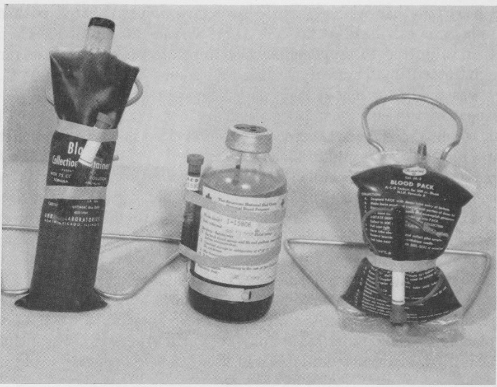

On 2 December 1949, at a symposium on blood preservation held by the National Research Council's Committee on Blood and Blood Derivatives, a Boston surgeon laid down nine rules for a new kind of blood container. It should be one piece, sealed from collection to transfusion. It should fill slowly, by the donor's venous pressure and gravity, with no air vent at all. It should be clear, unwettable, compressible, stable at 121 °C for thirty minutes, and cheap enough to throw away. The surgeon was **[Carl W. Walter](kloom:e/carl-w-walter)** of the Peter Bent Brigham Hospital and Harvard Medical School, and the container he described was a bag of plastic.

## What the bottle cost

Blood had been taken into glass bottles closed with rubber stoppers, and in many hospitals given through rubber tubing that was washed, sterilized and used again. Each part had its failure. Badly cleaned tubing carried pyrogens, the bacterial residues that gave patients fevers and chills; the Army's official history of the wartime blood program calls them the chief cause of transfusion reactions in civilian life. A bottle had to let air in as blood ran out. In a hurry, a surgeon could force blood in by pumping air into the bottle with the bulb of a blood-pressure cuff, which called for a filter against contamination from the air and, the same history says, "could — and did — carry the risk of air embolism". And bottles broke.

| Cause of loss, World War II plasma program | Bottles | Share of all collected |
| ------------------------------------------ | ------: | ---------------------: |
| Bacterial contamination                    | 125,748 |                  0.99% |
| Positive serology (syphilis)               |  28,364 |                  0.22% |
| Miscellaneous                              |  20,734 |                  0.16% |
| Broken in the centrifuge                   |  17,048 |                  0.13% |
| Hemolysis                                  |   7,567 |                  0.06% |
| Clotting                                   |   3,727 |                  0.02% |
| Broken in transit                          |   1,660 |                  0.01% |

## A bag that could fall

Walter had been trying to improve on bottles and rubber tubing since his residency, but only the flexible plastics of the late 1940s made it possible. In the telling of Harvard's Countway Library, which holds his papers, he built the prototype in his garage over Thanksgiving weekend in 1947 and patented it in 1949. The patent itself was applied for on 20 July 1950 and granted in 1955, and it describes the bag exactly. It was cut from extruded tubing of **[polyvinyl chloride](kloom:e/polyvinyl-chloride)** "appropriately plasticized", 12.5 cm wide laid flat, with a wall 0.25 mm thick, about 15 cm long and holding 500 cc, its ends sealed by heating the plastic until it fused. PVC is a **[thermoplastic](kloom:e/thermoplastic)**, softening when heated and setting as it cools, so a seam could be made simply by melting the plastic together. Flattened before use, it held no air. Filled, it withstood 50 pounds per square inch and "a free fall of 300 ft. onto a rigid platform". Walter's first sets took the calcium out of the blood with a column of ion-exchange resin rather than citrate.

Fenwal, a company Walter had co-founded, was making the bags by March 1950. In 1952 the Army tried them at Fort Sam Houston and at **[Walter Reed](kloom:e/walter-reed-army-medical-center)** General Hospital, where it proved worthwhile to have an experienced nurse train every member of staff in their use. The Army's history records their advantages: half the refrigerator space of a bottle, 48 bags to an insulated box instead of 24 bottles, and almost no blood discarded for hemolysis. A bag could be squeezed, too: under a patient's shoulder, or by an operator standing on it. It also says the bags were never formally used in the blood program of the **[Korean War](kloom:e/korean-war)**, because the [American Red Cross](kloom:e/american-red-cross) objected, though they came into general use in military hospitals; the Countway's note says the Army used them in the war. The frame on blood in the Korean War tells their trial there.

## One donation, three products

A sealed bag with smaller bags already joined to it made **component therapy** practical: one donation spun in a centrifuge and divided without ever being opened. One Indian blood bank's settings, published in 2009, show the steps:

| Step       | What is done                                                                                        |
| ---------- | --------------------------------------------------------------------------------------------------- |
| Collect    | 450 mL of blood into a triple bag holding CPDA-1 anticoagulant                                      |
| Light spin | 1,750 rpm for 11 minutes at 21 °C: the red cells settle, platelets stay in the plasma               |
| Express    | Press the platelet-rich plasma into the first satellite bag; the red cells stay, stored at 1–6 °C   |
| Heavy spin | The platelet-rich plasma alone, 3,940 rpm for 5 minutes at 21 °C: the platelets settle              |
| Express    | Press the plasma above them into the second satellite and freeze it, at −30 °C or below, for a year |
| Store      | Platelets rest an hour, then are kept at 20–24 °C, gently agitated, for five days                   |

The speeds belong to that centrifuge. The force on the bag grows with the square of the speed and with the rotor's radius: by our arithmetic, at an invented radius of 25 cm, 1,750 rpm is about 860 times gravity and 3,940 rpm about 4,340.

## The plasticizer

Rigid PVC is made soft with a plasticizer, in blood bags most often **[DEHP](kloom:e/bis-2-ethylhexyl-phthalate)**, di(2-ethylhexyl) phthalate. It is not bonded to the polymer's chains, and in 1970 R. J. Jaeger and R. J. Rubin reported that blood extracts it from bags and tubing, and found it in the tissues of patients transfused with stored blood. It turned out to help. In 1988 J. P. AuBuchon and colleagues found that 24 percent more red cells survived a day after transfusion when stored 35 days in DEHP-plasticized bags than in bags whose plasticizer hardly leached. The European Union classes DEHP as toxic to reproduction and lists it among the substances that may be used only with an authorization. As of October 2026, its rules let medical devices, blood bags among them, go on using it without one until 1 July 2030, the date a 2023 regulation set.

The next segment begins with plasma divided more finely still, into the fractions of Edwin Cohn.
