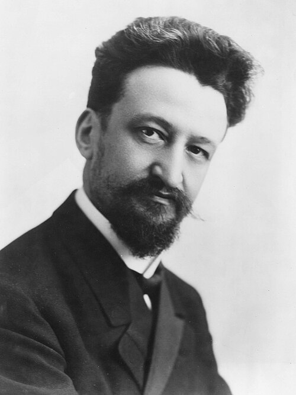

On 10 July 1937 the _Journal of the American Medical Association_ printed a preliminary report on a new service at the **[Cook County Hospital](kloom:e/john-h-stroger-jr-hospital-of-cook-county)** in Chicago: a **[blood bank](kloom:e/blood-bank)**. Its author, **[Bernard Fantus](kloom:e/bernard-fantus)**, the hospital's director of therapeutics, had opened the service that March, and he meant the name exactly: "Just as one cannot draw money from a bank unless one has deposited some, so the blood preservation department cannot supply blood unless as much comes in as goes out. The term 'blood bank' is not a mere metaphor." The idea of keeping blood was not new, as Robertson's depot had shown in 1917. What the 1930s added was the institution: a supply that ran all year, for a whole hospital or a whole army, with its own rules, records and refrigerators. Two came before Chicago's.

## Blood from the dead

At the **[Sklifosovsky Institute](kloom:e/sklifosovsky-institute-for-emergency-medicine)**, Moscow's emergency hospital, the surgeon **[Sergei Yudin](kloom:e/sergei-yudin-surgeon)** had both a stream of patients bleeding to death and a stream of bodies. Vladimir Shamov had shown in dogs that blood taken soon after death could be transfused safely. Yudin's first case, in his own account, was a young engineer who had cut both wrists, revived with 420 c.c. of blood from a man of sixty killed in a road accident six hours before; Wikipedia dates the first such transfusion to 23 March 1930. His method, as he described it in _JAMA_ in 1936, was simple. He chose the bodies of people who had died suddenly, of a heart attack, an electric shock or hanging, within six hours of death in summer and eight in winter, and examined each at autopsy. He cut the jugular vein, tipped the body head down and ran the blood into 500 c.c. flasks, two to three and a half liters a body, enough for five or six transfusions. The flasks went into a refrigerator for up to a month, long enough for a test for syphilis and cultures for sterility.

The blood of a sudden death clots and then, within an hour or so, dissolves its own clot and stays liquid, so Yudin needed no citrate, and he found it gave fewer reactions without: about 5 percent, against about 20 percent with citrate. By 1936 he counted almost a thousand transfusions of cadaver blood, with seven deaths that he put down to technical errors. The US Army's official history says the method was never widely used outside Russia. Fantus, who cited Yudin, thought it "revolting to Anglo-Saxon susceptibilities".

## Blood sent to the front

In August 1936, a month into the **[Spanish Civil War](kloom:e/spanish-civil-war)**, a young Barcelona physician, **[Frederic Durán i Jordà](kloom:e/frederic-duran-jorda)**, set up a transfusion service for the Republican army. Donors were questioned, typed and tested for syphilis before their first donation, came fasting, and gave 300 to 400 c.c. at a time, every three or four weeks. Blood of one group from six donors was pooled in a two-liter flask through a silk filter, sealed in small glass bottles under pressure, kept at about 2 °C for up to fifteen days, and driven to the front in a refrigerated lorry. At first only group O went forward, and group A stayed for the city's hospitals. Each container carried a card, so that every bottle could be traced back to its collection and forward to the hospital and the person who gave it. Over thirty months the service kept a list of 28,900 donors, made more than 20,000 collections and sent out some 9,000 liters. The Army's history says the citrate and glucose were added after collection; Wikipedia's article on Durán says the citrate was in the flask as the blood ran in.

## The bank in Chicago

Fantus's notice to his staff set out the bank's rules:

| Step       | The Cook County rule, 1937                                                                                                                                                                             |
| ---------- | ------------------------------------------------------------------------------------------------------------------------------------------------------------------------------------------------------ |
| Deposit    | A chilled 500 c.c. flask holding 70 c.c. of 2.5% sodium citrate, with two 5 c.c. tubes for typing and the Wassermann test. With it go the date, the donor's name, address and "color", and the service |
| Keep       | At once into a refrigerator held at 4–6 °C; typed, tested for sterility and syphilis, and credited to the service that brought it                                                                      |
| Withdraw   | The ward types 5 c.c. of its patient's blood and requisitions the type and quantity it needs                                                                                                           |
| Crossmatch | Both ways: the donor's cells against the patient's serum, and the donor's serum against the patient's cells                                                                                            |
| Give       | Warmed in water "not too hot for the hand", then given slowly, "literally drop by drop"                                                                                                                |

A donor's blood of any group was exchanged for blood of the group a patient needed, so only one donor needed to be bled, instead of a "horde of excited relatives" being called in until one matched. Here is an invented week in one ward's account:

| Day      | Surgery ward               | Pints in | Pints out | Balance |
| -------- | -------------------------- | -------: | --------: | ------: |
| Monday   | two donors, groups O and B |        2 |           |       2 |
| Tuesday  | a patient needs group A    |          |         1 |       1 |
| Thursday | a patient's brother gives  |        1 |           |       2 |
| Saturday | two pints of group A out   |          |         2 |       0 |

Fantus listed his sources: volunteers, heart patients being bled for their own good, women a week or two before delivery, and patients before an operation, who could bank a pint for themselves. He gave stored blood three to four weeks and proposed saving the serum once the cells began to break up. The plate draws the flask, the refrigerator and the ledger. His record of each donor's color points to the trail's frame on segregated blood. Within a few years hospitals across the United States had banks of their own, and the next frame shows the step that took blood across an ocean: plasma.
