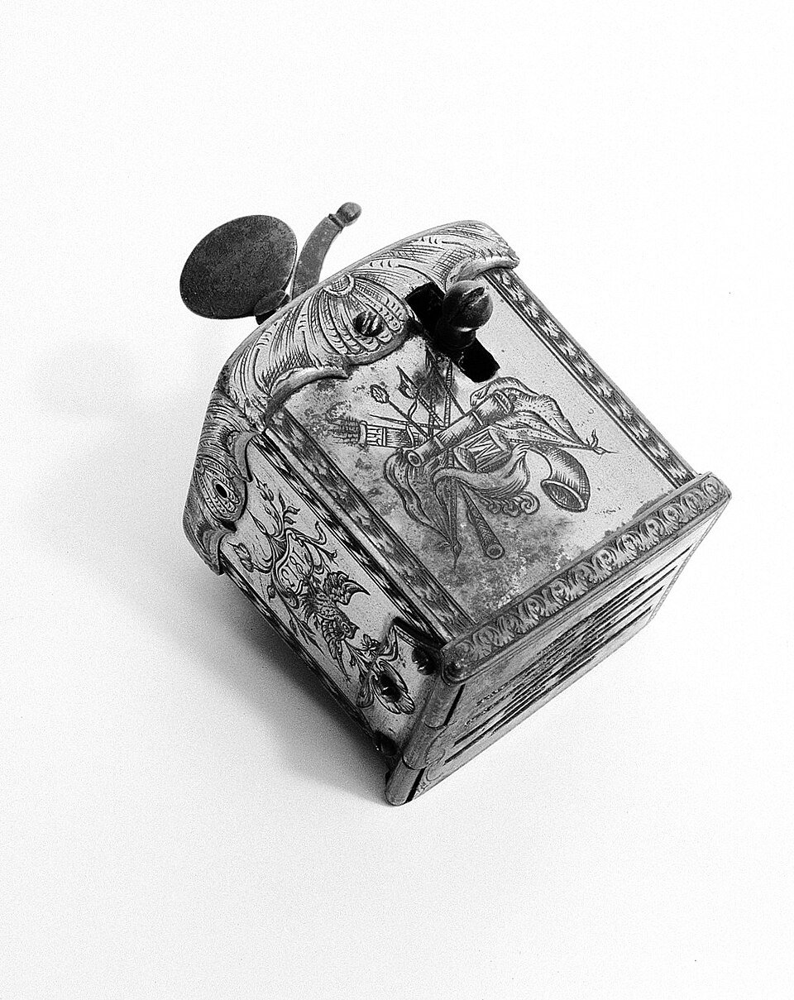

Between two and three in the morning of Saturday 14 December 1799, **[George Washington](kloom:e/george-washington)** woke his wife at **[Mount Vernon](kloom:e/mount-vernon)** to say he was very unwell. He had ridden round his farms two days before in rain, hail and snow, and come to dinner in wet clothes. Now he could barely speak or breathe, and could not swallow a drop. At daybreak, before any doctor could arrive, he sent for Rawlins, one of the estate's overseers, to bleed him. His secretary, **[Tobias Lear](kloom:e/tobias-lear)**, wrote down what happened in his diary that night. Rawlins was nervous; Washington told him not to be afraid, and when the cut was made said "The orifice is not large enough." Martha Washington, unsure whether bleeding was right, asked Lear to stop it. Washington raised his hand to prevent him and said, "More, more."

**[Bloodletting](kloom:e/bloodletting)** was by then the oldest treatment in medicine, and the commonest. The humors of the trail's anchor had given it its reason: a disease of excess was cured by drawing the excess off.

## How blood was let

The usual way was _venesection_, opening a vein. A cord was tied round the upper arm, so that the veins at the elbow swelled; the operator nicked one with a lancet, a small double-edged blade; the blood ran into a bowl, and was measured in ounces; the cord was untied and the cut bound up. Lear's account has each step, down to the string he was about to untie when Washington stopped him. Two other methods drew smaller amounts. A _scarificator_, a brass box like the one in the picture, snapped a row of spring-loaded blades into the skin, and a heated glass cup over the cuts drew the blood out as it cooled. **Leeches**, which became the fashion in the early nineteenth century, take five to fifteen milliliters each. The _fleam_, a blade struck into a vein with a stick, was mostly a farrier's tool, used on horses.

## Four bleedings in a day

Three physicians came: **[James Craik](kloom:e/james-craik)**, Washington's friend and doctor; Gustavus Brown, from Port Tobacco in Maryland; and **[Elisha Dick](kloom:e/elisha-c-dick)**, from Alexandria. Lear counts four bleedings. Craik and Dick published their own account in an Alexandria paper five days later, and it agrees on the number but gives only two volumes. The two accounts differ on the hours, and on the first amount.

| Bleeding | By whom, and when (Lear)          | Amount in the physicians' account           | Milliliters, by our arithmetic |
| -------- | --------------------------------- | ------------------------------------------- | -----------------------------: |
| 1        | Rawlins, soon after sunrise       | 12 or 14 ounces (Lear: "about half a pint") |    350–410 (Lear's: about 240) |
| 2        | Craik, on arriving in the morning | "copious"                                   |                   not recorded |
| 3        | Craik, about eleven               | "copious"                                   |                   not recorded |
| 4        | after Dick arrived, about three   | about 32 ounces; "the blood came very slow" |                      about 950 |

Another physician, John Brickell, writing six weeks after the death, put the total at 82 ounces "in about 13 hours". The physician Vibul Vadakan, writing two centuries later, counts 124 to 126 ounces, or 3.75 liters, though the account he quotes measures only the first and last bleedings. By our arithmetic, at about 30 milliliters an ounce, Brickell's total is some 2.4 liters. Taking a body's blood at about 70 milliliters a kilogram, and Washington at Vadakan's six foot three and 230 pounds, he had perhaps 7.3 liters. So the day took between a third of his blood, on Brickell's count, and a half, on Vadakan's. He was also blistered, purged with calomel and given tartar emetic. He died between ten and eleven that night.

## What they thought they were doing

The physicians called the disease _cynanche trachealis_, an inflammation of the upper windpipe. William Cullen, the Edinburgh professor whose teaching Craik and Brown had studied, wrote in 1778 that bleeding "has often given almost immediate relief" in it, "and by bleeding repeatedly has entirely cured the disease." Bleeding was meant to subdue the inflammation itself. Six years earlier, in **[Philadelphia's yellow fever of 1793](kloom:e/1793-philadelphia-yellow-fever-epidemic)**, **[Benjamin Rush](kloom:e/benjamin-rush)** had pushed the idea further than anyone. He judged how much to take by "the state of the pulse, and by the temperature of the weather", wrote of the need for "intrepidity in the use of the lancet", and drew "from many persons seventy and eighty ounces in five days", one man losing 114 ounces. When the journalist William Cobbett accused him of killing his patients, Rush sued for libel and won $5,000 in 1799.

## Did the bleeding kill him?

People argued about it at once. Brickell wrote that "very few of the most robust young men in the world could survive such a loss of blood", though his paper was not published until 1903. Dick had wanted to open Washington's windpipe, a tracheotomy, and was overruled by the other two. A letter attributed to Brown, written the next month, remembers Dick arguing against more bleeding, which sits uneasily with the account Dick signed. Modern physicians who have studied the case, such as the otolaryngologist White McKenzie Wallenborn, mostly diagnose acute _epiglottitis_, a swelling at the entrance of the airway that can kill by suffocation without any help. Others think the blood loss, likely enough to cause shock, hastened the end. Both may be true. What the physicians could not do was tell whether bleeding helped at all, because nobody had counted. The next frame is the man who did.
